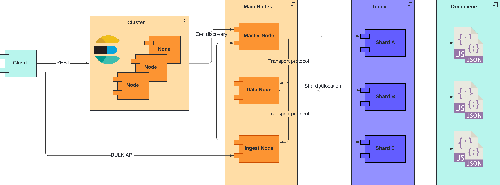
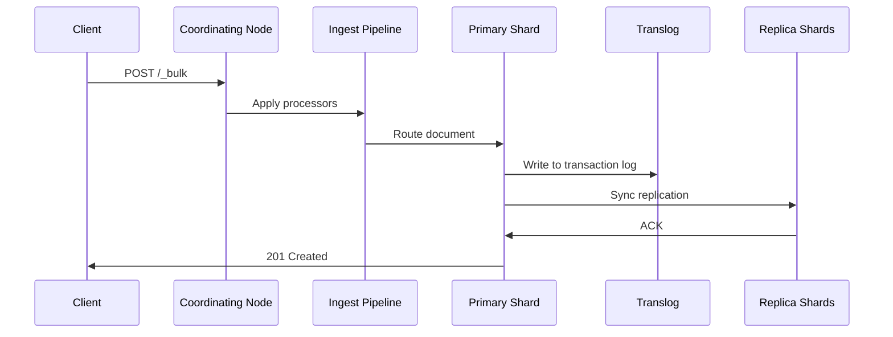

# Laboratory 1 - Design

**Full Name:** Juan Andres Orzoco Velandia 
**Selected Project:** ElasticSearch  
**Repository URL:** [Elasticsearch GitHub Repository](https://github.com/elastic/elasticsearch)  

---

## Project Description: Elasticsearch

Elasticsearch is a distributed, RESTful search and analytics engine built on Apache Lucene. It combines:
- **Real-time search** with near-instant response times
- **Horizontal scalability** through sharding and replication
- **Complex query capabilities** using JSON-based DSL
- **Advanced analytics** with aggregations and machine learning

**Key Large-Scale Characteristics**:
- Handles petabytes of data across distributed clusters
- Processes 100k+ operations per second per node
- Maintains high availability through automatic shard rebalancing
- Supports complex distributed operations (cross-cluster search, CCR)

---

## Architectural Analysis of Elasticsearch

### Architectural Style
Hybrid architecture combining:
- **Shared-nothing distributed system** (horizontal scaling)
- **Master-slave pattern** (cluster coordination)
- **Document-oriented database** (JSON storage)
- **Event-driven architecture** (bulk async operations)

---

### Component & Connector (C&C)

### Architecture Elements

#### Core Components
1. **Node Types**:
   - **Master Node**: Manages cluster state, shard allocation, and node membership
   - **Data Node**: Stores shards and handles CRUD operations (50% JVM heap for Lucene)
   - **Coordinating Node**: Routes requests and aggregates results
   - **Ingest Node**: Pre-processes documents using pipelines

2. **Data Organization**:
   - **Index**: Logical namespace (e.g., `logs-2025`)
   - **Shard**: 
     - Primary (read/write) and Replica (read-only) copies
     - Default 1 primary + 1 replica per index
   - **Segment**: 
     - Immutable Lucene index portion
     - Merged periodically for optimization

3. **Internal Mechanisms**:
   - **Transaction Log (Translog)**: Write-ahead log for durability
   - **Refresh Interval**: Near-real-time visibility (default 1s)
   - **Merge Policy**: Tiered merge strategy for segments
   - **Circuit Breakers**: JVM-level memory protection

#### Key Connectors
1. **HTTP/REST API** (9200 port):
   - CRUD operations: `PUT /index/_doc/1`
   - Search: `POST /_search` with JSON DSL
   
2. **Transport Protocol** (9300 port):
   - Binary communication between nodes
   - Uses Elasticsearch's custom protocol
   
3. **Zen Discovery**:
   - Gossip protocol for node discovery
   - Master election using minimum_master_nodes

4. **Shard Allocation**:
   - Balanced using weighted algorithms
   - Awareness attributes for rack/zone safety

---

### Workflow (Sequence Diagram)

#### Indexing Process

#### Search Execution
1. Query received by coordinating node
2. Query rewritten to match shard distribution
3. Fan-out to relevant shards (primary + replicas)
4. Scatter/gather results aggregation
5. Final scoring and ranking