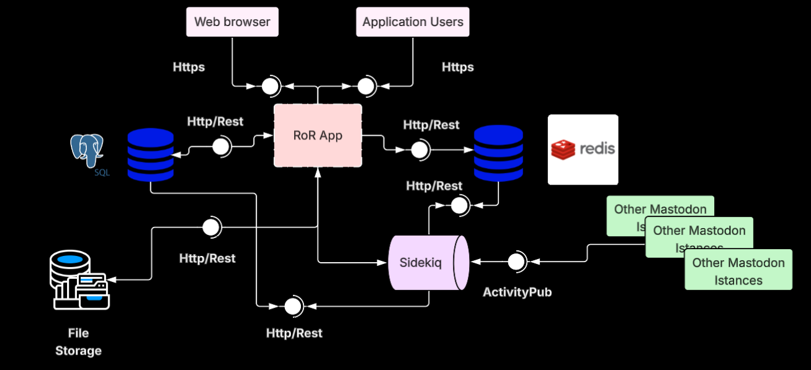

# Laboratory 1 - First LSS Architecture
## 1. Author:
Juan Esteban Hunter Malaver.
## 2. Selected project:
For this project I selected ***Mastodon***, a free, open-source, and decentralized social networking platform. Mastodon allows users to create and manage their own servers, known as "instances," which can interact with each other through the ActivityPub protocol. This architecture promotes user privacy, content moderation, and community-driven management.\

U can find the project repository [here](https://github.com/mastodon/mastodon]).
## 3. Mastodon's Architectural Style
Mastodon follows a decentralized, federated architectural style based on the ActivityPub protocol, where each federated node is an independent, self-hosted Mastodon instance. Despite its federated design, Mastodon itself is structured as a monolithic application (Ruby on Rails), with tightly coupled components managed within a single codebase.
### 3.1 Federated Monolith:

1. Each instance is a standalone monolith (Rails + PostgreSQL + Redis) but interoperates with others via ActivityPub.

2. ***Self-contained***: Includes frontend (Stimulus.js/ERB), backend (Rails), and data layers (PostgreSQL/Redis) in one deployable unit

### 3.2 Why it is a LSSS?:
* ***High concurrency***: Supports thousands of concurrent users per instance.
* ***Network-scale complexity***: While a single instance has few components, the federated network as a whole behaves like a distributed system, with each instance mirrors the same monolithic structur
## 4. C&C Diagram

## 5. Components Descriptions: 
* ***Web frontend:*** Serves as the principal interface where users interact with other users actions, compose posts, and manage profiles. It communicates with the backend via REST APIs while relying on the streaming service for real-time streamings. Mobile users access the same features through dedicated apps that consume Mastodon’s API.

* ***Ruby on Rails application:*** Here is where the core lies, all the bussines logic and fuctionalities are here aloccated, there relais the main and core functionalities reside. It acts as the central hub that orchestrates interactions between users, data storage, and federation. 

* ***PostgreSql:*** acts as the system’s long-term memory storing structured data like user accounts, posts, and social graphs. Its relational model ensures data integrity while supporting complex queries for timelines and federation. Every post, follow, or like originates here before propagating through the network.

* ***Redis:***  It caches home feeds to reduce database load, manages Sidekiq job queues for background processing, and relays instant notifications to the streaming API via pub/sub channels.

* ***Sideqik:*** Sidekiq acts as Mastodon’s background task engine, silently processing federation, notifications, and media jobs without slowing down user interactions. Its queue-based system ensures time-consuming operations—like delivering posts to remote servers or resizing images—happen efficiently in the background, keeping the Rails app responsive. Every federated action, from a like to a follow, passes through Sidekiq before spreading across the Fediverse.
* ***Media File Storage:*** images, videos, and attachments—are offloaded to file storage (typically S3-compatible systems). This decouples binary data from PostgreSQL, allowing scalable and cost-efficient storage while serving assets directly to clients via CDNs
## 6. References: 
[SoftwareMill](https://softwaremill.com/the-architecture-of-mastodon/).\
[Github Repository](https://github.com/mastodon/mastodon/tree/main/app/workers)