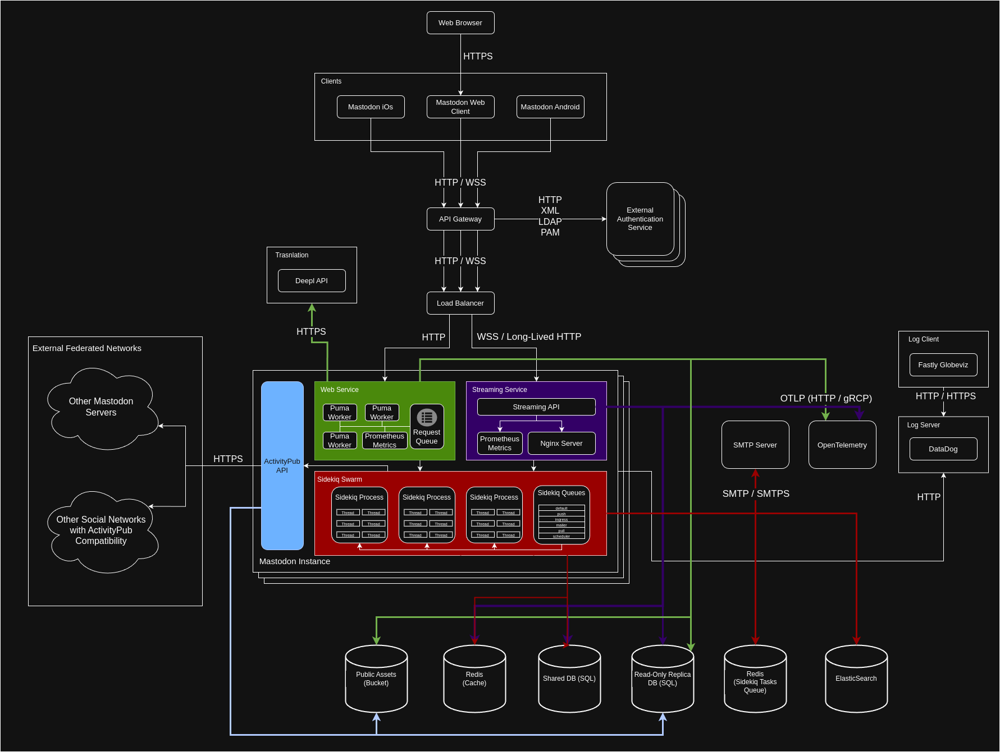

# Lab 1 - Design

**Author:** Carlos Santiago Sandoval Casallas

## Selected Project - Mastodon

Mastodon is a decentralized, open-source social network based on the ActivityPub standard. Its structure allows multiple independent servers, known as "instances," to connect with each other (or even with other applications that comply with the ActivityPub standard), forming a federated network where users can interact without being subject to centralized control.

### Source

- [Mastodon GitHub Organization](https://github.com/mastodon)
- [Mastodon Backend Repository](https://github.com/mastodon/mastodon)

## Mastodon Architecture

Mastodon follows a monolithic architecture, where each "instance" comprises three core components: a web server powered by Puma (Ruby) that handles short-lived HTTP requests, a real-time streaming server built with Node.js that supports WebSocket Secure (WSS) and long-lived HTTP connections, and a swarm of background workers managed by Sidekiq (Ruby) responsible for executing asynchronous tasks.

Although Mastodon uses a monolithic architecture, its backend can be horizontally scaled by deploying a load balancer across multiple instances. It also supports various integrations, including external authentication services, interoperability with other Mastodon servers, and applications that implement the ActivityPub protocol. Additionally, it provides support for telemetry and observability services.

### C&C Diagram

### Overview of the architectural elements

- The system follows a monolithic architecture.
- Mastodon clients are available for iOS, Android, and web browsers.
- The Mastodon web client can be accessed through a web browser over an HTTPS connection.
- The various Mastodon clients communicate with an API Gateway using HTTP or WebSocket Secure (WSS).
- The API Gateway allows access to external authentication services, depending on the method defined by each provider. Supported protocols include HTTP, XML (SAML), LDAP, and PAM.
- The API Gateway also routes HTTP/WSS requests through a load balancer, which forwards them to one of the deployed Mastodon instances.
  - If the request is of type HTTP, it is routed to the web service handled by Puma.
  - If the request is of type WSS or long-lived HTTP, it is routed to the streaming service.

All of the following components and functionalities are part of the `web service` within Mastodon’s architecture:

- The web service receives HTTP requests from the load balancer. If there are available workers, the request is assigned immediately; otherwise, it is queued until a Puma worker becomes available.
- It interacts with an internal Prometheus server for metric collection via its HTTP API.
- The metrics collected by Prometheus are sent to the OpenTelemetry client using the OTLP protocol, which operates over HTTP and gRPC using Protocol Buffers.
- It connects to the DeepL API over HTTPS to provide content translation services.
- The web service also interacts with a read-only replicated SQL database and a storage bucket containing public assets.
- If the operation is not a read action, the web service delegates the task as an asynchronous process to the Sidekiq swarm, which enqueues it into one of the available priority queues based on the type of operation.
- This service is also integrated with the ActivityPub protocol, allowing it to process HTTP requests from other Mastodon servers or from applications that support the standard.

All of the following components and functionalities are part of the `streaming service` within Mastodon’s architecture:

- The streaming service handles WSS and long-lived HTTP connections received from the load balancer.
- These connections interact with the shared primary SQL database, the read-only replica, and an in-memory Redis database used as a cache.
- It interacts with an internal Prometheus server for metric collection via its HTTP API.
- The metrics collected by Prometheus are sent to the OpenTelemetry client using the OTLP protocol, which operates over HTTP and gRPC using Protocol Buffers.
- Additionally, the service is capable of sending web push notifications using WebSocket Secure (WSS) and the VAPID protocol.
- The service can also delegate tasks to the Sidekiq swarm for asynchronous processing and interact with federated instances through the ActivityPub HTTP API.

The `Sidekiq service` consists of a set of processes with multiple threads dedicated to executing background tasks. Its main responsibilities include write operations, data synchronization, and the execution of scheduled jobs (cronjobs).

- It interacts with the ActivityPub HTTP API to exchange information with external instances within the federated network.
- It communicates with other internal components of the instance by processing tasks queued in multiple prioritized queues, enabling the handling of more complex operations asynchronously.
- To perform its tasks correctly, the service interacts with several key resources:
  - An in-memory Redis database used as a cache.
  - The shared primary SQL database and its read-only replica.
  - The full-text search engine powered by Elasticsearch.
  - An email server via SMTP or SMTPS protocols.
  - A dedicated Redis database used internally to manage task queues, locks, and other necessary mechanisms for its operation.

This behavior is general to the Mastodon instance and not specific to any single service:

- The logs generated by the application are sent to a DataDog server via its HTTP API.
- This information is then accessed through the server’s HTTP/HTTPS API and consumed by the monitoring provider’s client. In the case of the analyzed instance, the client is **Fastly Globeviz**.

## References

- [Mastodon Org](https://github.com/mastodon)
  - [Mastodon Main Repository](https://github.com/mastodon/mastodon)
    - [Mastodon - Streaming Implementation](https://github.com/mastodon/mastodon/blob/main/streaming/index.js#L103)
    - [Mastodon DeepL API Implementation](https://github.com/mastodon/mastodon/blob/5f87ae101c5e0e940e148d493eaac1ce31fe24c1/app/lib/translation_service/deepl.rb#L3)
  - [Mastodon Helm Chart Repository](https://github.com/mastodon/chart/blob/main/Chart.yaml#L26)
    - [VAPID RFC 8292](https://datatracker.ietf.org/doc/html/rfc8292)
  - [Web Push Notifications - Pull Request #3243](https://github.com/mastodon/mastodon/pull/3243)
  - [Terraform Fastly Service - Repository](https://github.com/mastodon/terraform-fastly-service)
    - [Gastly Globeviz Data - Repository](https://github.com/mastodon/fastly-globeviz-data)
    - [DataDog Variables - Terraform](https://github.com/mastodon/terraform-fastly-files-service/blob/91fade91cb34844c67fb9f39de0ee238d74bd9ee/variables.tf#L75)
- [Mastodon Engineering Blog](https://blog.joinmastodon.org/categories/engineering/)
  - [Mastodon Blog - Scaling Mastodon](https://blog.joinmastodon.org/2017/04/scaling-mastodon/)
  - [Mastodon Blog - Why ActivityPub is the future](https://blog.joinmastodon.org/2018/06/why-activitypub-is-the-future/)
  - [Mastodon Blog - How to implement a basic ActivityPub server](https://blog.joinmastodon.org/2018/06/how-to-implement-a-basic-activitypub-server/)
- [Mastodon Documentation](https://docs.joinmastodon.org)
  - [Mastodon Technical Overview](https://docs.joinmastodon.org/dev/overview/)
  - [Mastodon API Entities - Instance](https://docs.joinmastodon.org/entities/Instance/#example)
  - [Mastodon Administration - Configuration](https://docs.joinmastodon.org/admin/config/#postgresql)
  - [Mastodon Administration - Scaling](https://docs.joinmastodon.org/admin/scaling/)
- [What is Mastodon? - YouTube Video](https://www.youtube.com/watch?v=IPSbNdBmWKE)
- [Scaling Sidekiq](https://github.com/sidekiq/sidekiq/wiki/Scaling-Sidekiq)
- [OpenTelemetry OTLP Specification](https://opentelemetry.io/docs/specs/otlp/)
