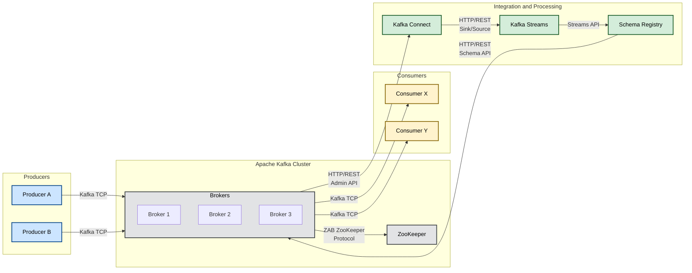

# Architecture Review and C&C Diagram of Apache Kafka
## 1. Author
Camilo Andres Cuello Romero

## 2. Project Information

- **Name of the Project**: Apache Kafka
- **Repository**: https://github.com/apache/kafka

## 3. Architecture Analysis

### 3.1 Architectural Style

Apache Kafka adopts a distributed, event-driven architecture. Its main characteristics are:

- **Publish/Subscribe Model**: Producers publish messages to topics, and consumers subscribe to these topics to receive messages.

- **Partitioning and Replication**: Each topic is divided into partitions, enabling parallel processing. These partitions are also replicated across multiple brokers to ensure fault tolerance.

- **High Concurrency and Scalability**: Designed to handle large volumes of data and high levels of concurrent operations, Kafka can scale horizontally by adding more brokers to the cluster.

- **Cluster Coordination**: Traditionally, Apache Kafka uses ZooKeeper for cluster coordination and metadata management. In recent versions, Kafka is migrating to KRaft (Kafka Raft Metadata Mode) to eliminate the external ZooKeeper dependency.

### 3.2 Components & Connectors (C&C) View

- **Producers**: Applications or services that send messages to Kafka topics.

- **Kafka Brokers**: Servers that form the Kafka cluster. They handle receiving, storing, and distributing messages.

- **Topics & Partitions**: A topic is a message category or channel. Each topic is split into partitions to allow parallel processing.

- **Consumers**: Applications or services that subscribe to topics to consume messages.

- **Coordination (ZooKeeper/KRaft)**: Service responsible for managing cluster metadata, controller elections, and coordination of cluster changes.

- **Connectors and APIs**:

  - *Kafka Connect*: A framework to integrate external systems (databases, file systems, etc.) with Kafka.

  - *Kafka Streams*: A library for real-time data stream processing and analysis.

### 3.3 Apache Kafka C&C Diagram

### 3.4 Elements Description
- **Producers**: Applications that publish data to Kafka topics. They communicate with brokers using the Kafka protocol over TCP.

- **Kafka Brokers**: Servers that make up the Kafka cluster. They store data in topics and manage requests from both producers and consumers. Each broker has a unique ID and can handle multiple partitions from different topics.

- **Topics y Partitions**: A topic is a category or channel where messages are sent. Each topic is divided into one or more partitions, enabling system parallelism and scalability. Messages within a partition are ordered, and each has a unique identifier called an offset.

- **Consumers**: Applications that read data from topics. They can subscribe to one or more topics and read data in real time. Consumers can be organized into groups (consumer groups) to balance the load and ensure that each message is processed by only one group member.

- **ZooKeeper/KRaft**: Traditionally, Kafka uses ZooKeeper for cluster coordination, configuration management, and leader election. However, in more recent versions, Kafka introduced KRaft (Kafka Raft Metadata Mode) to handle these functions internally, removing the dependency on ZooKeeper.

- **Kafka Connect and Kafka Streams**:

	- *Kafka Connect*: A framework for integrating external systems with Kafka, enabling scalable and fault-tolerant data import and export.

	- *Kafka Streams*: A library for building applications and microservices that process real-time data streams, allowing transformations, aggregations, and other complex operations.

## 4. References
- [Apache Kafka Documentation](https://kafka.apache.org/documentation/)
- [Kafka Architecture](https://medium.com/@cobch7/kafka-architecture-43333849e0f4)
