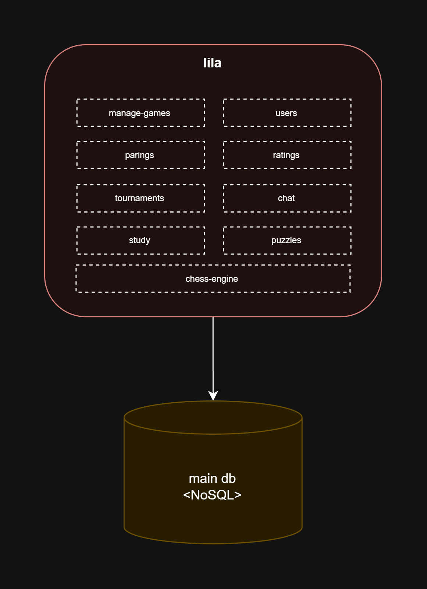
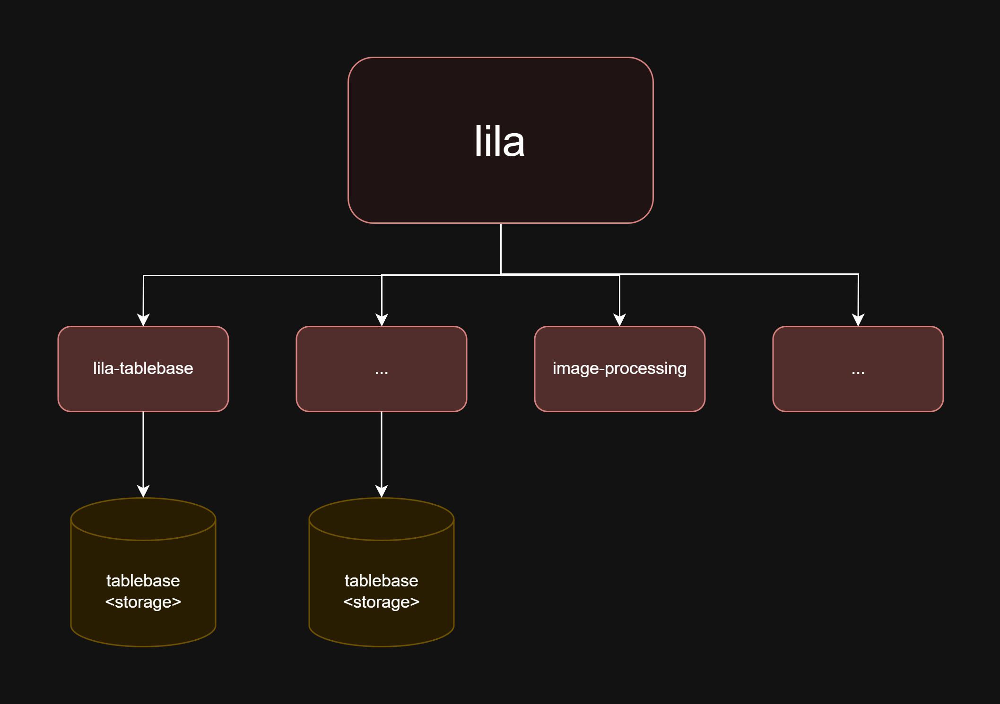
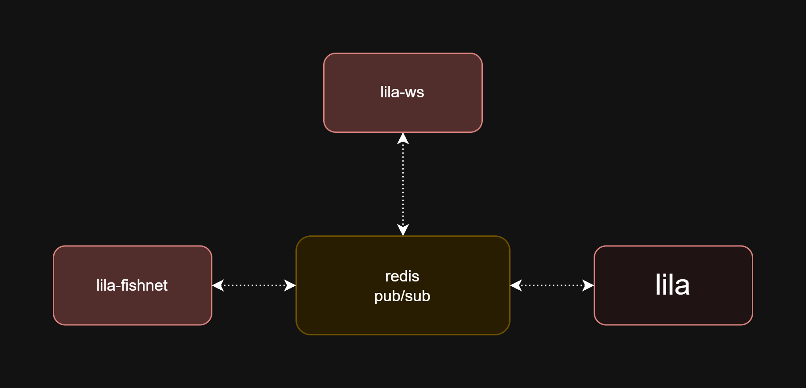
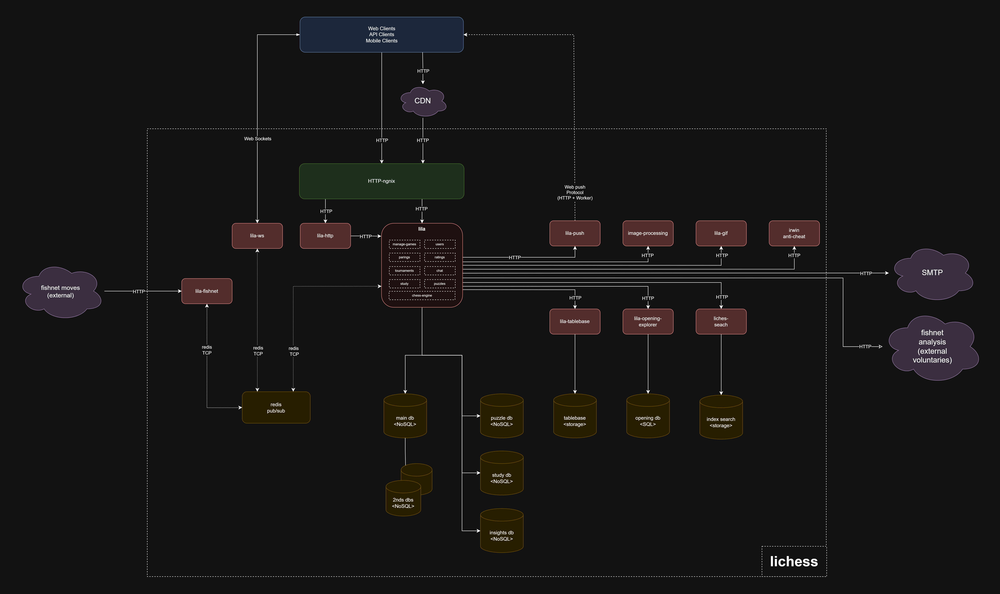

# Laboratory 1 - Architectural Design

Large Scale Software Architecture

UNAL - 2025 i

## Student

Name: Santiago Suárez

Document: 1001326848

## Project

[Lichess.org](https://lichess.org/) is a free and open-source platform for playing chess online. Since its creation in 2010 by Thibault Duplessis as a personal project, Lichess has evolved into one of the most prominent references in the digital chess ecosystem. Its development and maintenance are entirely sustained by a community of volunteers and user donations, without relying on advertising or traditional commercial models.

Lichess not only enables online gameplay at various time controls, but also provides a wide range of advanced tools for studying. Its key features include: opening and endgame databases, analysis modules powered by engines like Stockfish, collaborative studies, tournament broadcasting, and an API for integrating and automating external workflows.

Links:

- [Source code](https://lichess.org/source)
- [GitHub](https://github.com/lichess-org)
- [API](https://lichess.org/api)

## Architecture Overview

Lichess, as a global online chess platform, can be classified into two major categories of large-scale software systems:

1. **Systems with a large number of concurrent operations**

    The system must handle a considerable number of simultaneous operations in real-time. This is reflected in its current statistics, which regularly report around 100,000 active concurrent users and between 40,000 and 50,000 games being played simultaneously. This high concurrency requires an architecture that can scale horizontally, minimize latency in communication, and maintain synchronization across geographically distributed game sessions.

2. **Systems with large volumes of data**

    The platform continuously stores all the matches played by users, generating a database that is continuously growing. In addition to this, information related to opening theory, endgames, analysis modules, collaborative studies and event transmissions must be accessible quickly and efficiently to provide a smooth user experience.

These two challenges—high concurrency and large data volumes—have directly shaped the system’s architectural evolution, encouraging the adoption of distributed components, asynchronous processing, and dedicated storage mechanisms.

## Architectural Style

The architecture can be described as hybrid, which is the result of a progressive evolution that has responded to the growing demands of functionality, scalability and performance of the system. Initially, Lichess was developed as a monolithic application, where a single component handled game logic, interface operations, and data access. This structure suited the initial stages of the project, when the volume of users and functionalities was limited.

With the exponential growth of the community, feature complexity, and system load, the architecture evolved to distribute and divide responsibilities across additional components.

Rather than transitioning to a single modern style, the system evolved into a coexistence of multiple architectural approaches. Today, Lichess integrates three main architectural styles:

- Modular Monolithic Architecture
- Service-Oriented Architecture
- Event-Driven Architecture

### Monolith Architecture Style

Lichess’s system still features a monolithic architecture, specifically within a central module called **LILA**, which is is a modular monolith that encapsulates most of the business logic and performs many of the critical functions, such as:

- Game management
- Player matchmaking
- User handling and authentication
- Rating calculation and storage
- Tournament administration
- Collaborative study management
- Puzzle generation and validation
- Coordination of analysis requests with external engines

The monolith operates in conjunction with a **main database** that stores the system’s core data—users, games, configurations, etc.

In addition, the system has been modularized and enhanced with **secondary databases**, used both for redundancy (ensuring availability in case of failure) and for domain-specific storage that emerged from internal modularization. For example, there are databases dedicated exclusively to the study or puzzle modules in order to isolate workload and optimize queries.

While this monolithic approach has proven capable of handling a large share of the system’s responsibilities, it is complemented by other architectural styles that address the platform’s scalability, concurrency, and decoupling needs.

### Service Oriented Architecture Style

As the user base and feature set grew, Lichess’s system adopted a service-oriented approach to decouple specific tasks that were difficult to scale or maintain within LILA’s core monolith. This allows responsibilities to be split into independently deployable services, optimized to handle specific feature demands efficiently.

Among the most prominent services are those handling **opening search** and **endgame search**. These functionalities, which involve queries over massive chess data, have been extracted from LILA and are managed by specialized services with their own optimized databases for fast and efficient queries.

In addition, there are services known as “stateless services”, which are auxiliary services that do not contain critical business logic of their own but provide support for core Lichess functionalities.

Examples include:

- **Image processing services**, used to generate previews of games or boards
- **Notification services** (e.g., web notifications)

### Event Driven Architecture Style

Due to the need to handle asynchronous interactions and real-time communication, an **event-driven architecture** emerged. This style addresses high-concurrency scenarios like live chess matches, automatic analysis delivery, and synchronized actions between multiple users and services.

This model is based on a **messaging architecture**, using the **Publisher-Subscriber** pattern, where different system components react to events issued by other services.

Key services of this model are:

- **Lila WebSocket**: Manages real-time communication between client and server, sending instant updates on game states
- **Lila Fishnet**: A distributed analysis network that responds to game or position analysis requests
- **LILA**: The system monolith, which acts both as a publisher and subscriber, triggering actions or responding to results from external services

## C&C View Diagram

The following component-and-connector (C&C) diagram provides a high-level structure of the system's architecture.

## Elements Descriptions

### Components

- **Web Client:** The access browser used by end-users.
- **API Client:** Automated clients or integrations that consume the Lichess API to play games, perform analysis, or retrieve information programmatically. Includes bots and third-party tools.
- **Mobile Client:** The official Lichess mobile app for iOS and Android. It provides access to almost all platform features from mobile devices using the same backend infrastructure as the web client.
- **CDN:** The Content Delivery Network distributes static assets such as images, scripts, and styles. It enhances load times by serving resources from servers geographically closer to users.
- **HTTP-Nginx:** The entry component acting as a reverse proxy. It receives HTTP requests and routes them to Lichess’s internal services, such as lila-http and LILA, managing traffic and ensuring availability.
- **lila-http:** The HTTP interface of the LILA service, mainly exposed through a reverse proxy. It serves requests from clients such as mobile apps or bots, returning data in formats like JSON.
- **LILA:** The core of the Lichess system, developed in Scala. It contains the central business logic for handling games, users, tournaments, studies, and coordination with other ecosystem services.
- **lila-ws:** A component responsible for coordinating real-time data delivery for games and other asynchronous activities like automatic position analysis.
- **lila-fishnet:** A component that coordinates and receives game and position analysis results from the fishnet service.
- **Message bus (pub/sub):** An in-memory asynchronous messaging system using the Publish/Subscribe pattern. It allows LILA and other services to exchange events in a decoupled way, enabling real-time communication and event-based architecture.
- **lila-push:** A service responsible for sending web push notifications to users’ browsers. It receives HTTP requests from LILA and delivers notifications using the Web Push standard through Service Workers.
- **image-processing:** A service that generates chess position images in formats like SVG or PNG from FEN data. Used by LILA to share boards or moves as visual assets on and off the platform.
- **lila-gif:** A service that creates animated GIFs of complete games or move sequences. LILA interacts with this component to produce dynamic visual content that users can easily share.
- **anti-cheat:** A service that detects suspicious behavior or cheating in games. It uses game data, statistical analysis, and machine learning to generate alerts or apply automatic sanctions.
- **lila-tablebase:** A specialized service that provides access and statistics to an endgame database. It allows users to query historical moves and performance from a FEN position, based on binary storage.
- **lila-opening-explorer:** A specialized service that provides access and statistics for an opening database. It allows users to query historical moves and their success rates from a FEN position, using an indexed game database.
- **lila-search:** A search service based on Elasticsearch that enables efficient querying of games, users, studies, and other resources. It receives requests from LILA and consults optimized indexes built for text search and complex filters.
- **main-db:** Refers to the central database of the system—a non-relational database storing Lichess’s main data: users, games, relationships, and key configurations.
- **secondary-dbs:** Additional databases used to store less critical or specialized information. These may include temporary data, metrics, logs, or backups.
- **puzzle-db:** A specialized database for storing chess puzzles. It contains FEN positions, solutions, evaluations, and metadata used to generate tactical puzzles for training mode.
- **insights-db:** A storage optimized for specific queries like statistics, reports, or analytical searches. It may be separated from the transactional model to enhance read performance.
- **tablebase-st:** A file-based storage system containing perfect solutions to endgames with a few pieces. Used by lila-tablebase to answer queries on theoretically solved positions.
- **opening-db:** A database used by lila-openingexplorer to store and query opening statistics. It indexes large volumes of historical games to provide frequency and performance data on moves.
- **index-search-st:** Refers to the search indexes built in Elasticsearch. lila-search queries this optimized structure to quickly resolve searches for games, users, studies, and other relevant resources.

### External Components

- **fishnet:** A distributed analysis network made up of servers provided by volunteers. It connects to the system via two components:
    - **fishnet-moves:** Sends completed analysis results to the lila-fishnet component
    - **fishnet-analysis:** Receives analysis requests from LILA
- **SMTP:** The email messaging service connected to LILA.

### Connectors

Lichess clients—web clients, mobile apps, bots— interact with the system through different types of network connectors:

- **HTTP/HTTPS**
- **WebSocket**
- **Web Push Protocol**

A centralized event bus system is implemented in Lichess’s architecture, using a **Publish/Subscribe** model over **persistent TCP connections**. The services involved in this event bus include:

- **lila-fishnet**
- **lila-ws**
- **LILA**

LILA, as the system’s core, interacts with multiple distributed services via synchronous HTTP connectors.

The system's internal components access different databases using native drivers (e.g., MongoDB, Elasticsearch) or direct disk access, depending on the type of storage used.

## References

1. [**Lichess Official Website**](https://lichess.org)

    Lichess.org. *Free online chess server powered by volunteers and donations.*

2. [**Lichess Source Code**](https://lichess.org/source)

    Short description of components and their repositories

3. [GitHub](https://github.com/lichess-org)

    *Open-source repository containing all the components of the Lichess platform.*

4. [**Lichess API Documentation**](https://lichess.org/api)

    Lichess.org. *RESTful API for developers to build bots, extract data, and integrate with external systems.*

5. [**Lichess Discord**](https://discord.com/invite/lichess)

    Lichess Discord *Community,* with topics about development, the architecture and infrastructure behind Lichess.

6. [**Lichess Blog**](https://lichess.org/blog)

    Lichess.org. *Official blog with updates on features, infrastructure changes, and development insights.*
