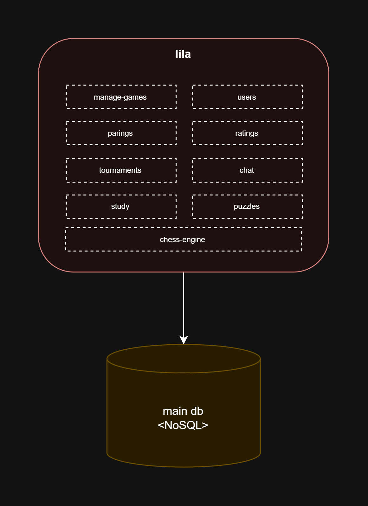
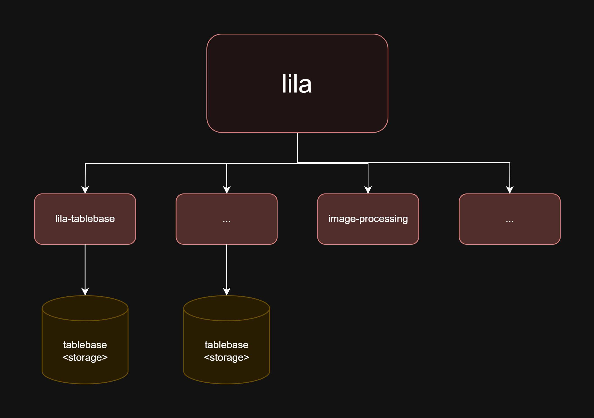
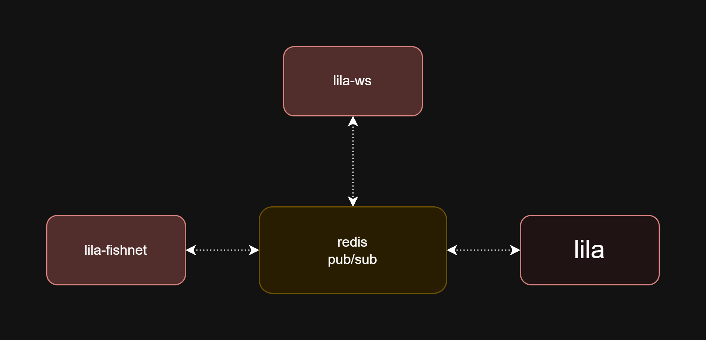
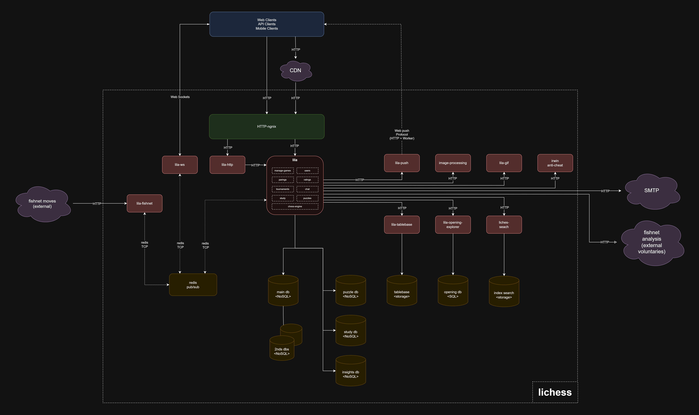

# Laboratory 1 - Architectural Design

## Student
Santiago Suárez

## Project
[Lichess](https://github.com/lichess-org/lila)

## Architecture Overview

## Architectural Style
Lichess follows a service-oriented architecture with loosely coupled components. It mixes monolithic and service-based elements...

### Monolith Architecture Style

### Service Oriented Architecture Style

### Event Driven Architecture Style

## C&C View Diagram

### Component Descriptions
- **Frontend**: Vue.js app served by Play Framework
- **API Gateway**: Entry point handling client-server communication
- **Game Service**: Handles chess logic and real-time updates...
- **Database**: MongoDB for games, Redis for sessions...
