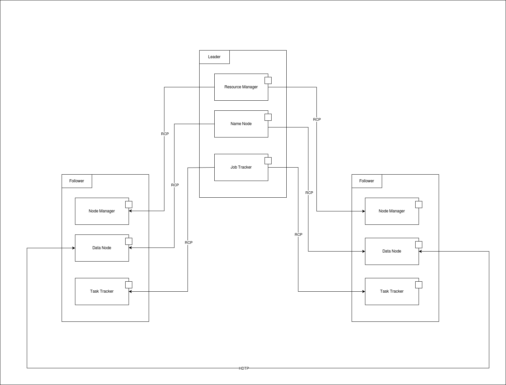

# Laboratory 1 - Design
#### Daniel Estivenson Dorado Lame

### Hadoop
[Hadoop](https://github.com/apache/hadoop) is a framework that allows for the distributed processing of large data sets across clusters of computers using simple programming models. It is designed to scale up from single servers to thousands of machines, each offering local computation and storage. Rather than rely on hardware to deliver high-availability, the library itself is designed to detect and handle failures at the application layer, so delivering a highly-available service on top of a cluster of computers, each of which may be prone to failures.

#### Component & Connector view

This is a simplified **component & connector view**. This diagram shows a *Leader* node connected to two *Follower* nodes. All the communication is done through **Remote Procedure Call (RPC)** except for *DataNode* to *DataNode* where **Hadoop Data Transfer Protocol (HDTP)** is use.

When a secondary *Leader* exists in the system, **HTTP(S)** is use to replicate all metadata and state from primary *Leader* node to secondary one. Since I want to keep this diagram simple, this scenario was not represented in the diagram but can be easily integrated just with a *Leader* node replica and direct connections between components using **HTTP(S)** as I mention above.

#### Architectural Style
Hadoop follows a **distributed architecture** based on the **Leader/Follower** pattern.  Also could be described as a **Layered Architecture** system since is organized by some functional levels.

#### Components description
- **Hadoop Distributed File System (HDFS)**, designed to store large data volumes in a scalable and fail-tolerant way. It's compose by two elements in the architecture:
	1. *NameNode(Leader)*: Manages the file system structure (metadata). Stores information about data blocks location, not data.
	2. *DataNode(Follower)*: Stores physical data blocks and reports status periodically to *NameNode*. Also can serve these data directly via HDTP over TCP.

- **Yet Another Resource Negotiator(YARN)**, the resource manager for hadoop. Separates the processing logic from the storage logic. It's compose by two elements in the architecture:
	1. *ResourceManager(Leader)*: allocates resources in the cluster for tasks, as well as receive execution tasks request and choose the node to run the task.
	2. *NodeManager(Follower)*: manages *containers* where a specific task is run and reports status periodically to *ResourceManager*.

- **MapReduce(v1+)** is a framework to process masive data in parallel. For Hadoop v1+ this module has specific components.
	1. *JobTracker(Leader)*: Receives and manages all the *MapReduce* requests. Divide those tasks in *Map* and *Reduce* tasks. Assigns those tasks to *TaskTrackers* nodes. Supervise all tasks status and retries the failed ones.
	2. *TaskTracker(Follower)*: Receives the *Map* and *Reduce* tasks from the *JobTracker*. Execute those tasks in the local node and send information periodically to *JobTracker*.
	
 - **MapReduce(v2+)** since Hadoop v2+ is run over *YARN*.
 	1. *ApplicationMaster(Leader)*: It's created with each *MapReduce* request to coordinate all the *Map* and *Reduce* tasks across all the containers.
 	2. *Containers(Follower)*: all *Map* and *Reduce* tasks uses the *containers* through the *NodeManager*, that's why this *MapReduce* works over *YARN*.
