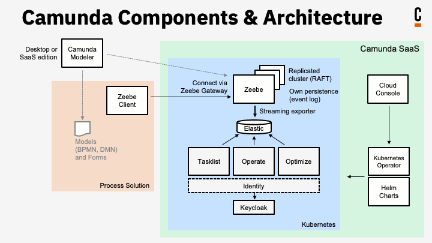

# Laboratorio 1 - Diseño Arquitectónico

**Nombre:** Yilver Alirio Ramírez Ochoa  
**Cédula:** 1015994056  
**Nombre:** Camunda Modeler   
**Sitio oficial:** https://camunda.com/platform/modeler/   
**Repositorio:** [https://github.com/camunda](https://github.com/camunda)   

---

## 1. Introducción

Camunda es una plataforma open source para la automatización de procesos empresariales (Business Process Automation - BPA) que permite orquestar tareas humanas, servicios automatizados, decisiones y flujos de trabajo complejos en entornos distribuidos. Es ampliamente utilizada en industrias financieras, gubernamentales y tecnológicas por su capacidad de coordinar múltiples microservicios mediante BPMN (Business Process Model and Notation).

Camunda es especialmente relevante en el contexto de software a gran escala, ya que su arquitectura es compatible con entornos cloud-native, despliegues en Kubernetes, y la ejecución paralela de procesos y servicios. Esto la convierte en una solución idónea para sistemas empresariales modernos que requieren escalabilidad, flexibilidad y automatización.

---

## 2. Justificación de selección

Camunda fue seleccionada por cumplir con los criterios definidos para sistemas de software a gran escala:

### ✔ Gran número de componentes

Camunda 8 está compuesta por múltiples microservicios especializados: motor de procesos, herramientas de monitoreo, interfaces de usuario, servicios de autenticación, y conectores externos. Cada uno cumple una función específica y puede ser desplegado de forma independiente.

> *Ejemplo:* Zeebe (motor), Operate (monitoreo), Tasklist (gestión de tareas), Optimize (analítica), Gateway (API), Modeler (diseño), Identity (usuarios), entre otros.

### ✔ Gran número de operaciones concurrentes

Camunda está diseñada para orquestar cientos o miles de procesos de negocio simultáneamente, con soporte nativo para entornos distribuidos y procesamiento paralelo.

> *Ejemplo:* Un sistema bancario puede manejar miles de solicitudes de crédito en paralelo, cada una con validaciones, integraciones y decisiones automáticas.

### ✔ Gran volumen de datos

La plataforma genera, procesa y almacena grandes volúmenes de eventos, logs de procesos, métricas de rendimiento, trazas y datos históricos para análisis y auditoría.

> *Ejemplo:* Optimize consulta y analiza millones de eventos para generar reportes de rendimiento en tiempo real.

### ✔ Integración con estructuras complejas

Aunque Camunda es principalmente software, interactúa con sistemas físicos a través de APIs o colas de eventos. Por ejemplo, puede integrarse con sensores, terminales de punto de venta o sistemas de logística.

> *Ejemplo:* En una empresa de transporte, Camunda puede orquestar procesos que incluyen rastreo GPS, sensores de carga, y notificaciones físicas a operadores.

---

## 3. Estilo arquitectónico predominante

Camunda 8 adopta una **arquitectura basada en microservicios**, compuesta por servicios independientes que se comunican entre sí usando mecanismos asíncronos (Kafka, gRPC) y síncronos (REST). Sus componentes están desacoplados, lo que facilita la escalabilidad horizontal y la tolerancia a fallos.

Los patrones arquitectónicos clave incluyen:

- **Microservicios**: cada funcionalidad crítica está desacoplada como servicio.
- **Event-Driven Architecture (EDA)**: comunicación basada en eventos con Kafka.
- **Backend for Frontend (BFF)**: para interfaces como Tasklist.
- **CQRS (Command Query Responsibility Segregation)**: separación entre orquestación y consulta.

---

## 4. Overview de elementos arquitectónicos

- El sistema sigue el estilo arquitectónico de microservicios.
- El usuario interactúa con Tasklist a través de HTTPS (web frontend).
- Tasklist se comunica con el Gateway mediante REST/gRPC.
- Gateway actúa como punto de entrada para todos los servicios backend.
- Un balanceador de carga distribuye el tráfico entre múltiples instancias de Zeebe.
- Los principales microservicios son:
  - **Zeebe**: motor de procesos distribuidos.
  - **Operate**: visualización y trazabilidad.
  - **Optimize**: análisis de rendimiento.
  - **Tasklist**: interfaz de tareas humanas.
  - **Identity**: gestión de autenticación y permisos.
- Cada servicio tiene su propia base de datos o almacén de datos (por ejemplo, ElasticSearch).
- ElasticSearch centraliza la información de procesos para consultas por parte de Operate y Optimize.
- Kafka permite la comunicación asíncrona entre Camunda y otros sistemas empresariales.
- El Modeler permite a los usuarios diseñar flujos BPMN y desplegarlos en el motor.

---

## 5. Componentes y Conectores (C&C View)

| Tipo        | Nombre         | Rol dentro del sistema                                         | Interacciones principales                                 |
|-------------|----------------|----------------------------------------------------------------|------------------------------------------------------------|
| Componente  | Zeebe Engine   | Orquestación de procesos BPMN distribuidos                    | Recibe procesos del Gateway y publica eventos              |
| Componente  | Operate        | Visualización del estado y trazabilidad de procesos           | Se conecta a ElasticSearch para obtener métricas           |
| Componente  | Tasklist       | Interfaz de usuario para gestionar tareas humanas             | Consulta procesos vía REST y Zeebe                         |
| Componente  | Optimize       | Analítica de rendimiento y reportes de procesos               | Obtiene información desde ElasticSearch                    |
| Componente  | Modeler        | Editor visual de diagramas BPMN y DMN                         | Exporta modelos al Gateway o archivo                       |
| Componente  | ElasticSearch  | Almacén indexado para procesos y métricas                     | Accedido por Operate, Optimize y Tasklist                  |
| Componente  | Identity       | Gestión de usuarios, autenticación y permisos                 | Conecta con Tasklist y Operate                             |
| Componente  | Gateway API    | Entrada de comandos y consultas externas                      | Exposición vía gRPC/REST a otros sistemas                  |
| Conector    | gRPC           | Comunicación entre Zeebe, Gateway y microservicios            | Gateway ↔ Zeebe, Task Workers                              |
| Conector    | REST           | API pública para integraciones externas                       | Frontend ↔ Gateway, Operate ↔ Tasklist                     |
| Conector    | Kafka          | Comunicación asíncrona con otros sistemas empresariales       | Zeebe ↔ Microservicios externos                            |

---

## 6. Diagrama de arquitectura (C&C View)

A continuación, se presenta una vista general del modelo Componentes y Conectores de Camunda 8:

  
*Fuente: [camunda.com](https://camunda.com/blog/2023/03/running-camunda-8-on-openshift/)*

---

## 7. Conclusiones

Camunda representa un excelente caso de estudio de arquitectura de microservicios aplicada a la automatización de procesos empresariales. Su diseño desacoplado, basado en componentes escalables, APIs bien definidas y soporte para entornos distribuidos, le permite coordinar sistemas complejos en tiempo real.

### Ventajas arquitectónicas clave:

- **Escalabilidad**: cada componente puede escalar horizontalmente de forma independiente.
- **Desacoplamiento**: los servicios están separados por contratos (APIs y eventos).
- **Observabilidad**: Operate y Optimize ofrecen trazabilidad completa de procesos.
- **Portabilidad**: compatible con múltiples entornos (on-premise, cloud, Kubernetes).
- **Extensibilidad**: puede integrarse con cualquier lenguaje o plataforma vía API o eventos.

Camunda no solo cumple con los requisitos de un sistema a gran escala, sino que también es una herramienta clave en entornos donde la orquestación, la automatización y la adaptabilidad son fundamentales.

---
