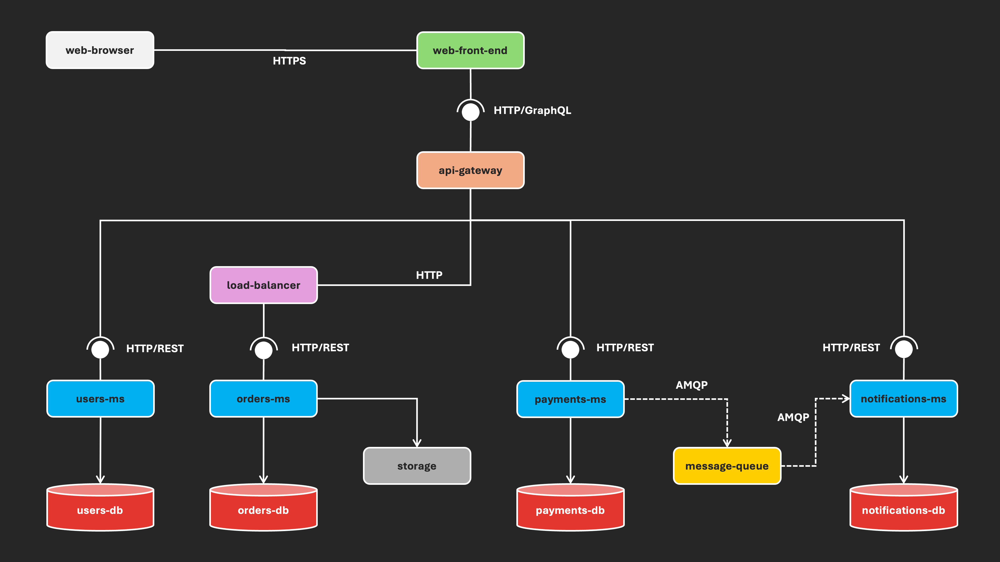

# Laboratorio 1 - Diseño Arquitectónico - Análisis ERPNext

**Nombre del estudiante**: Yilver Alirio Ramírez Ochoa  
**Número de documento**: 1015994056  

---

## 1. Introducción

La arquitectura de software es un aspecto crítico en el diseño y mantenimiento de sistemas de software a gran escala. Un análisis arquitectónico permite entender cómo se estructuran los componentes de un sistema, cómo interactúan entre ellos y qué estilo arquitectónico sigue la solución. En el contexto de proyectos open source, este análisis se vuelve aún más valioso, ya que permite comprender el diseño de sistemas colaborativos, complejos y altamente reutilizables.

ERPNext es un sistema ERP (Enterprise Resource Planning) open source que facilita la gestión de múltiples procesos empresariales como contabilidad, inventarios, recursos humanos, ventas y manufactura. Debido a su complejidad, modularidad y base tecnológica, ERPNext es un excelente caso de estudio para realizar un análisis arquitectónico con enfoque en Componentes y Conectores (C&C).

---

## 2. Justificación de la selección del proyecto

ERPNext es un sistema ERP de código abierto altamente modular y escalable que permite a las empresas administrar todos sus procesos desde una única plataforma.

### 쯇or qué es software a gran escala?

- **Número de componentes**: ERPNext está compuesto por múltiples módulos funcionales (ventas, compras, contabilidad, recursos humanos, manufactura, etc.) y servicios asociados como backend, frontend, cola de eventos, búsqueda, etc.
- **Alta concurrencia**: Soporta múltiples usuarios concurrentes mediante workers y colas de trabajo en segundo plano.
- **Procesamiento de datos a gran escala**: Maneja grandes volúmenes de información financiera, transaccional y de inventario.
- **Complejidad estructural**: Implementa arquitectura de microservicios y servicios desacoplados, como Redis, Celery, MariaDB, ElasticSearch, etc.

### Información del proyecto:

- **Repositorio GitHub**: [https://github.com/frappe/erpnext](https://github.com/frappe/erpnext)  
- **Sitio web oficial**: [https://erpnext.com](https://erpnext.com)

---

## 3. Análisis de la arquitectura

### a. Estilo arquitectónico

El estilo arquitectónico de ERPNext es una **combinación de microservicios y arquitectura modular monolítica** (modular monolith). Si bien algunos servicios están desacoplados (como workers para tareas asíncronas), la mayoría de la lógica de negocios reside en módulos bien organizados dentro del framework **Frappe**, que sirve como backend extensible para ERPNext.

Características clave:

- **Microservicios internos y desacoplados**: como Celery workers, Redis, y servicio de búsqueda.
- **Frontend separado**: construido con JavaScript y renderizado desde el backend de Frappe.
- **Colas y procesamiento asíncrono**: mediante Redis + Celery.
- **Base de datos centralizada**: MariaDB.

---

### b. Representación de Componentes y Conectores (C&C View)

#### 📌 Descripción general del sistema

ERPNext funciona como una plataforma integrada, en la que el backend está basado en Python (Frappe Framework) y sirve diferentes módulos funcionales. El sistema se comunica con una base de datos relacional (MariaDB), utiliza Redis para colas y caching, y gestiona tareas en segundo plano mediante Celery. Además, el frontend se comunica con el backend a través de HTTPS y WebSockets.

---

### 🧩 Tabla de Componentes y Conectores

| Tipo       | Nombre            | Rol dentro del sistema                                   | Interacciones principales                                    |
|------------|-------------------|-----------------------------------------------------------|---------------------------------------------------------------|
| Componente | Frappe Backend    | Núcleo del sistema; gestiona reglas de negocio y API     | Se comunica con frontend, MariaDB, Redis y Workers            |
| Componente | ERPNext Modules   | Módulos funcionales (ventas, compras, contabilidad, etc.)| Se ejecutan dentro del backend de Frappe                      |
| Componente | Frontend Web      | Interfaz de usuario (HTML/JS)                            | Peticiones al backend por HTTPS y WebSockets                  |
| Componente | MariaDB           | Base de datos relacional principal                       | Consultas y almacenamiento desde Frappe backend               |
| Componente | Redis             | Cache y broker de colas                                  | Usado por Frappe y Celery workers                             |
| Componente | Celery Workers    | Procesamiento asíncrono de tareas                         | Consume tareas desde Redis; comunica resultados al backend    |
| Componente | Elasticsearch (opcional) | Motor de búsqueda para texto libre               | Indexa datos del sistema para mejorar la búsqueda             |
| Conector   | HTTPS             | Protocolo seguro de comunicación                         | Navegador <--> Backend                                        |
| Conector   | WebSocket         | Comunicación en tiempo real para notificaciones          | Backend <--> Frontend                                         |
| Conector   | SQL               | Lenguaje de consulta estructurado                        | Backend <--> Base de datos MariaDB                            |
| Conector   | AMQP (Redis)      | Sistema de colas para tareas                             | Backend <--> Workers                                          |

---

## 🔗 Recursos

- **Repositorio GitHub**: [https://github.com/frappe/erpnext](https://github.com/frappe/erpnext)  
- **Sitio oficial del proyecto**: [https://erpnext.com](https://erpnext.com)  
- **Documentación técnica**: [https://frappeframework.com/docs](https://frappeframework.com/docs)  
- **Arquitectura visual (referencia)**:  
  

---

> 📌 Este informe fue elaborado como parte del análisis arquitectónico solicitado en la Guía de Laboratorio 1 del curso **LSSA_2025i**.
