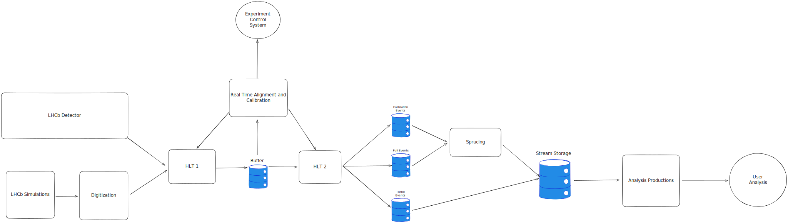

# Laboratory 1 - Architectural Design at LHCb

Large Scale Software Architecture

UNAL - 2025 i

## Student

**Name:** Juan Bernardo Benavides Rubio

**Document:** 1019142922

## Project

The [LHCb](https://home.cern/science/experiments/lhcb) is one of the four main detectors at the LHC (Large Hadron Collider). It's main goal is to study the CP violation and other rare phenomena in beauty hadron decays.

In order to accomplish this goal, LHCb needs to process, filter and analyze the data of around 40 Million collisions read by the detector every second. In this document I'll do a high level overview of the architecture that supports operations of this experiment.

Links:

- [LHCb's Gitlab](https://gitlab.cern.ch/lhcb)
- [Gaudi](https://gitlab.cern.ch/lhcb/Gaudi)
- [Moore](https://gitlab.cern.ch/lhcb/Moore)
- [Allen](https://gitlab.cern.ch/lhcb/Allen)
- [Gauss](https://gitlab.cern.ch/lhcb/Gauss)
- [DaVinci](https://gitlab.cern.ch/lhcb/DaVinci)

## Architecture Overview

## Architectural Style

## C&C View Diagram

The following component-and-connector (C&C) diagram provides a high-level structure of the system's architecture.

## Elements Descriptions

### Components

## References

