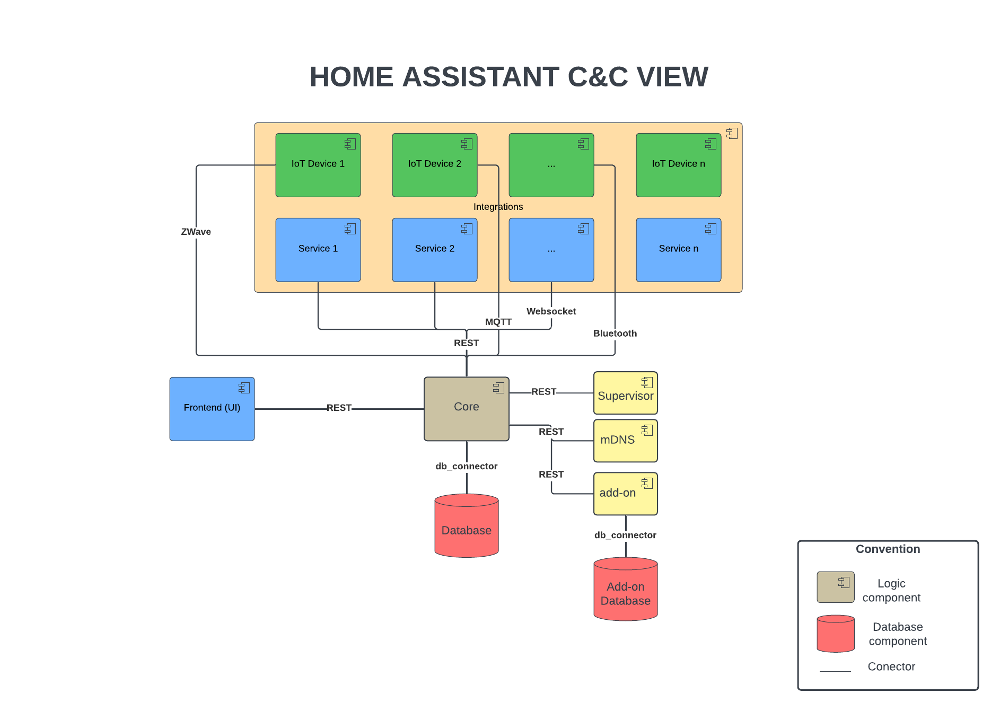

# Home Assistant
## 1. Author
Lucas Peña Salas

CC: 1019147265

## 2. What is Home Assistant?
Home Assistant is a free and open-source software used for home automation. It can be used as an integration platform and smart home hub, allowing user to control multiple types of smart home devices.

Home Assistant software is commonly run on a machine running "Home Assistant Operatin System", this machine acts as the central control system controlling IoT devices, software, applications and services from third-parties, as long as they provide access via an open API or an MQTT interface. It includes native integration for wireless or wired communication protocols such as Bluetooth, Wi-Fi, Z-Wave, Zigbee among others.

## 3. Architecture
Home Assistant architecure is component-based and event-driven.

- **Event-Driven State Machine:** All entities and devices operate based on events, and changes are recorded in a centralized state machine.
- **Component Modularity:** Each device or service is a self-contained component, allowing flexible expansion and integration withouth affecting the core system.
- **Reactive Automations:** Automations are triggered by event changes and can operate on real-world inputs, such as sensors or user actions.
- **Asynchronous I/O:** The system is designed to handle multiple tasks concurrently, allowing for efficient resource utilization and responsiveness.
- **Cyber-Physical Systems:** Home Assistant integrates with various physical devices, sensors, and actuators, creating a bridge between the digital and physical worlds.

## 4. C&C View

- **Core:** Handles the main functionalities of Home Assistant, including the event bus, state machine, and core services. Also runs the main I/O loop and coordinates the execution of components and automations.
- **Integrations:** Includes all the components (IoT devices, services, and platforms) that Home Assistant can interact with. Each integration can communicate with external APIs or hardware to synchronize data and fire events. These integrations communicate with the Core through diffferent protocols, such as REST API, MQTT, WebSockets, etc.
- **Frontend:** The user interface of Home Assistant, which allows users to interact with the system, view data, and control devices. It communicates with the core through REST API.
- **Supervisor:** Manages the Home Assistant runtime environment, including updates, backups, and add-ons. 
- **mDNS:** Is used for service discovery, allowing Home Assistant to automatically find and connect to devices on the local network. 
- **Add-ons:** Optional components that extend the functionality of Home Assistant. They can be used to run additional services or applications alongside Home Assistant, such as databases, web servers, or custom integrations.
- **Database:** Stores the state of all entities and devices, as well as historical data for automations and analytics. Home Assistant uses SQLite by default, but it can be configured to use other databases like MySQL or PostgreSQL.