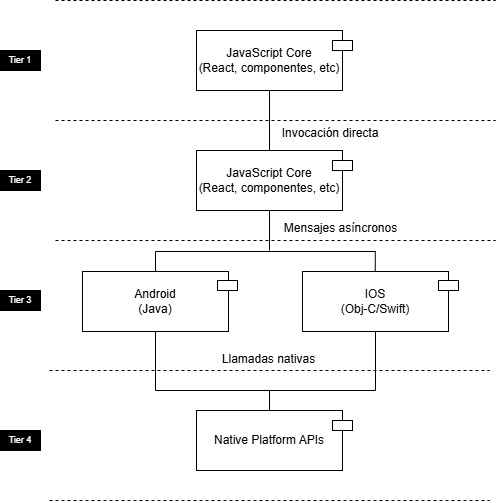
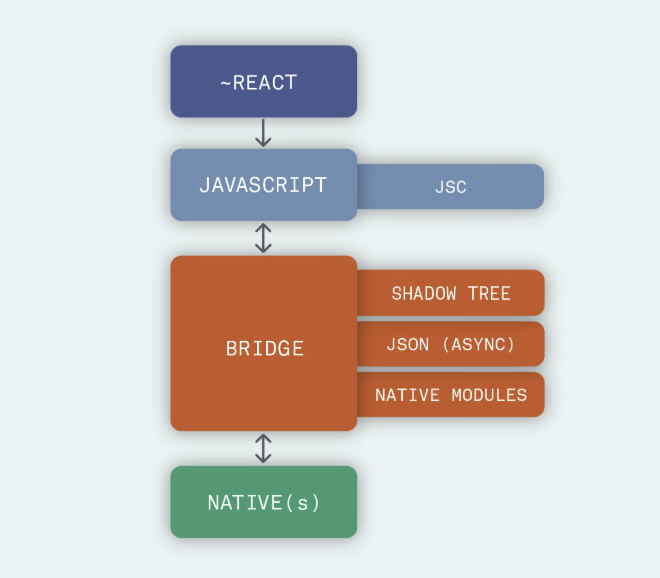

# [LSSA_2025i] - U2 - Laboratorio 1
**Nombre:** Juan Sebastián Alcina Rodríguez
**Nombre del proyecto:** Facebook - react-native
**URL del repositorio:** https://github.com/facebook/react-native

## Descripción
React Native es un framework de desarrollo de aplicaciones móviles. Es un proyecto open source desarrollado por Meta. Permite construir aplicaciones nativas para IOS y Android usando JavaScript y React.

He decidido seleccionar este proyecto porque cumple con la característica de contar con un gran número de componentes. Si bien React Native permite el desarrollo de aplicaciones capaces de manejar un alto grado de concurrencia, gestionar grandes volúmenes de datos e integrarse con sistemas ciberfísicos, estas características no pueden analizarse directamente a partir de su repositorio open-source. Por ello, resulta más pertinente enfocarse en su complejidad modular y en la amplitud de componentes que lo conforman.

## Análisis arquitectónico
### **Estructura del repositorio**
El repositorio está organizado de la siguiente manera:

- **packages/:** Contiene paquetes y módulos adicionales que extienden las funcionalidades de React Native.
- **scripts/:**  Incluye scripts utilizados para tareas de desarrollo, construcción y otros procesos automatizados relacionados con el mantenimiento del proyecto.
- **template/:** Proporciona una plantilla básica para iniciar nuevos proyectos de React Native, facilitando la configuración inicial.
- **website/:** Contiene los archivos relacionados con la documentación y el sitio web oficial de React Native.

### **Estilo Arquitectónico**
React Native no utiliza un estilo de arquitectura único, sin embargo, el estilo más predominante es el estilo de **arquitectura modular*. En la estructura del respositorio en la rama main se evidencia la modularidad en la carpeta "packages/", en esta carpeta se encapsulan funcionalidades independientes en módulos reutilizables. Cada módulo puede ser mantenido, probado y desplegado de forma independiente.

Adicionalmente, React Native se apoya en una **arquitectura en capas**. En el repositorio encontramos la siguiente estructura de carpetas:

- **template/:** capa de inicio/configuración de proyectos.
- **scripts/:** capa de automatización y soporte.
- **packages/:** núcleo funcional extensible.
- **website/:** interfaz de documentación.

React Native no utiliza una arquitectura de microservicios porque no distribuye múltiples servicios desplegados de manera independiente y no es un sistema distribuido que depende de múltiples nodos.

Su arquitectura modular favorece el aislamiento de responsabilidades y permite modificar sus funcionalidades sin afectar el núcleo del sistema.

### **Diagrama de Componentes y Conectores**

El diagrama de componentes y conectores se representa por medio de los siguientes componentes:

- **JavaScript Core:** Es el componente donde vive la lógica de negocio, construida con React y JavaScript.
- **Bridge Layer:** Un componente clave que permite que el código JS se comunique con los módulos nativos mediante serialización y mensajes asíncronos.
- **Android / iOS:** Los motores nativos que interpretan las instrucciones del puente para generar interfaces y acceder a funcionalidades del dispositivo.
- **Native APIs:** Conectan con funcionalidades del sistema como la cámara, el GPS, la red, etc.

Estos componentes están relacionados entre si por medio de los siguientes conectores:

- **Invocación directa:** funciones normales entre componentes JS.
- **Mensajes asincrónicos:** comunicación a través del Bridge, entre JS y el código nativo.
- **Eventos / callbacks:** el nativo puede emitir eventos que JS escucha.
- **Llamadas nativas:** invocación directa a APIs del sistema operativo.

El diagrama inicia en el **núcleo de JavaScript**, donde reside la lógica de la aplicación escrita en React. Desde aquí los componentes definen interfaces y comportamientos que son interpretados y ejecutados por el entorno JavaScript. Cuando una funcionalidad requiere interacción con capacidades del sistema operativo, se realiza una comunicación a través del **Bridge**, que esun canal asincrónico que serializa y transfiere datos entre el hilo JavaScript y el entorno nativo. Este bridge conecta con los módulos nativos específicos de cada plataforma (Android o iOS), los cuales, a su vez, hacen llamadas directas a las APIs del sistema operativo para ejecutar las operaciones solicitadas.

El diagrama de arquitectura de React Native también se representa de la siguiente manera en la documentación que encontré en la busqueda de internet:

## Referencias

- [React Native Architecture 1] (https://reactnative.dev/architecture/landing-page)
- [React Native Communication] (https://reactnative.dev/docs/communication-ios)
- [React Native Architecture 2] (https://medium.com/%40antoniogally/exploring-react-natives-architectures-bridge-and-beyond-76e414accf7d)
- [React Native Architecture 3] (https://dev.to/goodpic/understanding-react-native-architecture-22hh)
- [React Native Bridge] https://www.reactnativecrossroads.com/posts/react-native-bridge-part-1
