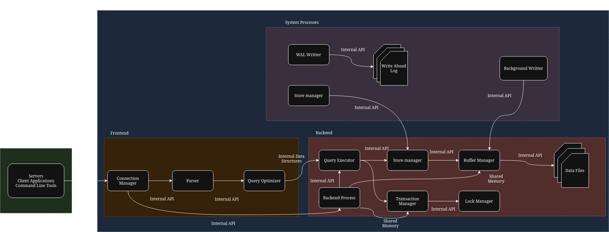

# [LSSA_2025i] - Laboratory 1 - Design

---
## Large-Scale Software Architecture - PostgreSQL Case Study

Name: Santiago Restrepo

Citizenship ID:  1021665025

Course: Large-Scale Software Architecture

Date: April 5, 2025

---
## 1. Motivation 

The world of software development is constantly evolving, and as applications grow in complexity and scale, we face numerous challenges. Building systems that are reliable, efficient, and can adapt to changing needs requires a solid understanding of fundamental principles.

Imagine constructing a large building. You wouldn't just start laying bricks without a detailed plan. Similarly, in software, **architecture** acts as the blueprint. It defines the structure of the system, its components, and how they interact. A well-thought software architecture helps manage complexity, promotes collaboration among developers, and ensures the system can meet its performance, security, and scalability requirements. It provides a roadmap for development and evolution.

Now, consider the way software is built and shared. **Open Source** represents a paradigm where the source code of software is made freely available for anyone to view, use, modify, and distribute. This approach fosters a collaborative environment where developers from around the globe can contribute to a project, leading to faster innovation, increased transparency, and the creation of robust and widely adopted solutions. By sharing knowledge and code, the open-source community collectively tackles complex problems and drives technological advancement.

At the heart of many software applications lies the need to manage and organize information effectively. This is where **databases** come into play. A database is essentially a structured collection of data that is organized for efficient access and management. In today's data-driven world, databases are crucial for storing, retrieving, and manipulating the vast amounts of information that power our applications. They provide mechanisms to ensure data integrity, security, and efficient querying, enabling applications to function reliably and provide valuable insights.

These three concepts: robust software architecture, the collaborative power of open source, and efficient database management, are not isolated entities. They are deeply interconnected and play vital roles in addressing the challenges of building and maintaining large-scale software systems. **To better understand how these principles are applied in a real-world, large-scale project, we will now delve into the architectural case study of PostgreSQL, a renowned open source relational database.**

## 2. Case Study - PostgreSQL

PostgreSQL is a powerful, open source relational database management system (RDBMS) known for its reliability, feature robustness, and extensibility.

**A Brief History:**

PostgreSQL has a rich history rooted in the Ingres project at the University of California, Berkeley. The Ingres project, led by Michael Stonebraker, was a pioneering effort in relational database technology in the 1970s. In the mid-1980s, Stonebraker initiated a successor project called Postgres. After several years of development and releases, Postgres evolved and, in 1996, was renamed PostgreSQL to reflect its support for SQL and its lineage from the original Postgres. Since then, it has continued to be developed and maintained by a global community of contributors, becoming one of the most popular and advanced opensource database systems available today.

### 2.1. Architectural Analysis

#### Identify the architectural style of the selected project.

When we delve into the architecture of PostgreSQL, we find a system primarily based on the **client-server model**. This fundamental model allows multiple client applications to connect and interact with a single server instance, enabling centralized data management and access. However, to fully understand PostgreSQL's design, we need to recognize that it also incorporates other architectural characteristics that contribute to its robustness and scalability.

While deployed as a single unit, PostgreSQL exhibits a **monolithic architecture** with a significant degree of **modular design**. Internally, the server is composed of numerous interconnected modules, each responsible for specific functionalities. This modularity, as evidenced by components like the Connection Manager, Parser, Query Optimizer, and Storage Manager, allows for better organization of the codebase, easier maintenance, and the ability to extend the system's capabilities.

To handle the demands of concurrent usage, PostgreSQL employs a **process-based architecture**. Instead of relying solely on threads within a single process, it spawns a new, independent backend process for each client connection. This approach provides better isolation between connections, enhancing stability and preventing issues in one session from affecting others. The operating system manages these processes, allowing for parallel execution and efficient utilization of system resources.

Furthermore, we can observe elements of a **layered architecture** within PostgreSQL. The system can be conceptually divided into layers, each with distinct responsibilities. The frontend layer handles client communication and query processing up to the optimization stage. The backend layer is responsible for query execution, transaction management, and interacting with the storage layer. The storage layer, in turn, manages the physical storage of data on disk and in memory. This layering helps to abstract complexities and promotes a separation of concerns within the system.

Finally, while not a core architectural style of the base server, PostgreSQL's design strongly emphasizes **extensibility**. Through features like extensions and foreign data wrappers, the system can be adapted and integrated with other systems and data sources. This allows PostgreSQL to be a versatile component in various architectural landscapes, even those that might incorporate distributed elements.

In summary, PostgreSQL leverages a combination of architectural styles to achieve its functionality and performance:

| Architectural Style          | Purpose                                                                                                                               |
| :--------------------------- | :------------------------------------------------------------------------------------------------------------------------------------ |
| Client-Server                | Enables multiple clients to interact with a central database server.                                                              |
| Monolithic (with Modularity) | Provides a cohesive system while allowing for organized development and maintenance of distinct functionalities.                      |
| Process-Based                | Facilitates concurrent handling of multiple client connections with better isolation and stability.                                 |
| Layered                      | Organizes the system into logical tiers with specific responsibilities, promoting separation of concerns and managing complexity. |
| Extensible                   | Allows for the addition of new features and integration with other systems and data sources.                                        |

#### Extract, represent and describe the architecture.

For instance, when a client sends a query, it first reaches the **Connection Manager**, which handles the initial connection. The query is then passed to the **Parser**, responsible for understanding the SQL syntax. Following this, the **Query Optimizer** steps in to devise the most efficient way to execute the query. The actual execution is handled by the **Query Executor**, which interacts with the **Storage Manager** to retrieve or modify data on disk. To enhance performance, PostgreSQL utilizes a **Buffer Manager** to cache frequently accessed data in memory.

Ensuring the integrity and reliability of data is paramount, and PostgreSQL achieves this through its **Transaction Manager** and **Lock Manager**, which handle concurrent access and guarantee ACID properties. A crucial aspect of its design is the use of **Write-Ahead Logging (WAL)**, a mechanism that ensures data durability and recoverability in case of system failures. These architectural choices contribute to PostgreSQL's reputation for stability and data integrity.

PostgreSQL stands out as an excellent case study for large-scale software architecture for several reasons. Its internal structure is composed of a **large number of interacting modules**, demonstrating how complex functionalities can be organized within a cohesive system. Furthermore, it is engineered to handle and manage **very large volumes of data** efficiently, making it suitable for demanding applications. Finally, its **open source nature**, with a vibrant and active global community driving its development, showcases the power of collaborative software engineering.

#### Graphical representation illustrating components and their interactions (C&C view):

Now that we have a visual representation of the key components and their connections, let's delve into a detailed description of each element and the methods they use to communicate with one another.

* **Description of architecture elements:**

    * **Client Application:** This represents any external software that needs to interact with the PostgreSQL database. Examples include web applications, desktop tools, and mobile apps. Communication between the Client Application and the **Connection Manager** on the PostgreSQL Server occurs via the **TCP/IP** protocol, a standard networking protocol for establishing connections and exchanging data over a network.

    * **Connection Manager (Frontend):** As the entry point, the Connection Manager listens for incoming connection requests via **TCP/IP**. Upon successful authentication, it spawns a dedicated **Backend Process (Backend - BE)** for the client. Internally, the Connection Manager uses **Internal APIs** (a set of internal functions and procedures) to interact with other frontend components like the **Parser**. It also uses **TCP/IP** to establish the initial link with the Backend Process.

    * **Backend Process (Backend):** This process handles all subsequent communication with a specific client. It receives queries from the client via the established **TCP/IP** connection. Internally, it communicates with various other components:
        * With the **Buffer Manager** and **Transaction Manager**, it uses **Shared Memory**, a mechanism for fast inter-process communication within the same server.
        * With the **Query Optimizer**, **Query Executor**, and **Transaction Manager**, it uses **Internal APIs** to pass control and data.

    * **Parser (Frontend):** The Parser analyzes the query's syntax and structure. It communicates the resulting parse tree to the **Query Optimizer** using **Internal Data Structures**, which are specific data formats used for passing information between internal modules.

    * **Query Optimizer (Frontend):** Receiving the parse tree via **Internal Data Structures**, the Query Optimizer determines the most efficient way to execute the query. It then communicates the chosen execution plan to the **Query Executor** also using **Internal Data Structures**. The **Backend Process** initiates the optimization by calling the Query Optimizer through **Internal API**.

    * **Query Executor (Backend):** The Query Executor takes the execution plan and carries out the necessary operations. It interacts with the **Storage Manager** via **Internal API** to retrieve or store data. It also uses **Internal API** to communicate with the **Transaction Manager** to ensure transactional integrity.

    * **Storage Manager (Backend):** This component manages the physical storage of data in **Data Files**. It communicates with the **Query Executor** and the **Autovacuum** process using **Internal APIs** to perform read and write operations on the data. It also interacts with the **Buffer Manager** via **Internal API** to manage the caching of data blocks.

    * **Buffer Manager (Backend):** The Buffer Manager caches frequently accessed data in memory. It communicates with the **Query Executor**, **Background Writer**, and **Storage Manager** using **Internal APIs** to manage the buffer pool. The **Backend Process** also directly interacts with the Buffer Manager via **Shared Memory** for quick access to cached data.

    * **Data Files (Backend):** These are the files on disk where the actual database data is stored. They are accessed directly by the **Storage Manager** using standard operating system file I/O operations.

    * **Transaction Manager (Backend):** This component ensures the ACID properties of transactions. It communicates with the **Query Executor** and **Lock Manager** via **Internal APIs** to manage the lifecycle and integrity of transactions. The **Backend Process** also communicates with the Transaction Manager using **Shared Memory** for efficient transaction control.

    * **Lock Manager (Backend):** The Lock Manager manages locks on database objects to ensure concurrency control. It is used internally by the **Transaction Manager** through **Internal APIs**.

    * **Background Writer (System Process):** This background process writes dirty buffers from the **Buffer Manager** to disk. It communicates with the Buffer Manager using **Internal API**.

    * **WAL Writer (System Process):** This background process writes transaction log records to the **Write-Ahead Log (WAL)**. It communicates with the WAL subsystem using **Internal API**.

    * **Write-Ahead Log (WAL) (System Process):** This is a set of files on disk that persistently record all database changes. It is written to by the **WAL Writer** and read during recovery.

    * **Autovacuum (System Process):** This background process performs maintenance tasks like reclaiming storage and updating statistics. It communicates with the **Storage Manager** using **Internal API**.

## Conclusion

In this laboratory exercise, we have analyzed the architectural design of PostgreSQL, a prominent large-scale open-source relational database management system. We identified its primary architectural style as client-server, while also recognizing its characteristics as a monolithic application with a modular internal structure, employing a process-based approach for concurrency, and exhibiting a layered architecture.

We explored the key components of PostgreSQL, including the Frontend (Connection Manager, Parser, Query Optimizer), the Backend (Backend Process, Query Executor, Storage Manager, Buffer Manager, Data Files, Transaction Manager, Lock Manager), and System Processes (Background Writer, WAL Writer, Autovacuum). We also examined the communication methods between these components, noting the use of TCP/IP for client-server interaction, Shared Memory for efficient inter-process communication within the server, and Internal APIs and Data Structures for communication between internal modules.

PostgreSQL serves as an excellent case study for understanding the principles of large-scale software architecture due to its complexity, its ability to handle large volumes of data and concurrent operations, and its robust and well-defined internal structure. Its open-source nature further highlights the power of community-driven development in creating reliable and widely adopted software solutions. This analysis provides a foundational understanding of the architectural considerations involved in building and managing complex database systems.

## References

* **The PostgreSQL Project Official Website:** [https://www.postgresql.org/](https://www.postgresql.org/)
* **PostgreSQL Official Repository:** [https://github.com/postgres/postgres](https://github.com/postgres/postgres)
* PostgreSQL Global Development Group. "A Brief History of PostgreSQL." *PostgreSQL Official Documentation*. Available at: https://www.postgresql.org/docs/current/history.html
* Wikipedia Contributors. "PostgreSQL." *Wikipedia*. Last updated August 25, 2001. Available at: https://en.wikipedia.org/wiki/PostgreSQL
* GeeksforGeeks. "PostgreSQL – System Architecture." *GeeksforGeeks*. Last updated August 21, 2024. Available at: https://www.geeksforgeeks.org/postgresql-system-architecture/
* Schönig, Hans-Jürgen. *Mastering PostgreSQL*. CYBERTEC PostgreSQL International GmbH, multiple editions (PostgreSQL 10–17). Available at: https://www.cybertec-postgresql.com/en/postgresql-books/
