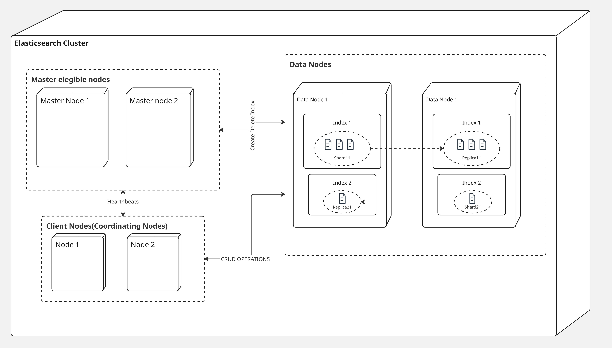

  

# 1. Full name

Cristian Camilo Triana García

  

# 2. URL of the selected open source project repository.

[https://github.com/elastic/elasticsearch](https://github.com/elastic/elasticsearch)

  

# 3. Structured representation of the architecture

  
  

## 3.1. Graphical representation illustrating components and their interactions (C&C view)

  

  

## 3.2. Description of architecture

  

Elasticsearch sigue un estilo arquitectónico de **arquitectura distribuida.**

Está basado en un diseño por cluster, en donde los nodos interactúan entre sí con el fin de formar un sistema de almacenamiento, indexación y queries.

Tiene los siguientes componentes:

| Componente    | Descripción                                                                                                                                                                                                                                                   |
| ------------- | ------------------------------------------------------------------------------------------------------------------------------------------------------------------------------------------------------------------------------------------------------------- |
| Cluster       | Un grupo de nodos que se interconecta con el fin de brindar el servicio de almacenamiento, indexado y queries. Los clusters aseguran una alta disponibilidad y tolerancia al fallo.                                                                        |
| Nodo          | Una instancia de elasticsearch, puede ser un nodo maestro, un nodo de datos o un nodo coordinador(O cliente), entre otros. Los nodos ayudan a                                                                                                              |
| Shard         | Un subconjunto de índice, encargado de distribuir los datos por los diferentes nodos. Su fin es lograr el escalado horizontal y mejorar el rendimiento por medio de un procesamiento paralelo.                                                                |
| Replica Shard | Copias de un shard primario, con el fin de asegurar redundancia y alta disponibilidad.                                                                                                                                                                        |
| Index         | Una colección de documentos que comparten características en común, análogo a una base de datos en sistemas relacionales. Cada índice tiene su propio nombre, el cual se referencia para operaciones CRUD. Los índices se dividen en Shards y Replicas. |
| Document      | La unidad básica de información a ser indexada. Se almacenan en formato JSON                                                                                                                                                                                  |

## Ventajas del estilo arquitectónico

### Escalado Horizontal
Este estilo arquitectónico permite una escalada horizontal sencilla, ya que añadiendo más nodos al cluster se pueden manejar datasets más grandes.

### Fragmentación y Replicas Automáticas
Los datos se dividen automáticamente en shards  y se replican a través de los nodos, asegurando tolerancia al fallo y redundancia de los datos.

### Alta Disponibilidad
El cluster puede continuar funcionando cuando algún nodo falla, gracias a que los datos están replicados.

### Accesibilidad
Elasticsearch expone una RESTful API por medio del protocolo HTTP, que soporta operaciones CRUD usando los métodos HTTP estándar(POST, PUT, GET, DELETE).
Además permite un poderoso DSL (Domain Specific Language) para construir queries complejas utilizando sintaxis JSON.

### Diseño Libre de Esquema
Esto permite que sea un sistema flexible, gracias al mapeado dinámico, el esquema puede ser inferido de los datos que son indexados.
Se acomoda fácilmente a los cambios en la estructura de los datos, sin necesidad de migraciones complejas.

