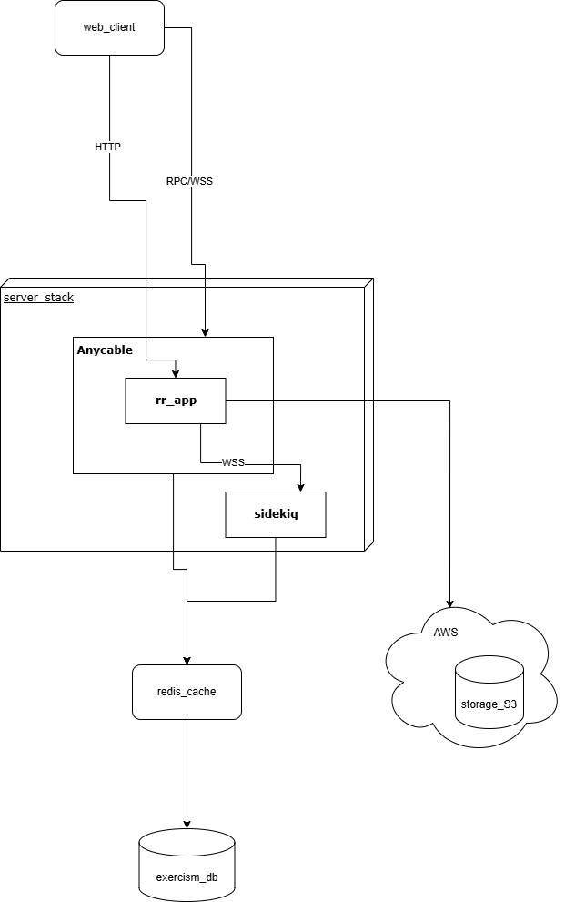

# Architectural view

## Open-source project details:

- **Name:** Exercism  
- **Web site:** [https://exercism.org//](https://exercism.org/)  
- **Repo:** [https://github.com/exercism/website](https://github.com/exercism/website)

## Description:

Exercism is an open-source web application dedicated to provide open community-created learning content like courses and exercises.

Most of the web-related componentes are self-contained within same stack, hence the application to be considered of a  **Monolithic style architecture**. 

## Architecture representation diagram:

The web application is a Ruby-on-rails-based application with the following architectural main caracteristics:

- **Ruby-on-rails application:** Main application with main web-content logic
- **Anycable server:** Anycable server mainly focused on capturing and redirecting both WSS and RPC traffic for real-time capacilities and performance.
- **Redis:** Database-caching capabilities for improved perfomance.
- **Sidekiq:** Open source plugin for application job handlig and prioritization.
- **MySQl DB:** Main application database for user and web-content data persistence
- **MongoDB:** NoSQL databse for course and excercise related content storage, expected to be allocated in AWS S3 storage.

