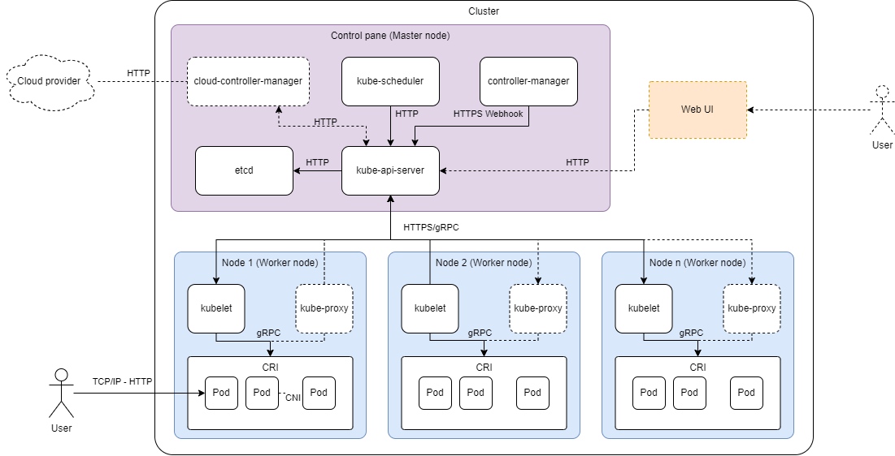

Large-Scale Software Architecture
# Laboratory 1 - Design
#### Julián Ricardo Beltrán Lizarazo - jrbeltranl@unal.edu.co - 1023949483

## Kubernetes

[Github Repository](https://github.com/kubernetes/kubernetes) -
[Documentation](https://kubernetes.io/)
> Kubernetes, also known as K8s, is an open source system for managing containerized applications across multiple hosts. It provides basic mechanisms for the deployment, maintenance, and scaling of applications. [1]

Kubernetes can be classified as a large-scale software system since it is desigend to be used as a building block in systems that can have one or more of the characteristics that define a software system as **large-scale**.
* It has a highly modular and distributed system that can have implementations with **large number of components**, up to 300.000 containers with 5.000 nodes each.
* Besides the business-specific operations of the particular implementation, it takes care of scheduling, health checks, communicating requests and ensuring data and state consistency for every container/node, resulting in a **large number of concurrent operations**.
* For large-scale scenarios, Kubernetes supports the implementation of dedicated etcd instances, that are used to store cluster state data, log data and metrics. Which can result in a **large volume of data**
* Although Kubernetes is not a **cyber-physical** system itsefl, it is often deployed in hybrid environments that can be considered CPSs, like IoT implementations.

## Master/Worker architecture

Besides being used as a building block in the construction of many distribiuted systems, Kubernetes itself is built with a **Master/Worker architecture**, a distributed system architecture in which the system has two type of nodes (**master nodes** and **worker nodes**) that work together to handle the distribution of work between the nodes, ensuring the data is consistent between them.
* Master nodes: Master node responsability is to receive all of the systems requests and split them between the worker nodes for execution, at the same time that it executes other tasks related to ensuring the data consistency and handling worker fail scenarios.
* Worker nodes: Worker nodes responsability is to execute the tasks assigned by the master and communicate results if needed.

## Kubernetes architecture

The following diagram is the Component & Connectors view of the core Kubernetes architecture, dashed elements represent optional components that are not present in every implementation.

### Components
Master node components:
* **kube-api-server:** Exposes the Kubernetes API, used to receive and handle all communication. Manages authentication and authorization.
* **etcd:** Stores all cluster data in distributed key-value databases.
* **kube-shceduler:**  Watches for newly created pods with no assigned node and selects no for them to run on, taking into account resource requirements, policies constraints, etc.
* **kube-controller-manager:** Takes care of controller processes of multiple internal elements, such as nodes, jobs, endpoint slices and service accounts, amongst others.
* **cloud-controller-manager (Optional):** Only present when the kubernet is deployed by/on a cloud provider. It acts as a control pane component for cloud-specific control logic.

Worker nodes components:
* **kubelet:** Ensures that the correct Pods and containers are running on the Worker node. Communicates with the kube-api-server. Monitors container health and restarts failed ones.
* **kube-proxy (Optional):** Network proxy that runs on each node.
* **Container Runtime (CRI):** Runs and manages containers inside pods. Interacts with the Kubelet ton ensure images consistency. Provides isolated environments for applications.
* **Addons (Not included in view):** There are some additional components that can be part of a Kubernetes implementation, such as Container resource monitoring, cluster-level logging and network plugins components.

### Connectors
| Component One              | Component Two               | Protocol                  |
|----------------------------|----------------------------|---------------------------|
| kube-api-server            | kube-scheduler             | HTTP (HyperText Transfer Protocol) |
| kube-api-server            | controller-manager         | HTTPS Webhook (HyperText Transfer Protocol Secure) |
| kube-api-server            | etcd                       | HTTP (HyperText Transfer Protocol) |
| kube-api-server            | cloud-controller-manager   | HTTP (HyperText Transfer Protocol) |
| kube-api-server            | Web UI                     | HTTP (HyperText Transfer Protocol) |
| kube-api-server            | kubelet (Worker nodes)     | HTTPS/gRPC (gRPC Remote Procedure Call) |
| cloud-controller-manager   | Cloud provider            | HTTP (HyperText Transfer Protocol) |
| kubelet (Worker nodes)     | Pods (via CRI)            | gRPC (gRPC Remote Procedure Call) |
| Pods (within a worker node) | Other Pods (via CNI)      | CNI (Container Network Interface) |
| User                       | Web UI                     | HTTP (HyperText Transfer Protocol) |
| User                       | Pods (via TCP/IP)         | HTTP (HyperText Transfer Protocol) |

## References
Dadon, B. (2023, September 13). Data Engineering Concepts #4 — Distributed Systems and the Master/Worker Architecture. Medium; Dev Genius. https://blog.devgenius.io/data-engineering-concepts-4-distributed-systems-and-the-master-worker-architecture-a61dc238b4ba

Kubernetes. (2024, April 26). Considerations for large clusters. Kubernetes. https://kubernetes.io/docs/setup/best-practices/cluster-large/

Kubernetes. (2019). Production-Grade Container Orchestration. Kubernetes.io. https://kubernetes.io/

kubernetes/kubernetes. (2020, October 25). GitHub. https://github.com/kubernetes/kubernetes