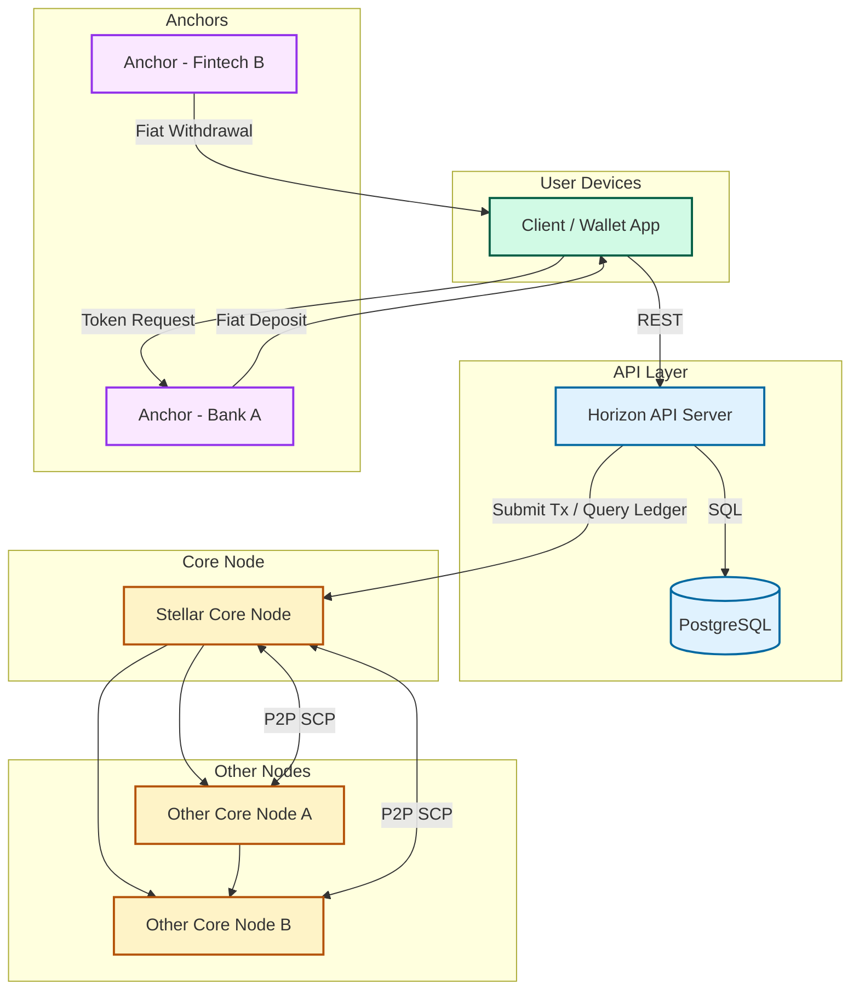

# Laboratory 1 - Architecture Review of Stellar Blockchain Network.

## 1. Author:
- **Jilkson Alejandro Pulido Cruz**
- **C.C 1.024.507.506**

## 2. Project Repository:
- **Project:** [Stellar - Global Financial Network]
- **Repository URL:** https://github.com/stellar/stellar-core

## 3. Architecture Review

---

### 3.1 Architectural Style

Stellar adopts a **distributed peer-to-peer architecture** designed specifically for financial transactions. Its main architectural characteristics are:

- **Decentralization**: Every Stellar Core node participates in the Stellar Consensus Protocol (SCP), without relying on a central authority.

- **Consensus via SCP**: Instead of mining, Stellar uses the Stellar Consensus Protocol, a federated Byzantine agreement system that allows fast and efficient agreement across nodes.

- **Separation of Concerns**: Stellar separates core responsibilities:
  - `Stellar Core` handles the consensus and ledger.
  - `Horizon` exposes a developer-friendly API.
  - `Anchors` act as fiat on/off ramps.

- **Scalability and Redundancy**: The network supports thousands of nodes, concurrent requests, and financial institutions operating globally.

---

### 3.2 Components & Connectors (C&C) View

- **Client / Wallet Applications**: Apps and interfaces used by end-users to interact with the Stellar network.

- **Horizon API**: RESTful API server that allows clients to access blockchain data, submit transactions, and manage accounts.

- **Stellar Core**: Responsible for maintaining the ledger and participating in consensus using SCP.

- **PostgreSQL**: Database used by Horizon to cache and index ledger data.

- **Other Stellar Core Nodes**: Peer nodes that form the decentralized network.

- **Anchors**: Trusted institutions that connect the Stellar network with the fiat world by issuing or redeeming assets.

- **P2P Network (SCP)**: Connects Stellar Core nodes for consensus, synchronization, and propagation of transactions and ledger entries.

--- 

### 3.3 C&C Diagram

---

### 4. References

	•	Stellar Documentation: https://developers.stellar.org/docs
