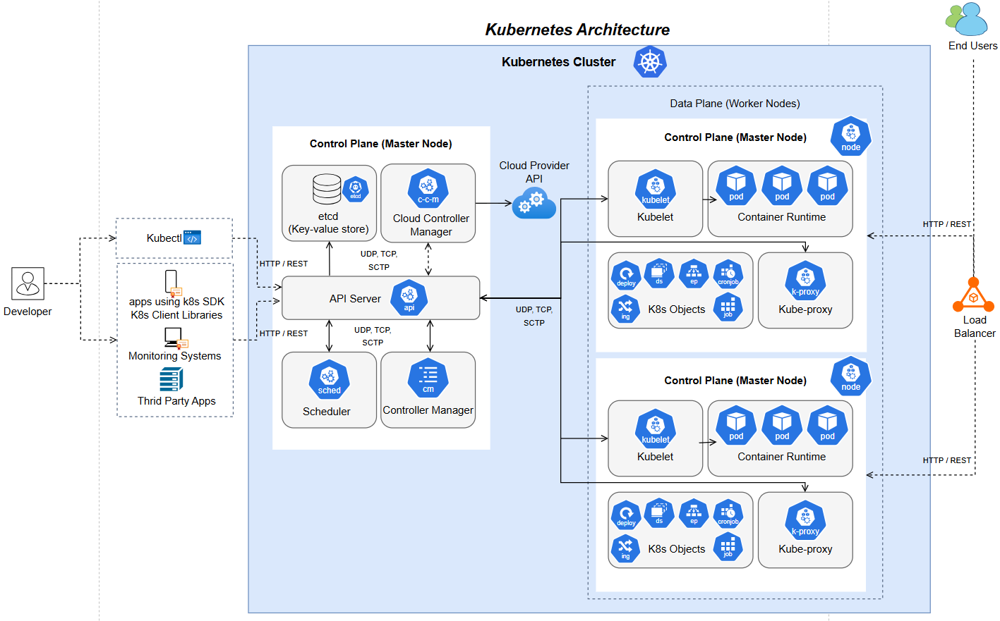

#### Large-Scale Software Architecture
### Laboratory 1 - Design

###### **Autor:** Leidy Johana Llanos Culma
###### **Proyecto:** Kubernetes
###### **Repositorio:** [github](https://github.com/kubernetes/kubernetes)

# Kubernetes

Kubernetes, también conocido como K8s, es una plataforma portátil, extensible y de código abierto para administrar cargas de trabajo y servicios en contenedores, que facilita tanto la configuración declarativa como la automatización. Tiene un ecosistema grande y de rápido crecimiento. 

Es considerado un sistema a gran escala, porque su arquitectura está formada por multiples componentes interconectados que funcionan como un sistema cohesivo, está diseñado para manejar operaciones concurrentes a escala masiva, gestiona grandes volumenes de datos en multiples niveles y presenta estructuras extremadamente complejas.

## Arquitectura

La arquitectura de Kubernetes sigue un diseño distribuido con una clara separación entre el plano de control (Control Plane) y los nodos de trabajo (Worker Nodes). Esta división permite una gestión centralizada pero una ejecución distribuida de las cargas de trabajo.

### Estructura principal

1. **Plano de Control (Control Plane):**
    - Gestiona el estado deseado del clúster
    - Toma decisiones globales sobre el clúster
    - Detecta y responde a eventos
2. **Nodos de Trabajo (Worker Nodes):**
    - Ejecutan las aplicaciones y cargas de trabajo
    - Mantienen las redes virtuales entre contenedores
    - Reportan su estado al plano de control

### Flujo de comunicación

- Todo pasa por el API Server, que es el punto central de comunicación
- Los componentes no se comunican directamente entre sí, sino a través del API Server
- Se utiliza un modelo de publicación/suscripción donde los controladores observan cambios y actúan en consecuencia

## Componentes de Kubernetes

### Componentes del Plano de Control (Control Plane)

- **kube-apiserver:** Es el componente central que expone la API de Kubernetes. Todas las operaciones y comunicaciones entre componentes pasan por él.
- **etcd:** Base de datos distribuida de tipo clave-valor que almacena todos los datos de configuración del clúster.
- **kube-scheduler:** Observa los pods recién creados que no tienen un nodo asignado y selecciona un nodo donde ejecutarlos.
- **kube-controller-manager:** Ejecuta los procesos de controlador en segundo plano
    - Controlador de nodos: Responde cuando los nodos caen
    - Controlador de replicación: Mantiene el número correcto de pods
    - Controlador de endpoints: Conecta servicios y pods
    - Controladores de tokens y cuentas de servicio
- **cloud-controller-manager:** Integra la lógica de control específica de proveedores cloud (AWS, GCP, Azure, etc.)

### Componentes de los Nodos

- **kubelet:** Agente que se ejecuta en cada nodo y asegura que los contenedores estén ejecutándose en un Pod.
- **kube-proxy:** Mantiene las reglas de red en los nodos, permitiendo la comunicación de red hacia los Pods desde dentro o fuera del clúster.
- **Container Runtime:** Software responsable de ejecutar los contenedores (Docker, containerd, CRI-O, etc.)

## Conectores y Flujos de Comunicación

- **API Requests:** Todas las comunicaciones van a través del kube-apiserver, que valida y procesa las peticiones.
- **etcd Communication:** El kube-apiserver es el único componente que se comunica directamente con el almacén etcd.
- **Node-to-Control Plane:** Los kubelets y kube-proxy en los nodos se comunican con el plano de control para recibir órdenes y enviar actualizaciones.
- **Controller Loops:** Los controladores observan constantemente el estado del clúster mediante el apiserver y trabajan para mover el estado actual hacia el estado deseado.
- **Scheduler-to-ApiServer:** El planificador determina en qué nodos deben ejecutarse los pods y comunica estas decisiones a través del apiserver.

###### Esta arquitectura está diseñada para ser altamente distribuida, resiliente y escalable, permitiendo que Kubernetes gestione cargas de trabajo en entornos de contenedores a gran escala.

## Estilos de Arquitectura

Kubernetes implementa varios estilos arquitectónicos:

1. **Arquitectura basada en microservicios:** Los componentes del sistema están desacoplados y se comunican a través de APIs bien definidas.
2. **Arquitectura de controlador y bucle de reconciliación:** El sistema funciona continuamente comparando el "estado deseado" con el "estado actual" e intentando reconciliarlos.
3. **Arquitectura declarativa:** Los usuarios declaran el estado deseado del sistema, y Kubernetes trabaja para mantener ese estado.
4. **Arquitectura basada en API:** Todas las operaciones y comunicaciones ocurren a través de la API de Kubernetes.
5. **Arquitectura distribuida:** Los componentes están distribuidos en múltiples nodos, proporcionando alta disponibilidad y escalabilidad.
6. **Arquitectura de observación (watch-based):** Los componentes observan cambios en el estado del sistema y reaccionan a ellos, en lugar de ser invocados directamente.

###### Estos estilos arquitectónicos permiten a Kubernetes ser flexible, escalable y resiliente.
