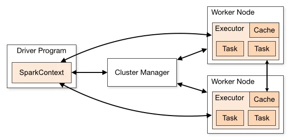

# Arquitecturas de Software a Gran Escala

### Juan David Ramírez Ávila

## Laboratorio 1 - Diseño

### 1. Objetivo

El objetivo de este laboratorio es analizar y extraer el diseño arquitectónico de Apache Spark, un proyecto de software de código abierto utilizado para el procesamiento de grandes volúmenes de datos.Es una solución Open Source que entra dentro de los sistemas de software a gran escala, porque se utiliza para procesar de forma distribuida grandes cantidades de datos, se adjunta el enlace del repositorio del proyecto https://github.com/apache/spark.

### 2. Vista Arquitectónica

Apache Spark sigue una arquitectura de procesamiento de datos distribuido. A continuación, se presenta la Vista de Componentes y Conectores (C&C) que ilustra sus principales elementos arquitectónicos.

### 3. Descripción Detallada de los Componentes Arquitectónicos de Apache Spark

En esta sección, se presenta una descripción de cada uno de los componentes de la Arquitectura de Apache Spark y se explica la interacción entre estos. Adicionalmente, se describe como es el flujo o la forma en que estas se comunican. 

#### 3.1. Driver Program:

* **Punto de Control de la Aplicación:** El Driver Program actúa como el cerebro o el orquestador de la aplicación Spark. Es el proceso donde se inicia la ejecución del código escrito por el usuario, es decir, el script que el desarrollador escribe en lenguajes como Scala, Python, Java o R que utiliza la API de Spark.
* **Creación del `SparkContext`:** En el Driver se crea un objeto denominado `SparkContext`. Este componente representa la conexión con el clúster de Spark y es el punto de ingreso, para generar la interacción con todas las funcionalidades de Spark. 
* **Definición de la Lógica de la Aplicación:** El Driver contiene la lógica principal, desde la lectura de los datos, pasando por la transformación y culminando en la escritura de los datos resultantes con la lógica deseada.  
* **Coordinación de la Ejecución:** El Driver juega el papel de orquestador, es decir es el encargado de distribuir las tareas a todos los nodos del clúster, con el fin de realizar un procedamiento en paralelo de los datos.
* **Mantenimiento de Metadatos:** El Driver guarda información sobre el estado de la aplicación, las tareas que se han ejecutado, los datos que se han procesado y entre otros metadatos, necesarios para el orquestamiento correcto de los procesos. 
* **Comunicación con el Cluster Manager:** El Driver Program se comunica con el `Cluster Manager` para solicitar los recursos necesarios para ejecutar la aplicación, como la cantidad de Workers y Executors que se van a requerir para el procesamiento de los datos.

#### 3.2. SparkContext:

* **Puerta de Entrada al Clúster:** Como se mencionó anteriormente, el `SparkContext` es el punto de entrada para todas las funcionalidades de Spark. Representa la conexión activa a un clúster de Spark.
* **Gestión de la Conexión:** El `SparkContext` se encarga de establecer y mantener la conexión con el `Cluster Manager`, que a su vez gestiona los recursos del clúster.
* **Configuración de Spark:** En el `SparkContext` se configuran parámetros importantes para la aplicación Spark, como el nombre de la aplicación, la configuración del clúster, la memoria asignada, entre otros metadatos importantes para garantizar el correcto funcionamiento de la aplicación de Spark. 

#### 3.3 Cluster Manager:

* **Gestor de Recursos del Clúster:** El `Cluster Manager` es el responsable de administrar los recursos computacionales disponibles en el clúster de Spark. Esto incluye la asignación de Workers a las aplicaciones Spark que se ejecutan en el clúster.
* **Negociación de Recursos:** Cuando el Driver solicita recursos a través del `SparkContext`, el Cluster Manager es el encargado de negociar con los nodos disponibles en el clúster para asignar los Workers necesarios para la aplicación de Spark y el correcto procesamiento de los datos.
* **Lanzamiento de Executors:** Una vez que se han asignado los Workers, el Cluster Manager trabaja con ellos para lanzar los procesos `Executor`, es decir, para procesar la lógica diseñada por el desarrollador.

#### 3.4. Worker Nodes:

* **Nodos de Procesamiento:** Los Worker Nodes son las máquinas físicas o virtuales que componen el clúster de Spark y que realmente se encargan de procesar los datos.
* **Ejecución de Executors:** Cada Worker Node puede ejecutar uno o más procesos `Executor`. La cantidad de Executors por Worker Node se configura según los recursos disponibles en cada nodo y las necesidades que se tengan.

#### 3.5. Executors:

* **Procesos de Ejecución de Tareas:** Los Executors son procesos que se ejecutan en los Worker Nodes y son responsables de llevar a cabo las tareas individuales que componen la aplicación Spark.
* **Ejecución de Tasks:** El Driver Program divide el trabajo en un conjunto de tareas más pequeñas, y estas tareas son enviadas a los Executors para su ejecución. Cada Executor puede ejecutar múltiples tareas en paralelo dentro de sus propios recursos.
* **Comunicación con el Driver:** Los Executors se comunican con el Driver Program para informarle sobre el estado de las tareas que están ejecutando y para devolver los resultados de las tareas cuando sea necesario.

#### 3.6. Tasks:

* **Unidades de Trabajo Paralelo:** Las Tasks son las unidades de trabajo más pequeñas que se ejecutan en Spark.
* **Ejecución por los Executors:** El Driver Program divide las etapas de la aplicación en Tasks y las distribuye a los Executors disponibles para su procesamiento paralelo.
* **Naturaleza Efímera:** Las Tasks suelen ser de corta duración. Una vez que una Task se completa, el Executor puede pasar a ejecutar la siguiente Task asignada.

#### 3.7. Cache:

* **Almacenamiento en Memoria Distribuido:** La `Cache` en Spark se refiere a la capacidad de almacenar en memoria los datos procesados en los Executors.
* **Mejora del Rendimiento:** El almacenamiento en caché es una optimización clave en Spark. Cuando los datos se almacena en caché, estos se mantienen en la memoria de los Executors, lo que permite un acceso mucho más rápido en futuras operaciones que requieran los mismos datos. Esto es especialmente útil para operaciones iterativas o cuando se realizan múltiples consultas sobre el mismo conjunto de datos.
* **Persistencia en Disco:** Opcionalmente, los datos también se pueden persistir en disco si no caben completamente en la memoria, aunque el acceso a la memoria es significativamente más rápido.

#### 3.8. Interacciones Clave:

La imagen de la arquitectura de Apache Spark muestra las interacciones clave entre los componentes:

* El **Driver Program** (a través del **SparkContext**) se comunica con el **Cluster Manager** para solicitar recursos.
* El **Cluster Manager** asigna los **Worker Nodes**.
* En cada **Worker Node**, se ejecutan uno o más **Executors**.
* El **Driver Program** envía **Tasks** a los **Executors** para su procesamiento.
* Los **Executors** pueden utilizar la **Cache** para almacenar datos en memoria localmente en los **Worker Nodes**, para agilizar el procesamiento de datos. 

#### 3.9. Flujo de Ejecución de Apache Spark:

1.  El desarrollador envía una aplicación Spark al Driver Program.
2.  El Driver Program crea un `SparkContext` que se conecta al `Cluster Manager`.
3.  El Cluster Manager asigna recursos (Workers) a la aplicación.
4.  El Cluster Manager lanza `Executors` en los Worker Nodes.
5.  El Driver divide la aplicación en `Tasks` y los distribuye a los Executors.
6.  Los Executors ejecutan las Tasks en paralelo sobre las particiones de los datos.
7.  Los Executors pueden leer y escribir datos desde y hacia el sistema de almacenamiento (Generalmente se utiliza un sistema de arhivos, conocido, mejor mente como lago de datos o data lake).
8.  Los Executors pueden comunicarse entre sí para ciertas operaciones.
9.  El Driver recopila los resultados de los Executors.

### 4. Conclusiones

En resumen, la arquitectura de Apache Spark se basa en que el Driver orquesta el trabajo que realizan los Executors distribuidos en los Worker Nodes, gestionados por un Cluster Manager.Y el uso eficiente de la memoria y la capacidad de paralelizar las tareas son los pilares que permiten a Spark procesar grandes cantidades de datos de manera rápida y eficiente y lo clasifican como un sistema de sofware a gran escala. 

La arquitectura de Apache Spark es ampliamente utilizada, por ejemplo, por equipos de ingeniería de datos en diversas empresas para procesar grandes volúmenes de datos (Big Data). Esto puede lograrse mediante la adquisición de un producto que utilice Apache Spark como base para su funcionamiento, o bien mediante el despliegue de un clúster local en servidores propios, en organizaciones que han decidido adoptar Spark como solución para el procesamiento de sus datos.

### 5.Referencias 
https://github.com/apache/spark 

https://pages.databricks.com/rs/094-YMS-629/images/LearningSpark2.0.pdf