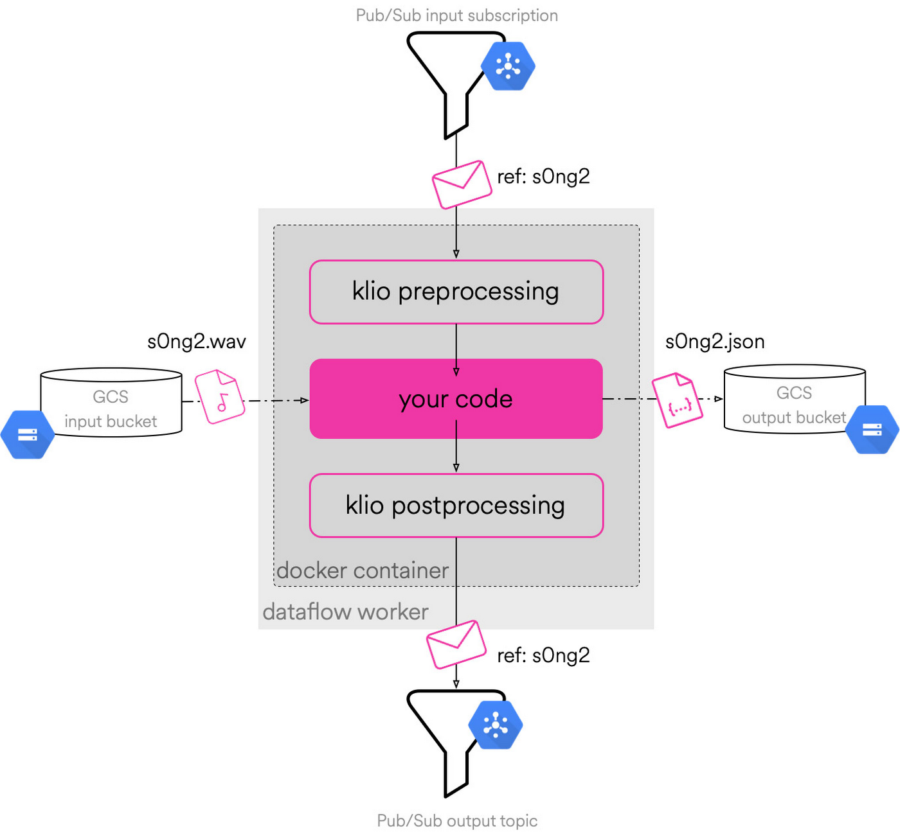
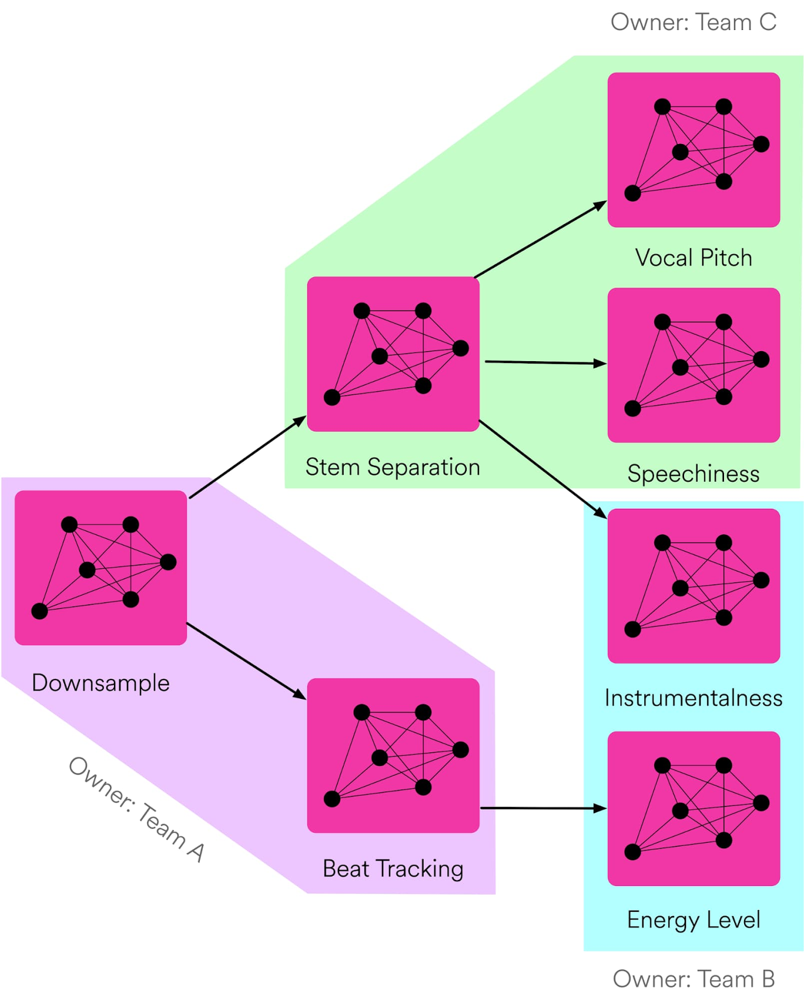

# Arquitectura de Software a Gran Escala

## Laboratorio 1 - Sistemas de Software a Gran Escala

### Carlos Alberto Arevalo Martinez

### Proyecto analizado: Klio

### Repositorio del proyecto Open Source:

[https://github.com/spotify/klio](https://github.com/spotify/klio)

### Resumen

Klio es un framework de código abierto creado por Spotify para procesar medios (audio, video e imágenes) a gran escala. Construido sobre Apache Beam, facilita la colaboración entre equipos de investigación e ingeniería mediante una infraestructura estandarizada, reduciendo la carga operativa.

Spotify utiliza Klio para diversas aplicaciones: inteligencia de audio, análisis de anuncios, fingerprinting de audio, generación de contenido y flujos de trabajo de investigación.

---

### Estilo Arquitectónico

Klio sigue una arquitectura basada en flujos de datos y procesamiento distribuido (Pipe-and-Filter), aunque como se puede evidenciar en el diagrama de arquitectura, también aplica el estilo dirigido por eventos (Event-driven).

### Vista Arquitectónica (C&C View)

La vista de componentes y conectores (C&C view) de Klio muestra los módulos principales que componen el framework, ilustra su interacción con Apache Beam, y explica cómo estos elementos se integran dentro del ciclo de vida completo de un pipeline de procesamiento de archivos multimedia.

---

### Descripción de los Componentes Arquitectónicos de Klio

A continuación, se describen los principales componentes que conforman la arquitectura de Klio, el framework de procesamiento de medios desarrollado por Spotify. Cada uno cumple un rol específico dentro del pipeline, permitiendo manejar grandes volúmenes de archivos binarios (como audio) de forma escalable, eficiente y automatizada.

#### Contenedor de Job Klio (Docker)

Cada pipeline de Klio se ejecuta dentro de un contenedor Docker. Este contenedor agrupa todo lo necesario para el job, incluyendo el código del usuario, las dependencias y las configuraciones. Al trabajar con contenedores, Klio garantiza portabilidad, consistencia en entornos distribuidos y facilidad de despliegue.

#### Apache Beam (Orquestador)

Apache Beam es el motor de ejecución sobre el cual se construye Klio. Se encarga de distribuir el procesamiento entre múltiples workers, administrar el flujo de datos y escalar la ejecución según la carga del sistema. Klio aprovecha su capacidad para ejecutar pipelines tanto en modo batch como en streaming.

#### Google Cloud Pub/Sub (Mensajería)

Pub/Sub se utiliza como sistema de mensajería asincrónica. Cada vez que se sube un nuevo archivo al bucket de entrada, se emite un mensaje que inicia el procesamiento. De forma similar, al finalizar un job, se puede emitir un nuevo mensaje para encadenar otros procesos (modelo DAG).

#### Google Cloud Storage

Klio trabaja con archivos binarios grandes, por lo que utiliza GCS para almacenar tanto los archivos de entrada como los resultados procesados. El pipeline descarga el archivo desde un bucket, lo procesa, y luego guarda la salida en otro bucket.

- Input Bucket: Contiene los archivos originales (audio .wav).

- Output Bucket: Recibe los resultados procesados (metadatos .json).

#### Pipeline de Klio (Lógica de usuario)

Este es el núcleo del job y se divide internamente en tres etapas principales:

- Preprocesamiento: Descarga el archivo desde GCS y prepara el entorno de ejecución.

- Procesamiento: Ejecuta la lógica definida por el usuario, que puede incluir análisis de audio, extracción de características, uso de modelos de machine learning, etc.

- Postprocesamiento: Sube el resultado al bucket de salida y, si es necesario, emite un nuevo mensaje a Pub/Sub.

#### DAG de Ejecución (Encadenamiento de Jobs)

Klio permite estructurar múltiples jobs en forma de grafo dirigido acíclico (DAG), donde la salida de un job puede activar la ejecución de otro. Esto facilita la creación de flujos complejos de procesamiento de datos sin intervención manual.

Ejemplo:

---

### Referencias

- https://github.com/spotify/klio  
- https://klio.io  
- https://beam.apache.org
- https://cloud.google.com/blog/products/data-analytics/try-spotifys-internal-os-tool-for-media-processing-in-beam
- https://engineering.atspotify.com/2020/11/its-all-just-wiggly-air-building-infrastructure-to-support-audio-research/