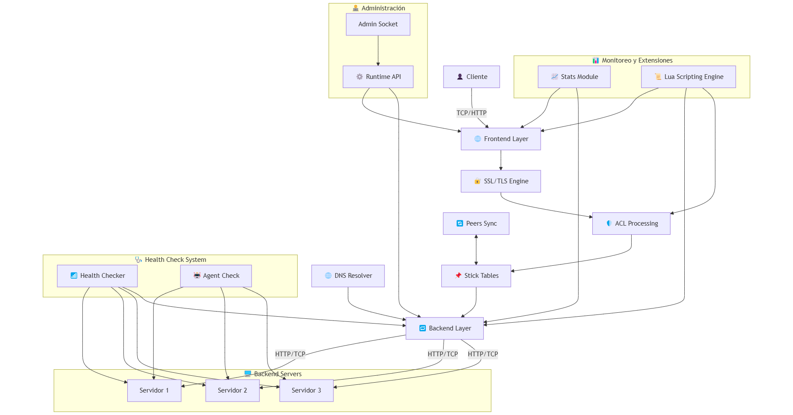

# Análisis Arquitectónico de HAProxy

## 1. Información General del Proyecto

- **Nombre:** HAProxy (High Availability Proxy)  
- **Sitio web:** [https://www.haproxy.org/](https://www.haproxy.org/)  
- **Repositorio:** [https://github.com/haproxy/haproxy](https://github.com/haproxy/haproxy)

---

## 2. Estilo Arquitectónico

HAProxy implementa una arquitectura de proxy de alto rendimiento basada en un modelo de eventos con una estructura de pipeline de procesamiento.  
Es un ejemplo de **arquitectura orientada a eventos de alto rendimiento**.

---

## 3. Vista de Componentes y Conectores (C&C)

**Arquitectura de HAProxy (C&C)**  

---

## 4. Descripción de los Componentes

### Componentes Principales:

- **Frontend Layer:** Punto de entrada para las conexiones de clientes.  
  - Define puertos de escucha y bindings  
  - Maneja conexiones TCP/HTTP entrantes  
  - Aplica políticas iniciales de procesamiento  

- **ACL Processing:** Sistema de reglas para toma de decisiones.  
  - Evalúa condiciones basadas en atributos de solicitud  
  - Implementa lógica de enrutamiento condicionada  
  - Aplica reglas de seguridad y acceso  

- **Stick Tables:** Mecanismo de persistencia y seguimiento.  
  - Almacena información de sesión  
  - Implementa contadores y tracking  
  - Permite limitación de tasas y detección de abusos  

- **Backend Layer:** Gestiona los servidores de destino.  
  - Balanceo de carga entre servidores  
  - Aplica algoritmos de selección de servidor  
  - Maneja fallos y reintentos  

- **Health Check System:** Verifica la disponibilidad de los servidores.  
  - Chequeos activos de conectividad  
  - Monitorización de servicios aplicativos  
  - Detección rápida de fallos  

- **SSL/TLS Engine:** Maneja la criptografía.  
  - Terminación SSL/TLS  
  - Offloading criptográfico  
  - Gestión de certificados  

### Componentes Auxiliares:

- **Stats Module:** Proporciona métricas y estado operativo.  
  - Expone estadísticas vía HTTP  
  - Ofrece monitorización en tiempo real  
  - Integración con sistemas externos  

- **Lua Scripting Engine:** Extensibilidad programática.  
  - Permite lógica personalizada  
  - Acceso a funciones internas del proxy  
  - Manipulación avanzada de solicitudes/respuestas  

- **Runtime API:** Interfaz para gestión dinámica.  
  - Modificación de configuración en caliente  
  - Control operativo sin reinicio  
  - Automatización e integración  

- **DNS Resolver:** Resolución dinámica de nombres.  
  - Resolución asíncrona de hostnames  
  - Actualizaciones periódicas  
  - Soporte para SRV y otros registros  

- **Peers Synchronization:** Sincronización entre instancias.  
  - Replicación de tablas de persistencia  
  - Compartición de información de estado  
  - Alta disponibilidad coordinada 

### Conectores:

- **TCP/IP:** Protocolo base para todas las comunicaciones.  
- **HTTP/HTTP2:** Protocolos de aplicación soportados.  
- **Health Check Protocol:** Protocolos específicos para verificación de salud.  
- **Peer Protocol:** Comunicación entre instancias de HAProxy.

---

## 5. Flujos de Datos

### Flujo de Solicitud:

1. El cliente establece conexión TCP con un frontend  
2. Se aplican reglas ACL para determinar el enrutamiento  
3. Si corresponde, se consultan stick tables para persistencia  
4. Se selecciona un servidor backend según algoritmo configurado  
5. La solicitud se reenvía al servidor seleccionado  
6. La respuesta sigue el camino inverso hacia el cliente

### Flujo de Monitorización:

1. El health checker verifica periódicamente los servidores  
2. Los resultados se utilizan para actualizar el estado de los backends  
3. Las estadísticas se recogen y actualizan en tiempo real  
4. Los eventos de salud se registran y pueden generar alertas

### Flujo de Sincronización:

1. Las tablas de persistencia se sincronizan entre pares  
2. Los contadores de limitación de tasa se comparten  
3. La información de sesión se replica para alta disponibilidad
