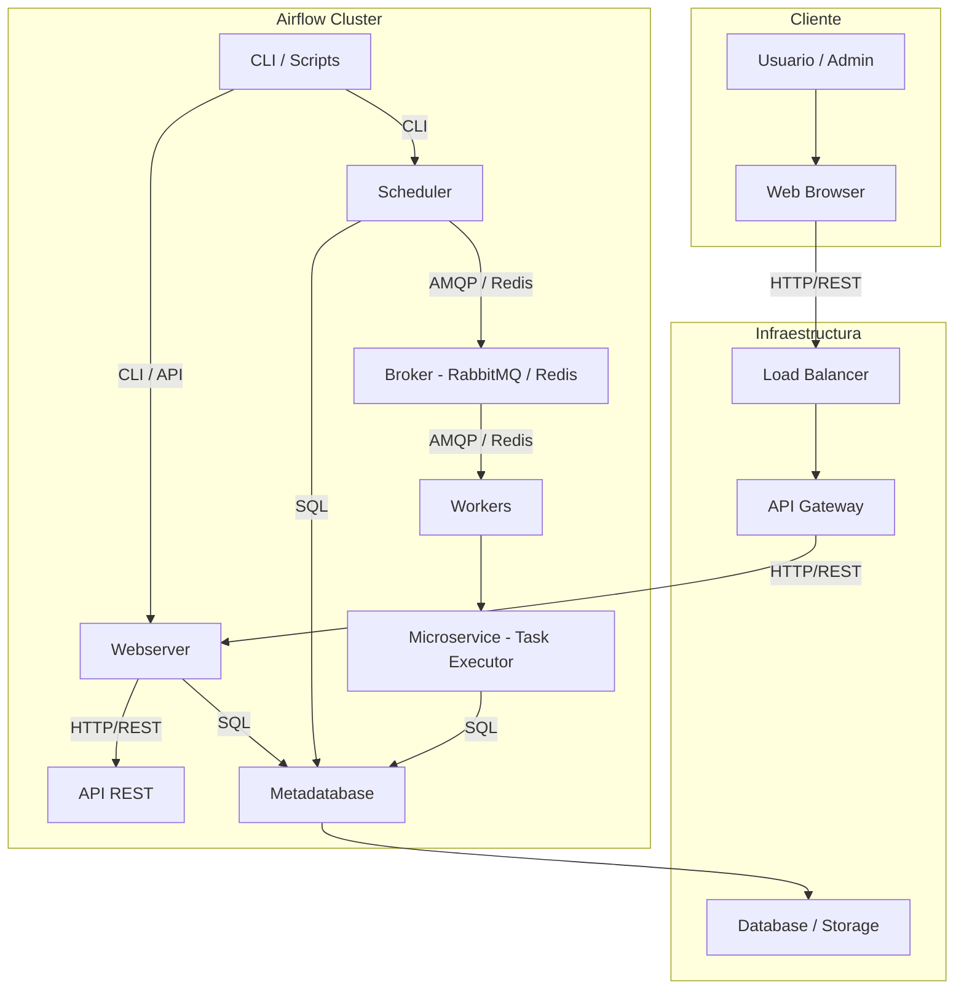

# Laboratorio 1 - Diseño Arquitectónico

**Nombre:** Sebastian Rios Sabogal

**Cédula:** 1143825130

**Repositorio del sistema analizado:** [https://github.com/apache/airflow](https://github.com/apache/airflow)

---

## 1. Introducción

[Apache Airflow](https://airflow.apache.org/) es una plataforma open source para la orquestación de flujos de trabajo programables ([DAGs](https://airflow.apache.org/docs/apache-airflow/stable/core-concepts/overview.html)), ampliamente utilizada en ingeniería de datos, ciencia de datos y automatización de procesos. Fue originalmente desarrollada por Airbnb y actualmente es un proyecto de la Apache Software Foundation.

Airflow permite definir flujos complejos como código Python y ejecutarlos de forma dinámica y distribuida. Gracias a su arquitectura modular y escalable, es ideal para flujos de trabajo intensivos en datos y tareas concurrentes.

---

## 2. Justificación de selección

Apache Airflow es un sistema altamente representativo para el análisis arquitectónico de **software a gran escala**, por las siguientes razones, que evidencian atributos clave como **modularidad**, **concurrencia**, **escalabilidad** y **adaptabilidad**:

- **Cantidad de componentes**: Airflow está compuesto por varios **servicios distribuidos** que se comunican entre sí, cada uno con **responsabilidades bien delimitadas**:
    
    - **Webserver**: expone una interfaz gráfica y una API REST para la gestión y monitoreo de flujos de trabajo.
    - **Scheduler**: analiza los DAGs y determina qué tareas deben ejecutarse y cuándo.
    - **Broker**: gestiona la cola de tareas entre Scheduler y Workers, usando RabbitMQ o Redis.
    - **Workers**: ejecutan las tareas planificadas, de forma concurrente y distribuida.
    - **Metadatabase**: almacén persistente que registra el estado de ejecución, logs, DAGs y metainformación.

    |💡Ejemplo de caso de uso: En un entorno productivo en GCP (Google Cloud Platform), se despliegan estos componentes en contenedores separados (por ejemplo en Kubernetes), lo cual permite escalar el número de Workers independientemente del Webserver o Scheduler

- **Alto grado de concurrencia**: Airflow está diseñado para ejecutar múltiples tareas en **paralelo**, permite ejecución simultánea de tareas en **clústeres**, usando estrategias como:

    - **CeleryExecutor**: distribución de tareas usando colas de mensajes (AMQP/Redis).
    - **KubernetesExecutor**: cada tarea se ejecuta como un microservicio aislado en un pod de Kubernetes.

    |💡Ejemplo de caso de uso: En una pipeline de ciencia de datos con 50 tareas independientes que procesan distintos segmentos de un dataset, Airflow puede lanzar 50 pods simultáneos (usando KubernetesExecutor), lo cual acelera el tiempo total de procesamiento.

- **Manejo de grandes volúmenes de datos**: Airflow es frecuentemente usado para orquestar flujos de **procesamiento de datos** (ETL/ELT) y flujos de machine learning, integrando herramientas como:

    - Spark
    - Hadoop
    - BigQuery
    - Amazon S3
    - Snowflake
    - Redshift

    |💡Ejemplo de caso de uso: Una empresa de retail puede usar Airflow para coordinar el procesamiento nocturno de 1 TB de transacciones diarias en un clúster Spark, incluyendo carga, transformación y escritura a un data warehouse (como Redshift).

- **Uso en sistemas complejos**: Airflow no solo se usa en entornos de procesamiento de datos, sino también como orquestador general de **procesos distribuidos y ciberfísicos**, donde se requiere integrar componentes heterogéneos.

    |💡Ejemplo de caso de uso: En el contexto Ciberfísico de una fábrica inteligente (Industria 4.0), Airflow se utiliza para coordinar flujos que recolectan telemetría de sensores de maquinaria, detectan anomalías con ML, y disparan alertas de mantenimiento.

---

## 3. Análisis Arquitectónico

### 3.1 Estilo arquitectónico predominante

Apache Airflow adopta una **arquitectura híbrida** que integra **múltiples estilos arquitectónicos clásicos y modernos**, lo que le permite atender requisitos clave como **escalabilidad**, **flexibilidad**, **resiliencia** y **mantenibilidad**:

- **Microservicios coordinados con mensajería asíncrona**

    Airflow puede configurarse con ejecutores como CeleryExecutor o KubernetesExecutor, en los cuales:

    - Las **tareas se distribuyen asíncronamente** desde el **Scheduler** a los **Workers** a través de un **Broker** de mensajes (Redis o RabbitMQ).

    - Cada **Worker** o **Pod** (en Kubernetes) actúa como una **unidad funcional independiente**, lo que refleja un **patrón de microservicio** con **bajo acoplamiento** y **alta cohesión**.

    |💡Ejemplo: Cada tarea del DAG puede ejecutarse como un contenedor autónomo, con su propio entorno, recursos y lógica de negocio, lo que permite ejecutar tareas heterogéneas simultáneamente sin interferencias.

- **Client-Server (Frontend / Backend)**

    Airflow ofrece una **interfaz gráfica** (Webserver) que actúa como **cliente web**, la cual se comunica con **componentes backend** mediante:

    - Llamadas **HTTP/REST** hacia la **API REST** (backend de control y monitoreo).
    - Conexiones **SQL** hacia la **base de datos de metadatos**.

    |💡Ejemplo: Un usuario accede a la UI web para visualizar el DAG, consulta el historial de ejecución y lanza una tarea manual; esta operación fluye desde el **navegador** → **Webserver** → **API** → **Scheduler** → **Broker**.

- **Pipeline / Pipe-and-Filter**

    Los flujos de trabajo en Airflow se modelan como **DAGs** (Directed Acyclic Graphs), en los que:

    - Cada **nodo es una tarea** (filter).
    - Las **aristas representan dependencias** entre tareas.
    - El flujo de datos o ejecución se canaliza de una tarea a otra, siguiendo un modelo tipo **pipe-and-filter**.

    |💡Ejemplo: Un pipeline que **extrae datos** → **los transforma** → **los carga** en un data warehouse, puede representarse como **ExtractTask** → **TransformTask** → **LoadTask**, donde cada tarea es ejecutada de forma **independiente** y **secuencial**.

- **Repositorio compartido**

    Todos los componentes de Airflow acceden a una base de datos relacional compartida (Metadatabase), este patrón sigue el estilo de Repositorio Compartido (Shared Database Repository), donde el estado del sistema se centraliza para garantizar coherencia eventual:

    - **Almacena definiciones** de DAGs, historial de ejecuciones, logs, variables de entorno, conexiones, etc.
    - **Sirve como mecanismo de coordinación** entre componentes (Scheduler, Workers, Webserver, CLI).

    |💡Ejemplo: El **Scheduler** consulta la base de datos para determinar qué tareas están listas, mientras que los **Workers** reportan el resultado de ejecución escribiendo en esa misma base de datos.

Esta arquitectura híbrida permite a Apache Airflow cumplir con los requisitos de los sistemas de software a gran escala, como:

- Escalabilidad horizontal de ejecución.
- Resiliencia ante fallos parciales de componentes.
- Adaptabilidad al entorno (cloud, on-premise, edge).
- Observabilidad distribuida y trazabilidad total del flujo de datos.

La combinación de estos estilos aporta las siguientes ventajas:

| Estilo                      | Aporta...                                              |
|-----------------------------|--------------------------------------------------------|
| Microservicios              | Desacoplamiento, escalabilidad, aislamiento de fallos |
| Client-Server               | Separación de UI y lógica de control                  |
| Pipe-and-Filter (DAGs)      | Flujo modular, composición flexible de procesos       |
| Repositorio compartido      | Coordinación, auditabilidad, persistencia compartida  |

---

### 3.2 Componentes y conectores

A continuación se describen los principales componentes arquitectónicos involucrados en la ejecución de flujos de trabajo en Apache Airflow, considerando tanto los servicios funcionales internos como los **elementos de infraestructura** que soportan su operación a gran escala:

| Componente                       | Rol principal                                                                 | Conectores clave                               |
|----------------------------------|-------------------------------------------------------------------------------|------------------------------------------------|
| **Web Browser**                 | Interfaz cliente utilizada por usuarios finales para acceder a la UI web.   | HTTP/REST hacia Load Balancer                  |
| **Load Balancer**              | Distribuye el tráfico entrante entre instancias del Webserver.              | HTTP/REST hacia API Gateway                    |
| **API Gateway**                | Entrada unificada a los servicios REST de Airflow.                          | HTTP/REST hacia Webserver                      |
| **Webserver**                  | Renderiza la UI web, sirve la API REST y se comunica con componentes backend. | HTTP/REST hacia API REST; SQL hacia Metadatabase |
| **API REST**                   | Provee endpoints RESTful para automatización y control externo.             | HTTP/REST desde Webserver                      |
| **Scheduler**                  | Evalúa DAGs, planifica tareas y las publica al Broker.                      | SQL a Metadatabase; AMQP/Redis al Broker       |
| **Broker (RabbitMQ / Redis)** | Cola de tareas para distribución asíncrona entre Scheduler y Workers.       | AMQP/Redis bidireccional                       |
| **Worker Pool**                | Infraestructura base para ejecutar tareas (pueden ser pods, procesos, etc.).| Recibe tareas desde el Broker                  |
| **Microservice - Task Executor** | Instancia aislada que ejecuta una tarea específica como microservicio.      | SQL hacia Metadatabase                         |
| **Metadatabase**               | Repositorio central con información de DAGs, tareas, variables, logs, etc.  | SQL desde Webserver, Scheduler, Workers, Microservices |
| **Database / Storage**        | Persistencia física de datos (PostgreSQL, MySQL, u otro backend).           | Usada por Metadatabase                         |
| **CLI / Scripts**             | Herramientas de línea de comandos o automatización externa.                 | CLI/API hacia Webserver; CLI hacia Scheduler   |

---

#### Conectores utilizados

- **HTTP/REST**: Para interacción con el usuario (UI), API Gateway y Webserver.
- **AMQP / Redis**: Protocolo de mensajería para distribución de tareas entre Scheduler y Workers.
- **SQL**: Acceso persistente a la Metadatabase desde todos los componentes clave.
- **CLI / API**: Interfaces administrativas para ejecución de comandos, automatización y orquestación externa.

---

## 4. Modelo Component & Connector (C&C)

### 4.1 Diagrama visual estilo Mermaid

[](https://mermaid.live/edit#pako:eNp1U9tu4jAQ_RXLz0BJwy15WCkXbhKRKLCKtEkfTDJAVIiRYy9tgX_fSQIllK2f4nPOXM54cqQRj4GadC3YfkMWbpgSPJlaloCzTSCVUKL5sYLfmWIi4eSJWPEuSV9vnG8HPiyJLfghA1EhLFKv_0K6RCCNw_RbnXG6EgwyKVQklWC30IkdTDiLic22LI3usg79wJqOyZBJOLCPCuHagcskW7IMsMu55IKt4fXn4lYiVlt-QLMqkyBuiQo_aOXvfd2i7Kw_X1RAJ5hHG4jV9k7qBjiMNxCkTmZsuUyk94IdzSBOsopqEPhcoKqKeYGXRILnxZMIMH7BsjfSf4dIoZ-KsB94IFl88VshRoEzGef-I5HsZfbo37fzZzmNFovpU-7mhMMumUnB4IDL69D_LrzoHhIMq_j8ZXIi_RJxfkAs72V6nciJXLbP_Q81KKlB0ZhXXryHpKMCKX3jI301-oWfiHO13y9SuTat4fInMTVx-aBGdyB2LL_SY64LqdzADkJq4mcMK6a2MqRhesawPUv_cL67Rgqu1pvrRe3xScBNGK7YTYHTB-FwlUpqPmtFBmoe6Ts1W3qjqXc6WkvrtfV2TzNq9IOaHb3RMppdQ-9p3Wej2-qda_SzKNlsGK2m0dHaOsJtXW_2ahQnhbvhlT908V-f_wGdpRvs)

- **Usuario / Admin**

    - Representa al usuario final que interactúa con el sistema.
    - Puede ser un analista, operador o ingeniero de datos que accede a la interfaz web de Airflow para visualizar, administrar y lanzar flujos de trabajo.

- **Web Browser**

    - Cliente HTTP que se comunica con la interfaz de usuario de Airflow.
    - Actúa como front-end de acceso a la UI, generalmente accediendo vía HTTPS al balanceador de carga.

- **Load Balancer**

    - Componente que distribuye las peticiones entrantes entre múltiples instancias del Webserver.
    - Proporciona **alta disponibilidad y escalabilidad horizontal** en entornos de producción.
    - Puede estar implementado como un servicio de Kubernetes (Ingress), un balanceador de nube (AWS ALB, GCP LB), o una solución como NGINX/HAProxy.

- **API Gateway**

    - Actúa como **frontera de entrada al backend**, validando y enroutando llamadas REST hacia los servicios internos.
    - Puede encargarse de seguridad (autenticación/autorización), rate limiting, logging y control de versiones de API.
    - Es común usar Kong, Traefik, Ambassador o el API Gateway de una nube pública.

- **Database / Storage**

    - Almacenamiento físico utilizado por la base de datos de metadatos (Metadatabase).
    - Suele ser una base de datos relacional como PostgreSQL o MySQL, y puede estar respaldada por volúmenes persistentes o servicios administrados.

- **Webserver**

    - Servicio que renderiza la interfaz de usuario web y expone la API REST pública de Airflow.
    - Permite a los usuarios visualizar DAGs, monitorear ejecuciones, acceder a logs, lanzar tareas, etc.

- **API REST**

    - Conjunto de endpoints RESTful expuestos por el Webserver.
    - Permite interactuar programáticamente con Airflow (por ejemplo, crear DAGs, ejecutar tareas, obtener logs).
    - Sigue el estándar OpenAPI y permite integración con scripts, CI/CD y plataformas externas.

- **Scheduler**

    - Núcleo de control del sistema: analiza los DAGs registrados y determina cuándo deben ejecutarse las tareas.
    - Inserta las tareas listas en el Broker de mensajería.
    - Tiene una visión global del estado de ejecución del sistema.

- **Broker (Redis / RabbitMQ)**  

    - Sistema de mensajería asíncrono utilizado para distribuir las tareas programadas a los Workers.
    - RabbitMQ usa AMQP, Redis es más simple pero eficiente para colas en memoria.
    - Permite desacoplar la planificación y la ejecución.

- **Workers**  

    - Proceso (o pod) encargado de ejecutar las tareas asignadas.
    - Puede haber múltiples Workers, escalables horizontalmente.
    - Toman tareas del Broker y reportan resultados en la Metadatabase.
    - En el caso de KubernetesExecutor, pueden ser pods transitorios que ejecutan tareas aisladas.

- **Microservice – Task Executor**

    - Representa una instancia concreta e independiente de ejecución de una tarea del DAG.
    - En KubernetesExecutor, cada tarea es ejecutada como un microservicio autosuficiente (un pod) con su propio entorno, lógica, y recursos.
    - Refleja una arquitectura serverless y altamente desacoplada.

- **Metadatabase (PostgreSQL / MySQL)**  

    - Base de datos central que mantiene el estado global del sistema.
    - Definiciones de DAGs
    - Historial de ejecuciones
    - Logs y auditoría
    - Variables, conexiones y configuraciones
    - Es accedida por casi todos los componentes: Webserver, Scheduler, Workers y Microservicios.

- **CLI / Scripts**

    - Herramientas de línea de comandos para interacción directa con Airflow (airflow CLI).
    - Permiten iniciar DAGs, visualizar estados, pausar tareas, cargar configuraciones, entre otras operaciones.
    - Se comunican con el Webserver y Scheduler según la operación.

---

## 5. Conclusiones

Apache Airflow representa un caso realista, maduro y robusto para el estudio de **arquitecturas distribuidas modernas**, especialmente aquellas orientadas al procesamiento intensivo de datos, orquestación de tareas y automatización de procesos complejos. A través de una clara separación de responsabilidades, uso de mensajería asíncrona y patrones de orquestación, logra un sistema resiliente, escalable y extensible.

Su arquitectura no solo cumple con los principios de software a gran escala, sino que también es adaptable a entornos híbridos (cloud, edge, ciberfísicos), y altamente integrable con el ecosistema de datos actual.

Airflow encarna múltiples principios clave de la arquitectura de software a gran escala:

- **Separación de responsabilidades**: cada componente (Scheduler, Worker, Webserver, etc.) cumple una función específica, lo que facilita el mantenimiento, la escalabilidad individual y la evolución del sistema.
- **Desacoplamiento mediante mensajería asíncrona**: el uso de un Broker como intermediario entre productores (Scheduler) y consumidores (Workers) desacopla tiempo y espacio, permitiendo escalamiento horizontal y tolerancia a fallos.
- **Modelo de ejecución basado en DAGs**: el enfoque declarativo permite visualizar claramente las dependencias entre tareas, facilitando su depuración, reuso y composición.
- **Persistencia y trazabilidad centralizada**: la Metadatabase actúa como un punto único de verdad para el estado del sistema, lo que permite análisis, auditoría, debugging e integración con herramientas externas.

Airflow no solo cumple con los principios de diseño de sistemas distribuidos escalables, sino que también se adapta a entornos de despliegue cada vez más diversos y complejos:

- **Cloud-native**: puede desplegarse fácilmente en plataformas como Kubernetes, y adaptarse a arquitecturas serverless mediante ejecutores como KubernetesExecutor.
- **Edge + Cloud híbrido**: se integra con fuentes de datos ubicuas (IoT, APIs externas) y puede coordinar el procesamiento entre dispositivos periféricos y la nube.
- **Sistemas ciberfísicos**: permite orquestar procesos donde interactúan elementos físicos (sensores, actuadores) y software analítico (modelos ML, ETL, alertas), con visibilidad y control desde la UI.

Además, su modelo de **extensibilidad basada en plugins**, su **API REST** abierta, y su ecosistema en expansión lo convierten en una plataforma altamente integrable con tecnologías como:

- Apache Spark, Hadoop, Kafka.
- Bases de datos SQL y NoSQL.
- Servicios de nube como S3, BigQuery, Redshift.
- Herramientas de CI/CD y DataOps.

Por estas razones, Apache Airflow constituye una **referencia pedagógica y práctica** para el análisis, modelado y diseño de sistemas de software a gran escala, cumpliendo con atributos críticos como:

- **Escalabilidad**
    
    Capacidad del sistema para aumentar su rendimiento o capacidad al añadir más recursos (horizontal o verticalmente), sin necesidad de rediseño significativo.

- **Resiliencia**

    Habilidad del sistema para recuperarse automáticamente de fallos parciales y continuar operando sin interrupciones totales.

- **Mantenibilidad**

    Facilidad con la que se pueden modificar, actualizar, corregir o extender los componentes del sistema de forma segura y controlada.

- **Adaptabilidad**

    Capacidad del sistema para ajustarse a nuevos entornos, requisitos o tecnologías sin rediseños drásticos (por ejemplo, migrar de on-premise a cloud).

- **Observabilidad**

    Grado en que el sistema expone su comportamiento interno mediante métricas, logs y trazas, facilitando el monitoreo y diagnóstico proactivo.

Apache Airflow es una plataforma ideal para aplicar técnicas de evaluación arquitectónica, análisis de calidad, y exploración de patrones de integración en arquitecturas distribuidas modernas.
