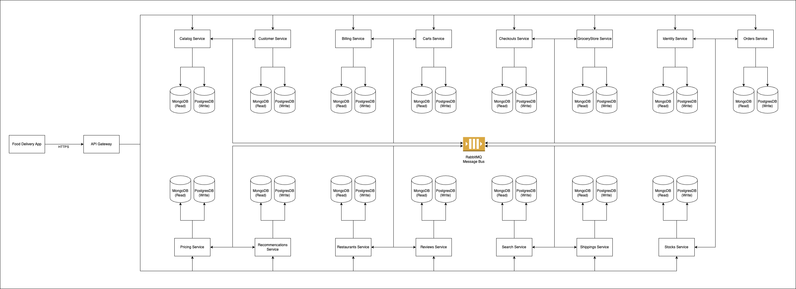

Yosman Alexis Arenas Jimenez

# Monolith To Cloud-Native Transformation | Food Delvery App

This is a project developed for educational purposes that explains how to migrate/transform a monolith into microservices, for an food delivery business context, where modules were created with well-isolated and defined responsibilities so that they can be decoupled from each other as independent components and communicate with each other, acting as a large mesh of nodes.

## 1. URL open source project repository

[https://github.com/mehdihadeli/monolith-to-cloud-native-transformation](https://github.com/mehdihadeli/monolith-to-cloud-native-transformation)

## 2. Structured representation of the architecture

### 2.1 Graphical representation

### 2.2 Description of architecture elements

Overview of architectural elements:

📱 **Frontend App**

The **Food Delivery App** communicates with the **API Gateway** via HTTPS connector.

📦 **Microservices**

- The **Billing MS** Handles billing logic and payment processing.

- The **Carts MS** Manages users' shopping carts.

- The **Catalogs MS** Manages information on available products.

- The **Checkouts MS** Coordinates the payment process, from validation to order generation.

- The **Customers MS** Manages customers' personal data and preferences.

- The **GroceryStores MS** Records and maintains information about grocery stores.

- The **Identity MS** Handles user authentication and authorization.

- The **Orders MS** Manages user-generated orders.

- The **Pricing MS** Calculates prices and manages dynamic promotions/discounts.

- The **Recommendations MS** Offers personalized product suggestions using historical data.

- The **Restaurants MS** Manages restaurants as product suppliers.

- The **Reviews MS** Allows users to leave ratings and comments.

- The **Search MS** Internal search engine for finding products, stores, etc.

- The **Shipping MS** Controls the shipping, tracking, and logistics process.

- The **Stocks MS** Maintains inventory availability by product and store.

🌐 **API Gateway**

Centralizes access to services, handling routing, authentication, and response aggregation.

📚 **CQRS (Command Query Responsibility Segregation)**

CQRS separates read operations (queries) from write operations (commands), each with its own flow and model.

📨 **Events with MassTransit + RabbitMQ**

MassTransit is a .NET-based messaging library that facilitates publishing and consuming events using RabbitMQ as a broker.
