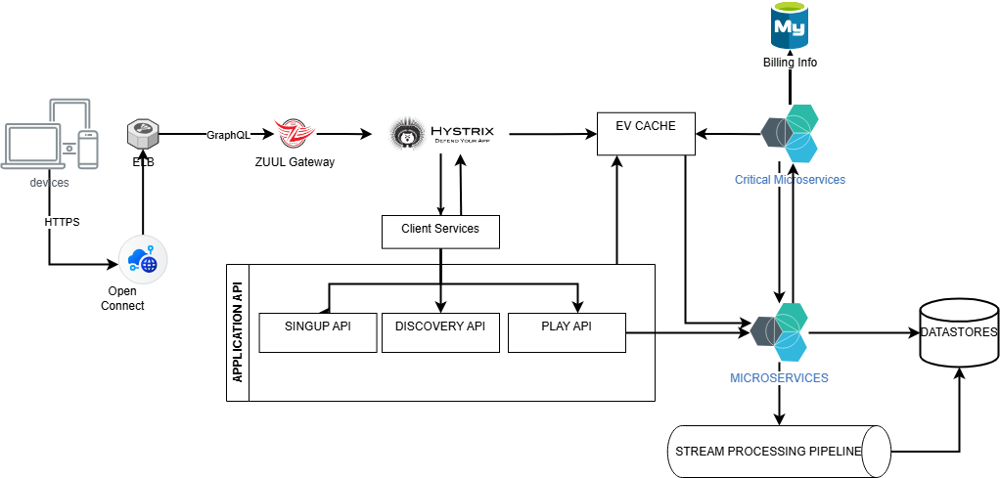

## ARQUITECTURA DE SOFTWARE A GRAN ESCALA
## LABORATORIO 1
### NANCY VIANETH VERA RORIGUEZ

## 1.	Proyecto seleccionado
Netflix

## 2.	Características generales
* 	Usuarios activos por día: Se estima que diariamente atiende a unos 200 millones de usuarios 
* 	MicroServicios: De acuerdo con la información consultada, Netflix tiene mas ñde 1000 microservicios diseñados para múltiples propósitos, como por ejemplo para la re codificación de los videos (Video Enconding Service, Video Validation Service, Video Quality Service, Ladder Generation Service, Streaming Workflow Orchestrator, Studio Workflow Orchestator, entre otros) , servicios para la gestión de usuarios, servicios para la gestión de facturas y hasta servicios que incorporan machine learning para la detección de fraudes 

## 3.	URL del proyecto:
https://github.com/Netflix

## 4.	Análisis de la arquitectura

### 4.1.	Estilo arquitectónico
Netflix posee **arquitectura de microservicios alojada en AWS.** De acuerdo con la información consultada, existen mas de 1000 microservicios. Orquestar el funcionamiento de todos estos microservicios y gestionar la alta demanda de los usuarios, exige alta tolerancia a fallos y al mismo tiempo optimizar la transferencia de los datos.

### 4.2.	Representación gráfica de la arquitectura

### 4.3.	Descripción de los elementos de la arquitectura
A continuación, se describen los elementos representados en el diagrama anterior:

* Los usuarios interactúan con la plataforma a través de diferente tipo de dispositivos: computador, celular, TV, XBOX, a través de HTTPS
* **Open Connect:** Es una red de servidores distribuidos en diferentes zonas geográficas. Este componente se encarga de detectar el tipo de dispositivo que está usando el usuario y su zona geográfica. De acuerdo con esto, le exhibe una copia del video ajustada para su tipo de dispositivo y características de su conexión (velocidad y estabilidad). Para esto, hace uso del ELB de AWS. 
*	**ZUUL:** Es el APP Gateway desarrollado por Netflix.. Zuul es el front door para las peticiones desde los difernetes dispositivos y sitios Web hacia el back end del streaming de Netflix. Zuul está diseñado para permitir el enrutamiento dinámico, la monitorización, la resiliencia y la seguridad. También permite enrutar solicitudes a múltiples grupos de Amazon Auto Scaling cuando corresponda . Zuul enruta la solicitud del usuario hacia un servicio especifico.
*	**HYSTRIX:** Hystrix es una librería desarrollada por Netflix que aisla cada microservicio de otros, con el fin de reducir las fallas. Está diseñada para aislar puntos de acceso a sistemas remotos, servicios y bibliotecas de terceros, detener fallas en cascada y permitir la resiliencia en sistemas distribuidos complejos donde las fallas son inevitables 
*	**EVCache:** Es un servicio de gestión de datos distribuido que almacena datos en la memoria. En particular, es una solución de almacenamiento en caché que usa la infraestructura AWS EC2 para almacenar en caché datos de uso frecuente 
*	El almacenamiento en MySQL se usa para la información relacionada con facturas, pagos, y en general la información de carácter financiero de los usuarios. 
* **Steam Processing Pipeline:** Aquí es en donde se hace el procesamiento para las recomendaciones personalizadas. Se encarga de producir, recopilar, procesar, agregar y trasferir todos los eventos de microservicios a otros procesadores de datos casi en tiempo real.
* **DataStrores:** Netflix usa Cassandra que es una base de datos NoSQL, que permite escalabilidad, implementaciones interregionales y no posee puntos únicos de fallo, lo cual proporciona alta disponibilidad.

## Referencias
 * https://github.com/Netflix/zuul/wiki 
 * https://github.com/Netflix/Hystrix 
 * https://github.com/Netflix/EVCache/blob/master/docs/introduction.md 
 * https://dev.to/karanpratapsingh/system-design-netflix-3d9g 
 * https://netflixtechblog.com/rebuilding-netflix-video-processing-pipeline-with-microservices-4e5e6310e359 
 * https://netflixtechblog.com/machine-learning-for-fraud-detection-in-streaming-services-b0b4ef3be3f6 

