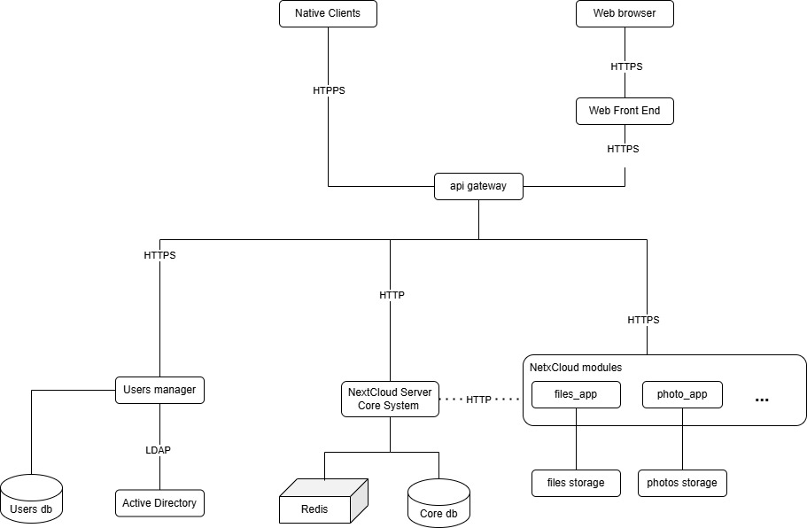

# [LSSA_2025i] - U2 - Laboratory 1

**Nombre:** Andrés Arenas
**Project name:** NextCloud

**Description**
NextCloud is and open-source file hosting and collaboration platform similar to DropBox or Google Drive.

**Project classification**

This project can be classified as:
- **Large Number of components:** The project has 290 repositories hosted in Github.
- **Large Number of concurrent operations:** As Nextcloud is hosted on-premise, this number depends of the users of the deployed system.
- **Large Volume of data:** As Nextcloud is hosted on-premise, this number depends of the data stored in the deployed system.

**Github repository**
https://github.com/nextcloud

**C&C View**

**Components description**

- **Native clients:** Nextcloud has clients for Android, Windows, macOS and Linux
- **Web browsers: **Firefox, Chrome and Edge are supported.
- **Web front end:** Web application accesed via browsers
- **Api gateway:** Single entry point to access the backend services.
- **User manager:** Services for user management
- **Users db:** Database with users, profiles, roles, user logs, ...
- **Active directory:** LDAP is supported for autentication
- **Next Cloud Server Core System:** Kernel functionalities of Nextcloud
- **Core db:** Main database. It can be mirrored if required. 
- **Redis:** Caching used by the application
- **Next Cloud Modules:** Groups different modules as files and photos handling, videoconferences, ...
- **files_app:** Handles most of the file types
- **file storage:** Stores the files handled by files_app
- **photos_app:** Handles graphic file types
- **photos storage:** Stores the graphic file types

********