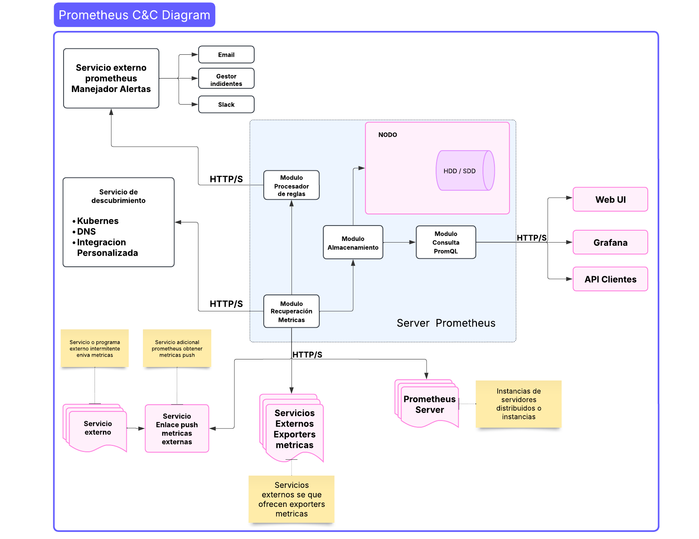

# PROMETHEUS (Licencia Apache 2.0)
Prometheus es un sistema de monitorización de sistemas y servicios, con manejo de alertas. Es de código abierto bajo supervisión de (**Cloud Native Computing Foundation** ) diseñado para entornos distribuidos y dinámicos.

Su arquitectura está optimizada para recolectar, almacenar y consultar métricas en tiempo real, siendo ampliamente utilizado en DevOps y la observabilidad de un sistema.

## URL repositorio

Repositorio de prometheus ( https://github.com/prometheus/prometheus ) . 
## Características de software a gran escala 

* Gran volumen de datos

* Alto número de Operaciones concurrentes

* Componentes orientados al dominio

* Sistemas distribuidos

* Se usa en empresas o proyectos grandes como (SoundCloud, Google (parte de CNCF), y Kubernetes).

* Escalabilidad  permite el descubrimiento de servicios dinámicamente 

* Alta disponibilidad trabaja en cluster

## Estilos de arquitectura ( Híbrido )

* **Arquitectura Modular**

	* Componentes desacoplados (Server, Alertmanager, Exporters).

* **Patrón Publisher-Subscriber**

	* Exporters "publican" métricas → Prometheus las "lee" (scraping).

* **Modelo Basado en Eventos:**

	* Alertas disparadas por condiciones en métricas (ej: CPU > 90%).
# Diagrama C&C 

## Interacciones entre componentes

* El módulo de **recuperación de métricas** lee o recupera información de métricas a través de un o varios de los siguientes artefactos exporters ( Exporter: Servicio http/s por lo general API's  donde otros programas que exponen sus métricas )
	* **Servicio de enlace push - (Gateway push)** Es un servicio de Prometheus independiente, donde llegan métricas de trabajos asincrónicos, queda pendiente para procesar la información que reciba eventualmente.
	* **Servicios externos que exponen métricas ( Job - Exporters)**, son programas o servicios externos sincronicos que exponen sus métricas para ser consumidas por Prometheus
	* **Otras instancias del servidor o servidores Prometheus en cluster** desde el cual se procesan las métricas, si es en **cluster** se debe tener en cuenta un servidor principal donde gestionar las métricas de los demás servidores. 
* Desde el módulos de **Procesador de reglas** valida si las métricas obtenidas cumple con algún criterio alguna regla configurada en el servidor, esto con el ánimo de encontrar acciones que requieran envíar una alerta. Si es el caso entonces publica la alerta el servicio de **Manejador de alertas (AlertManager)**
* Al mismo tiempo que valida las métricas y valida reglas de grabación que previamente se configuró en el servidor y si cumple o pasa la regla se envía para el almacenamiento en el **Módulo de almacenamiento en HDD o SDD**
* El **Servicio de manejo de alertas  -  (AlertManager)** Este servicio está pendiente si recibe un mensaje desde el servidor y en tal caso lo comunica por diferentes medios a los interesados de la alerta ocurrida.
* El módulo de consulta **PromQL** Es el punto de enlace con las aplicaciones externas que desean obtener las métricas recolectadas por Prometheus, se tiene diferentes interfaces para diferentes aplicaciones gráficas como se ve a continuación
	*  **Web UI**
	*  **Grafana**
	*  **API clientes**
