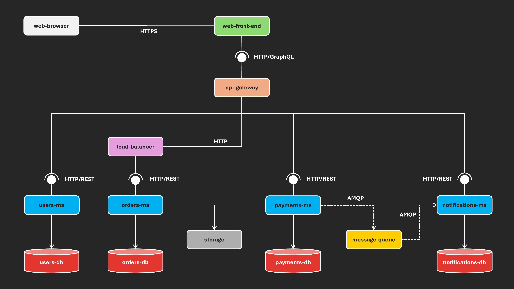

Large-Scale Software Architecture
# Laboratory 1 - Design

## 1. Objective

The objective of this lab is to analyze and extract the architectural design of a large-scale open-source software project. Students will classify the project based on its architectural characteristics according to the large-scale software systems principles.

## 2. Instructions

### 2.1. Architectural View

* Study the **Component & Connector (C&C) View** of a reference software system. The following graphical representation illustrates an example architecture following the microservices style.

* Overview of architectural elements:

  - The software system follows the **microservices architecture style**.
  - The **web-browser** interacts with the **web-front-end** through an HTTPS connector.
  - The **web-front-end** communicates with the **API Gateway** via HTTP/GraphQL connector.
  - The **API Gateway** serves as the entry point for all backend services.
  - A **Load Balancer** distributes traffic among multiple instances of the **Orders Microservice (orders-ms)**.
  - There are four microservices: **users-ms**, **orders-ms**, **payments-ms**, and **notifications-ms**.
  - Each microservice has its own dedicated database (**users-db**, **orders-db**, **payments-db**, **notifications-db**).
  - The **payments-ms** and **notifications-ms** communicate asynchronously via a **message queue** (AMQP connector).
  - The **orders-ms** interacts with a **storage** service for file persistence.

### 2.2. Project Selection

Perform a search for an open-source project that meets at least one of the following characteristics:

* **Large number of components:** The system is composed of multiple interacting components.
* **Large number of concurrent operations:** The system handles a large number of concurrent operations.
* **Large volume of data:** The system processes or stores significant amounts of data.
* **Complex structures (cyber-physical systems):** The system integrates software with physical processes.

### 2.3. Architectural Analysis

* Identify the architectural style of the selected project.
* Extract, represent and describe the architecture.

## 3. Delivery

### 3.1. Deliverable

* Full name.
* URL of the selected open source project repository.
* Structured representation of the architecture, including:
  - Graphical representation illustrating components and their interactions (C&C view).
  - Description of architecture elements.

### 3.2. Submission Format

* The deliverable must be submitted via GitHub ([lssa2025i](https://github.com/unal-lssa/lssa2025i) repository).
* Steps:
  - Use the branch corresponding to your team (team1, team2, ...).
  - In the folder [laboratories/laboratory_1](), create a file **X.md** (where X = your identity document number), which must include the **deliverable**.

### 3.3. Delivery Deadline

Saturday, April 5, 2025, before 23h59.
