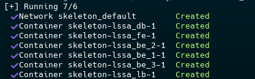
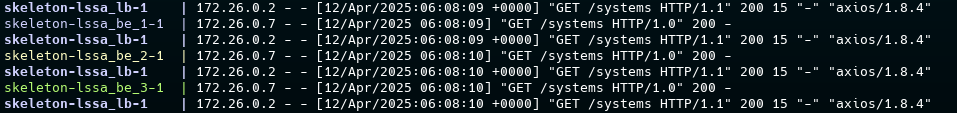
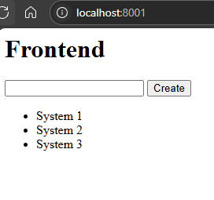

# Large-Scale Software Architecture
# Laboratory 2 - Modeling

## Camilo Andres Cuello Romero

## 1. Objective

The objective of this lab is to apply the Model-Driven Software Engineering (MDE) paradigm in order to automate the generation of the skeleton of a software system from an architectural perspective. Students will create a computer program to define a DSL-based metamodel, define a set of transformation rules, define a model (as a metamodel instance) and execute the generation process.

*DSL: Domain-Specific Language.*

## 2. Modified Files Overview

### 2.1. `arch.tx`

**Changes Made:**
- Added support for the new component type **load_balancer**.
- Updated the `Component` rule to include an optional `instances` attribute.

```tx
Component:
    'component' type=ComponentType name=ID instances=INT?
;

ComponentType:
    'database' | 'backend' | 'frontend' | 'load_balancer'
;
```

### 2.2. `transformations.py`

**Changes Made:**
- *`generate_load_balancer`*: Added a new function to automatically generate the skeleton for the load balancer component using an Nginx configuration.
	```python
	def generate_load_balancer(name, backend: str, instances: int = 1):
		path = f'skeleton/{name}'
		os.makedirs(path, exist_ok=True)
		with open(os.path.join(path, 'nginx.conf'), 'w') as f:
			f.write(textwrap.dedent(f"""
				worker_processes 1;
				events {{
					worker_connections 1024;
				}}
				http {{
					upstream backend_servers {{
						least_conn;
						{f"\n\t".join([f'server {backend}_{i}:80;' for i in range(1, instances + 1)])}
					}}
					server {{
						listen 80;
						location / {{
							proxy_pass http://backend_servers;
						}}
					}}
				}}
			"""))
		with open(os.path.join(path, 'Dockerfile'), 'w') as f:
			f.write(textwrap.dedent("""
				FROM nginx:latest
				COPY nginx.conf /etc/nginx/nginx.conf
			"""))
	```
- *`apply_transformations`*: Updated the  function to handle the load balancer type and its associated attributes like instances.
	```python
	def apply_transformations(model: Model):
		for e in model.elements:
			if e.__class__.__name__ == 'Component':
				# Other component types handling...
				elif e.type == 'load_balancer':
					load_balancer_name = e.name
					back_instances = e.instances
		for component in model.components:
			if component.type == 'load_balancer':
				generate_load_balancer(component.name, backend=backend_name, instances=back_instances)
			# Other transformations...
		generate_docker_compose(components, backend_name=backend_name, backend_instances=back_instances)
	```
- *`generate_docker_compose`*: Modified to include service definitions for the load balancer and modify _backend_ ctype to replicate itself into n (number of replicas) services.
	```python
	def generate_docker_compose(components, backend_name, backend_instances=1):
		path = f'skeleton/'
		os.makedirs(path, exist_ok=True)
		with open(os.path.join(path, 'docker-compose.yml'), 'w') as f:
			sorted_components = dict(sorted(components.items(), key=lambda item: 0 if item[1] == "database" else 1))
			f.write("services:\n")
			db = None
			for i, (name, ctype) in enumerate(sorted_components.items()):
				port = 8000 + i
				if ctype == "database":
					db = name
					f.write(f"  {name}:\n")
					f.write("    image: mysql:8\n")
					f.write("    environment:\n")
					f.write("      - MYSQL_ROOT_PASSWORD=root\n")
					f.write(f"      - MYSQL_DATABASE={name}\n")
					f.write("    volumes:\n")
					f.write(f"      - ./{name}/init.sql:/docker-entrypoint-initdb.d/init.sql\n")
					f.write("    ports:\n")
					f.write("      - '3307:3306'\n")
				# --------- New Backend Handling ---------
				elif ctype == "backend":
					for j in range(1, backend_instances + 1):
						f.write(f"  {name}_{j}:\n")
						f.write(f"    build: ./{name}\n")
						f.write("    depends_on:\n")
						f.write(f"      - {db}\n")
				# --------- New Load Balancer Handling ---------
				elif ctype == "load_balancer":
					f.write(f"  {name}:\n")
					f.write(f"    build: ./{name}\n")
					f.write("    ports:\n")
					f.write("      - '80:80'\n")
					f.write("    depends_on:\n")
					f.write(f"      - {db}\n")
					for j in range(1, backend_instances + 1):
						f.write(f"      - {backend_name}_{j}\n")
				else:
					f.write(f"  {name}:\n")
					f.write(f"    build: ./{name}\n")
					f.write("    ports:\n")
					f.write(f"      - '{port}:80'\n")
			f.write("\nnetworks:\n  default:\n    driver: bridge\n")
	```

### 2.3. `model.arch`

**Changes Made:**
- Included the new **load_balancer** component with an instances parameter.
- Updated connectors to incorporate the load balancer in the communication flow.

```arch
architecture:

    component frontend lssa_fe
    component backend lssa_be
    component database lssa_db
    component load_balancer lssa_lb 3

    connector http lssa_fe -> lssa_lb
    connector http lssa_lb -> lssa_be
    connector db_connector lssa_be -> lssa_db
```

## 3. Evidence

### 3.1 Containers Running


### 3.2 Correctly balancing requests


### 3.3 Frontend correctly working


## 4. Testing

1. **Build Docker Image:**

   ```bash
   docker build -t lssa-lab2 .
   ```

2. **Run Docker Container (Generate skeleton):**

   ```bash
   docker run --rm -v "$PWD:/app" lssa-lab2
   ```

3. **Enter skeleton Folder & Start Services:**

   ```bash
   cd skeleton
   docker-compose up --build
   ```

4. **Verify Containers:**

   ```bash
   docker ps -a
   ```

5. **Open Frontend:**

   Open `http://localhost:8001` in a web browser.

6. **Check Database:**

   ```bash
   docker exec -it skeleton-lssa_db-1 sh
   mysql -u root -p  # Password: root
   SHOW DATABASES;
   USE lssa_db;
   SELECT * FROM systems;
   ```