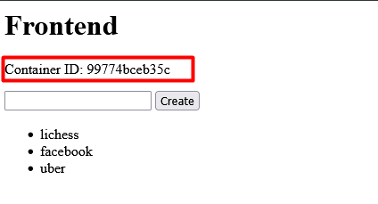
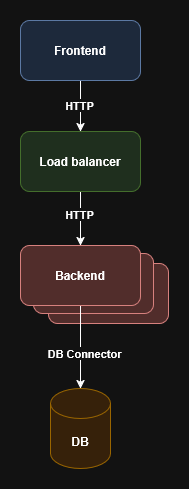

# Laboratory 2 - Modeling

Large Scale Software Architecture

Universidad Nacional de Colombia – 2025-I

## Student Information

Name: Santiago Suárez Suárez

Document ID: 1001326848

## Proyect Overview

This laboratory explores the application of Model-Driven Software Engineering (MDE) to define and transform high-level software architecture models into executable artifacts. The goal is to validate how abstract architecture descriptions can be automatically translated into infrastructure configurations, leveraging transformation rules to generate a container-based architecture.

## How to Run the Project

Follow the steps below to build and run the system from the model definitions:

1. Build the Docker image:

        docker build -t lssa-lab2 .

2. Run the container:

    - Linux / macOS

            docker run --rm -v "$PWD:/app" lssa-lab2

    - PowerShell (Windows)

            docker run --rm -v "${PWD}:/app" lssa-lab2

    This will generate the output architecture inside the `skeleton/` directory.

3. Navigate into the generated folder:

        cd skeleton

4. Start the services and scale the backend to 5 instances:

        docker compose up --build -d --scale lssa_be=5

## Verifying the Setup

To ensure everything is working as expected:

1. Run `docker ps` to confirm all containers are up.1.
2. Access the frontend (default port is 8002) to verify the application.1.
3. Each request on the frontend shows the container ID handling it. This helps verify that the load balancer is correctly distributing traffic among backend instances.



## Architecture C&C Diagram

Below is the Component & Connector (C&C) diagram representing the logical structure of the system.



## Changes Introduced

1. `arch.tx`: Updated Metamodel

    Added support for a new architectural component:

        ComponentType:
            'database' | 'backend' | 'frontend' | 'loadbalancer'
        ;

    This change enables the model to represent an architectural style where a load balancer mediates requests between frontend and backend services.

2. `model.arch`: Architecture Instance

    We defined a specific system architecture with the new loadbalancer component integrated:

        architecture:
            component frontend lssa_fe
            component loadbalancer lssa_lb
            component backend lssa_be
            component database lssa_db

            connector http lssa_fe -> lssa_lb
            connector http lssa_lb -> lssa_be
            connector db_connector lssa_be -> lssa_db

    This architecture emphasizes separation of concerns and scalability by enabling load-balanced backend processing.

3. `transformations.py`: Code Generation Logic

    - **Load Balancer Configuration**

        We added a function to generate an Nginx-based load balancer:

        ```python
            def generate_loadbalancer(name, backend):
                path = f'skeleton/{name}'
                os.makedirs(path, exist_ok=True)

                with open(os.path.join(path, 'nginx.conf'), 'w') as f:
                    f.write(textwrap.dedent(f"""
                        events {{
                            worker_connections 1000;
                        }}

                        http {{
                            server {{
                                listen 80;

                                location / {{
                                    proxy_pass http://{backend}:80;
                                }}
                            }}
                        }}
                    """))
        ```
        Explanation:

        - This function creates the configuration file for the Nginx load balancer.

        - It forwards all incoming HTTP traffic to the backend service, which is defined dynamically by the model.

    - **Docker Compose Generator**

        We also updated the transformation logic to emit a docker-compose.yml file:

        ```python
            def generate_docker_compose(components):
                path = f'skeleton/'
                os.makedirs(path, exist_ok=True)

                with open(os.path.join(path, 'docker-compose.yml'), 'w') as f:
                    sorted_components = dict(sorted(
                        components.items(),
                        key=lambda item: 0 if item[1] == "database" else 1 if item[1] == "backend" else 2
                    ))

                    f.write("services:\n")

                    db = None
                    back = None

                    for i, (name, ctype) in enumerate(sorted_components.items()):
                        port = 8000 + i
                        f.write(f" {name}:\n")
                        if ctype == "database":
                            db = name
                            f.write("    image: mysql:8\n")
                            f.write("    environment:\n")
                            f.write("        - MYSQL_ROOT_PASSWORD=root\n")
                            f.write(f"        - MYSQL_DATABASE={name}\n")
                            f.write("    volumes:\n")

                            f.write(f"       - ./{name}/init.sql:/docker-entrypoint-initdb.d/init.sql\n")

                            f.write("    ports:\n")
                            f.write("       - '3306:3306'\n")
                        elif ctype == "loadbalancer":
                            f.write("    image: nginx:latest\n")
                            f.write("    volumes:\n")
                            f.write(f"       - ./{name}/nginx.conf:/etc/nginx/nginx.conf:ro\n")
                            f.write("    ports:\n")
                            f.write(f"       - '{port}:80'\n")
                            f.write(f"    depends_on:\n      - {back}\n")
                        else:
                            f.write(f"   build: ./{name}\n")

                            if ctype == "frontend":
                                f.write(f"   ports:\n       - '{port}:80'\n")
                            elif ctype == "backend":
                                back = name
                                f.write(f"   ports:\n       - '80'\n")
                                f.write(f"   depends_on:\n      - {db}\n")

                    f.write("\nnetworks:\n  default:\n      driver: bridge\n")
        ```

        Explanation:

        -This function interprets the architecture model and generates a validate docker-compose.yml file.

        -It determines build order, assigns ports, configures dependencies, and sets up volume mounts.

        -Backend and frontend services are auto-generated, ensuring consistency with the model.

        -Load balancer depends on backend; backend depends on the database.
