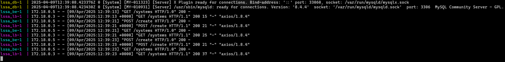

# Laboratory 2
#### Daniel Estivenson Dorado Lame

## Summary
For this laboratory, I changed the `arch.tx`, `transformations.py` and `model.arch` files to include a new component type `load_balancer`. The changes were:

### arch.tx
- Added a new `ComponentType` called `load_balancer`

### model.arch
- Added a new `component` in the architecture called `lssa_lb`
- Updated `connector http` for `lssa_fe` instead of going to `lssa_be` now goes to `lssa_lb`
- Added a new `connector http` from `lssa_lb` to `lssa_be`

### transformations.py
- Created a new `generate_load_balancer` function with the configuration for a nginx service
- Updated `generate_frontend` function to take `load_balancer` input instead of `backend` (naming)
- Updated `generate_docker_compose` function to take into account a priority for component creation 
- Updated `generate_docker_compose` function to include the `load_balancer` creation
- Updated `apply_transformations` function to include the `load_balancer` type

## Evidence

This screenshot shows a frontend service working as before, where two elements were created

This screenshot shows logs for the requests made from frontend to the load_balancer and then to the backend.

## Conclusion
Now, with the new `load_balancer` component configured we can create a bunch of `backend` instances effortless in the `model.arch` file and the frontend won't notice that change since it's connected to the `load_balancer`. This probablly will require some configuration for the `generate_load_balancer` function since I'm not sure nginx can handle multiple instances in the current configuration state, but this is a prove of concept (POC) of the power of metamodeling.
