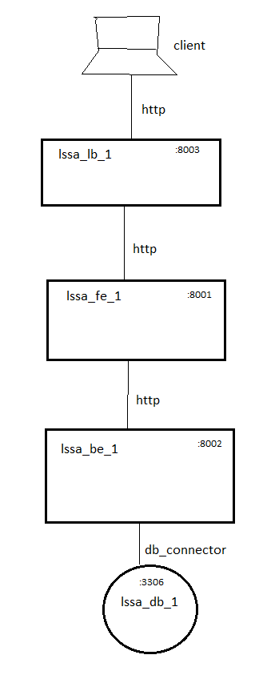

# Laboratory 2 - MDE

**Name**: Sergio Andres Cabezas

## Work description:

In order to allow a new load balancer component to be created and deployed by the proposed model-driven-architecture backbone, the following has been done:

Included new load_balancer component definition to DSL-defined allowed syntax. 

```tx
Model:
    'architecture' ':'
        elements*=Element
;

Element:
    Component | Connector
;

Component:
    'component' type=ComponentType name=ID
;

Connector:
    'connector' type=ConnectorType from=[Component] '->' to=[Component]
;

ComponentType:
    'frontend' | 'backend' | 'database' | 'load_balancer'
;

ConnectorType:
    'http' | 'db_connector'
;
```

Added new components to model file:

```arch
architecture:

    component frontend lssa_fe
    component backend lssa_be
    component database lssa_db
    component load_balancer lssa_lb

    connector http lssa_lb -> lssa_fe
    connector http lssa_fe -> lssa_be
    connector db_connector lssa_be -> lssa_db
```

For the sake of this exercise, a new HAProxy load balancer has been added. Such balancer requires a dedicated container with an HAProxy Alpine image and HAProxy configuration file. Also a GET Healthcheck endpoint has been created in frontend artifact for the load balancer to verify connection. The proposed architecture is as follows: 




For this implementation, the load balancer receives client traffic and redirects it to actual frontend artifact. The related code is as follows: 

```python
def generate_load_balancer(name, frontend):
    
    path = f'skeleton/{name}'
    os.makedirs(path, exist_ok=True)

    with open(os.path.join(path, 'Dockerfile'), 'w') as f:
        f.write(textwrap.dedent("""
            FROM haproxy:2.8-alpine

            COPY haproxy.cfg /usr/local/etc/haproxy/haproxy.cfg

            EXPOSE 80 8404

            # Health check
            HEALTHCHECK --interval=5s --timeout=3s CMD wget --no-verbose --tries=1 --spider http://localhost:8404/stats || exit 1
            """
        ))

    with open(os.path.join(path, 'haproxy.cfg'), 'w') as f:
        f.write(textwrap.dedent(f"""
            global
                log stdout format raw local0
                maxconn 4096
                user haproxy
                group haproxy

            defaults
                log     global
                mode    http
                option  httplog
                option  dontlognull
                retries 3
                timeout connect 5s
                timeout client  30s
                timeout server  30s
                timeout http-request 10s

            # Stats page
            listen stats
                bind *:8404
                stats enable
                stats uri /stats
                stats refresh 10s
                stats admin if TRUE

            # Frontend configuration
            frontend http_front
                bind *:80
                default_backend web_servers
                
                # Add request headers
                http-request set-header X-Forwarded-Proto http

            # Backend configuration for web servers
            backend web_servers
                balance roundrobin
                option httpchk GET /health
                http-check expect status 200
                server {frontend} {frontend}:80 check
            """
        ))
```

```python
def generate_docker_compose(components):

    path = f'skeleton/'
    os.makedirs(path, exist_ok=True)

    with open(os.path.join(path, 'docker-compose.yml'), 'w') as f:
        
        sorted_components = dict(sorted(components.items(), key=lambda item: 0 if item[1] == "database" else 1))

        f.write("services:\n")

        db = None
        fe = None

        for i, (name, ctype) in enumerate(sorted_components.items()):
            port = 8000 + i
            f.write(f"  {name}:\n")
            if ctype == "database":
                db = name
                f.write("    image: mysql:8\n")
                f.write("    environment:\n")
                f.write("      - MYSQL_ROOT_PASSWORD=root\n")
                f.write(f"      - MYSQL_DATABASE={name}\n")
                f.write("    volumes:\n")
                f.write(f"      - ./{name}/init.sql:/docker-entrypoint-initdb.d/init.sql\n")
                f.write("    ports:\n")
                f.write("      - '3306:3306'\n")
            else:
                f.write(f"    build: ./{name}\n")
                f.write(f"    ports:\n      - '{port}:80'\n")
                if ctype== "backend":
                    f.write(f"    depends_on:\n      - {db}\n")
                if ctype== "frontend":
                    fe = name
                if ctype== "load_balancer":
                    f.write(f"      - '8084:8084'\n")
                    f.write(f"    depends_on:\n      - {fe}\n")
                    f.write(f"    restart: unless-stopped\n")

        f.write("\nnetworks:\n  default:\n    driver: bridge\n")
```

Once the entire stack is running, user traffic is handled via **http://localhost:8003** URL.