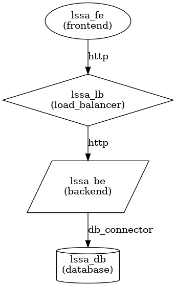

# Large-Scale Software Architecture

## Laboratory 2 - Modeling

### ✅ Author

- **Name:** Jilkson Alejandro Pulido Cruz
- **ID:** 1024507506

## 1. Objective

The objective of this laboratory is to apply the Model-Driven Software Engineering (MDE) paradigm to automate the generation of a software system skeleton from an architectural perspective.

## 2. Laboratory

### 2.1 New Component: Load Balancer

A new component type, **load balancer**, has been added.

#### 2.1.1 **arch.tx**

The `arch.tx` file has been updated to include the new component type:

```ebnf
ComponentType:
    'frontend' | 'backend' | 'database' | 'load_balancer'
```

#### 2.1.2 **transformations.py**

A new function has been added to generate the load balancer using Node.js for load balancing:

```python
def generate_load_balancer(name, targets):
    path = f'skeleton/{name}'
    os.makedirs(path, exist_ok=True)

    with open(os.path.join(path, 'Dockerfile'), 'w') as f:
        f.write(textwrap.dedent("""
            FROM node:18
            WORKDIR /app
            COPY . .
            RUN npm install express http-proxy
            CMD ["node", "app.js"]
        """))

    with open(os.path.join(path, 'app.js'), 'w') as f:
        targets_str = ", ".join([f"'{t}'" for t in targets])
        f.write(textwrap.dedent(f"""
            const express = require('express');
            const httpProxy = require('http-proxy');
            const app = express();
            const proxy = httpProxy.createProxyServer({{}});
            const targets = [{targets_str}].map(host => `http://${{host}}:80`);
            let index = 0;

            app.use((req, res) => {{
                const target = targets[index % targets.length];
                index++;
                proxy.web(req, res, {{ target }});
            }});

            app.listen(80, () => console.log("Load balancer running on port 80"));
        """))
```

The `generate_docker_compose` function has been modified to include the load balancer and generate two backend instances:

```python
elif ctype == "backend":
    for suffix in ['1', '2']:
        instance_name = f"{name}{suffix}"
        f.write(f"  {instance_name}:\n")
        f.write(f"    build: ./{name}\n")
        f.write(f"    ports:\n      - '{port}:80'\n")
        f.write(f"    depends_on:\n      - {db}\n")
        port += 1
elif ctype == "load_balancer":
    port += 1
    f.write(f"  {name}:\n")
    f.write(f"    build: ./{name}\n")
    f.write(f"    ports:\n      - '{port}:80'\n")
    f.write(f"    depends_on:\n")
    f.write(f"      - lssa_be1\n")
    f.write(f"      - lssa_be2\n")
```

The `apply_transformation` function has also been updated to handle the load balancer:

```python
elif e.type == 'load_balancer':
    generate_load_balancer(e.name, targets=[f"{backend_name}1", f"{backend_name}2"])
```

#### 2.1.3 **model.arch**

The `model.arch` file has been updated to include the load balancer component and modify the connections:

```ebnf
architecture:

    component frontend lssa_fe
    component backend lssa_be
    component database lssa_db
    component load_balancer lssa_lb

    connector http lssa_fe -> lssa_lb
    connector http lssa_lb -> lssa_be
    connector db_connector lssa_be -> lssa_db
```

---

### 2.2 Updated Architecture Diagram

The updated architecture diagram, reflecting the addition of the **load balancer** component, is shown below:


