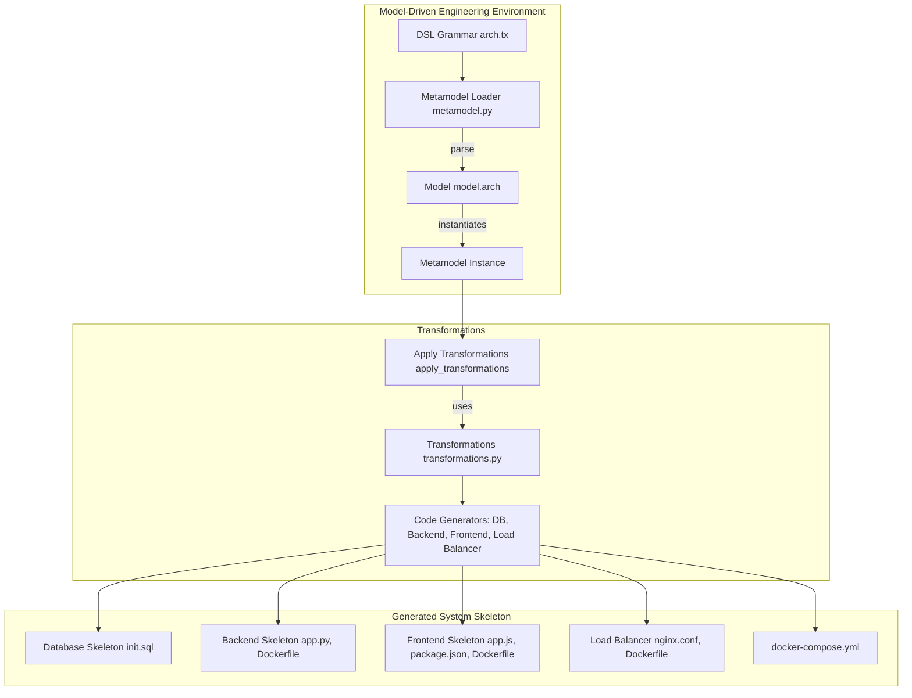
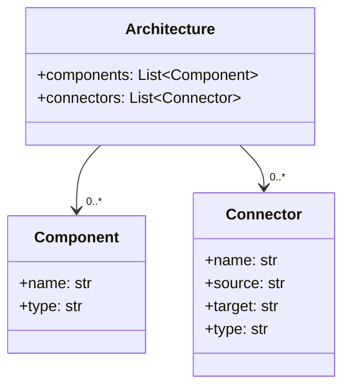
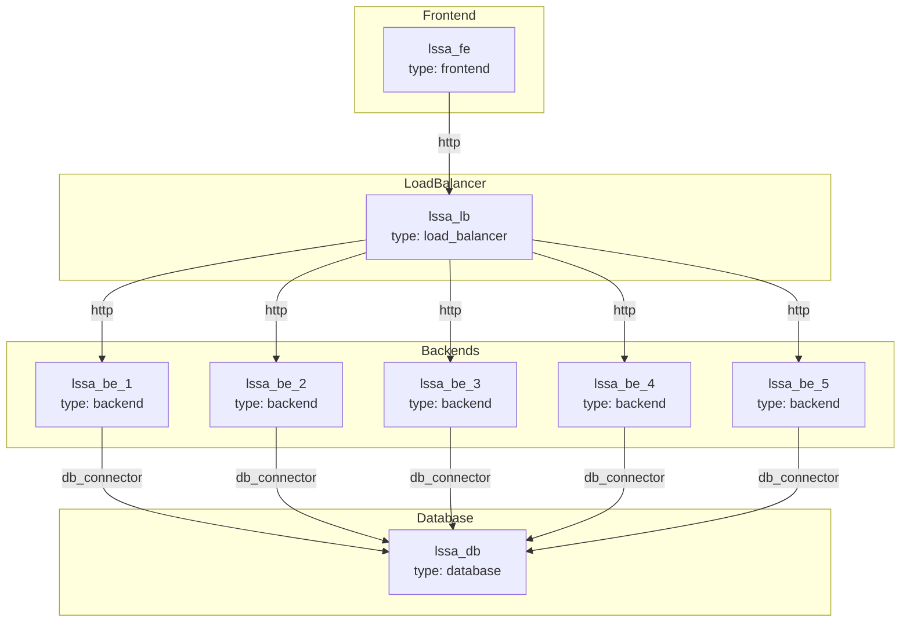
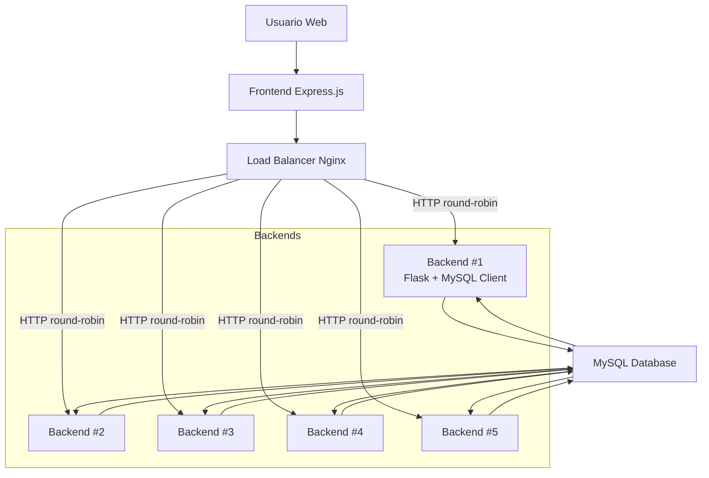
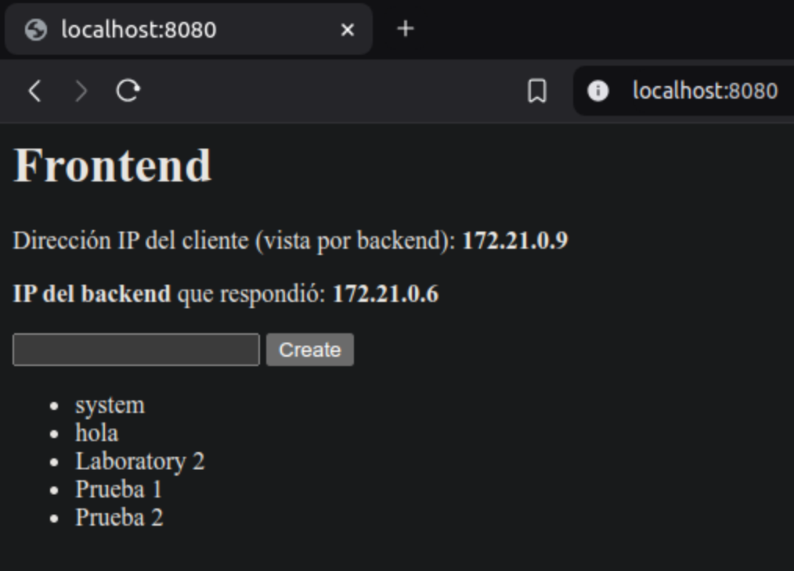

# Laboratorio 2 - Modelado

**Nombre**: Sebastian Rios Sabogal

**Cédula**: 1143825130

---


## 1. El siguiente diagrama representa la arquitectura del sistema bajo el paradigma Model-Driven Engineering:

### Explicación de los bloques:

- **Model-Driven Engineering**: Captura el uso de la gramática DSL `arch.tx`, cargada como metamodelo con `metamodel.py`, y utilizada para instanciar un modelo concreto `model.arch`.
- **Transformations**: Aplica lógica declarada en `transformations.py` para generar código fuente desde la arquitectura descrita.
- **Generated System Skeleton**: Esqueleto del sistema generado automáticamente, incluyendo contenedores de `frontend`, `backend`, `base de datos` y `balanceador de carga`.



---

## 2. Diagrama del Metamodelo generado por textX:



---

## 3. El siguiente diagrama es una representacion del modelo Component & Connector (C&C)

### Componentes:

- **Frontend**: Interfaz de usuario.
- **LoadBalancer**: Distribuye tráfico entre los backends.
- **Backends**: Réplicas generadas automáticamente.
- **Database**: Persistencia de datos.

### Conectores:

- **http**: Comunicación REST entre frontend, balanceador y backends.
- **db_connector**: Interacción entre backend y base de datos.



---

## 4. El siguiente diagrama es una representacion logica del flujo:



### Descripción del flujo:

1. **Usuario → Frontend**: Un usuario accede al sistema vía navegador, interactuando con la interfaz servida por el contenedor frontend `Express.js`.
2. **Frontend → Load Balancer**: Todas las solicitudes HTTP POST/GET son redirigidas al Load Balancer `nginx`, quien implementa una estrategia de balanceo (e.g., round-robin).
3. **Load Balancer → Backends (x5)**: Se enrutan peticiones dinámicamente entre las 5 réplicas del backend `Flask apps`, generadas automáticamente.
4. **Backends → Base de Datos**: Cada backend maneja peticiones y realiza operaciones INSERT y SELECT sobre una única instancia de `MySQL`.

---

## 5. Estructura del Proyecto:

```plaintext
.
├── arch.tx                # Gramática del DSL de arquitectura
├── metamodel.py           # Loader del metamodelo con textX
├── model.arch             # Modelo de arquitectura (instancia del DSL)
├── transformations.py     # Reglas de transformación (M2T)
├── generation.py          # Script principal para ejecutar todo el flujo
├── build.sh               # Script opcional de automatización
├── README.md              # Documentación del proyecto
└── skeleton/              # Carpeta generada automáticamente (output)
    ├── lssa_be/           # Backend (Flask)
    │   ├── app.py
    │   └── Dockerfile
    ├── lssa_db/           # Base de datos (MySQL)
    │   └── init.sql
    ├── lssa_fe/           # Frontend (Express.js)
    │   ├── app.js
    │   ├── package.json
    │   └── Dockerfile
    ├── lssa_lb/           # Load Balancer (Nginx)
    │   ├── nginx.conf
    │   └── Dockerfile
    └── docker-compose.yml # Orquestación del sistema completo
```

## 6. Generar y ejecutar todo el sistema:

Todo el flujo MDE desde la interpretación del modelo hasta la generación y despliegue del sistema está automatizado mediante el script `build.sh`.

```bash
./build.sh
```

### Este script realiza las siguientes tareas:

1. Interpreta el modelo arquitectónico definido en `model.arch`.
2. Genera automáticamente los componentes en la carpeta `skeleton/`:
    - Backend (Flask)
    - Frontend (Express.js)
    - Base de datos (MySQL)
    - Balanceador de carga (Nginx)
3. Ejecuta `docker-compose up --build` para levantar todo el sistema.

### Verificación:

1. Visitar en navegador:
    - Frontend: [http://localhost:8080](http://localhost:8080) (lssa_fe)

2. Verificar base de datos vía:
```bash
docker exec -it skeleton-lssa_db-1 sh
```
```bash
mysql -u root -p
```
Password = root
```bash
SHOW DATABASES;
```
```bash
USE lssa_db;
```
```bash
SELECT * FROM systems;
```

## 7. Validar el balanceador de cargar:

Cuando visita el Frontend en el navegador, y cada vez que actualiza la página, puede observar que la dirección IP del Backend cambia. Esto indica que el balanceador de carga redirige las peticiones a una réplica distinta del Backend en cada solicitud.


