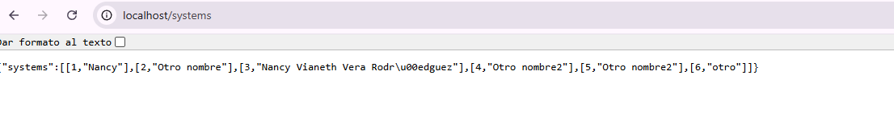
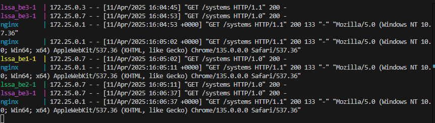

**Nancy Vianeth Vera Rodiguez**

### Cambios realizados

#### En el modelo
* Se crearon 2 nuevos backend, para contar con 3 backend en total
* Se creó el componente para el balanceador de carga
* Se crearon los conectores entre el balanceador y cada uno de los backend
* Se creó un conector del frontend al balanceador
  
      architecture:
      component load_balancer lssa_lb
      component frontend lssa_fe
      component backend lssa_be1
      component backend lssa_be2
      component backend lssa_be3
      component database lssa_db
      
      connector http lssa_fe -> lssa_lb  
      connector db_connector lssa_be1 -> lssa_db  
      connector load_balancer_connector lssa_lb -> lssa_be1  
      connector load_balancer_connector lssa_lb -> lssa_be2  
      connector load_balancer_connector lssa_lb -> lssa_be3  

#### En transformaciones
* Se genera el balanceador

       def generate_nginx_conf(components):
      
          path = "skeleton/lssa_lb"
          os.makedirs(path, exist_ok=True)
      
          nginx_conf = """
      events {
          worker_connections 1024;
      }
      
      http {
          upstream backend {
      """
      
          for name, ctype in components.items():
              if ctype == "backend":
                  nginx_conf += f"        server {name}:80;\n"
      
          nginx_conf += """
          }
      
          server {
              listen 80;
              
              location / {
                  proxy_pass http://backend;
                  proxy_set_header Host $host;
                  proxy_set_header X-Real-IP $remote_addr;
                  proxy_set_header X-Forwarded-For $proxy_add_x_forwarded_for;
                  proxy_set_header X-Forwarded-Proto $scheme;
              }
          }
      }
      """
* Se actualiza generate-docker_compose para incluir el balanceador
  
        f.write("\n lssa_lb:\n")
        f.write("  image: nginx:latest\n")
        f.write("  container_name: nginx\n")
        f.write("  ports:\n")
        f.write("    - '80:80'\n")
        f.write("  depends_on:\n")
        f.write("    - lssa_fe\n")
        f.write("    - lssa_be1\n")
        f.write("    - lssa_be2\n")
        f.write("    - lssa_be3\n")
        f.write("  volumes:\n")
        f.write("    - ./lssa_lb/nginx.conf:/etc/nginx/nginx.conf\n")

* Se actualiza apply_transforamations para incluir el balanceador

      generate_nginx_conf(components)

### Pruebas

* Frontend en ejecución
  
  Como se observa a continuación el Frontend quedó operativo, recibiendo datos y almacenandolos en la base de datos:
  
  
  
* Consulta a la Base de Datos
  
  Se puede apreciar que las consultas a la base de datos funcionan normalmente
  
  
  
* Validación del balanceo entre los tres backend
  
  Cada petición realizada, es respondida por una instancia diferente del backend
  
  

