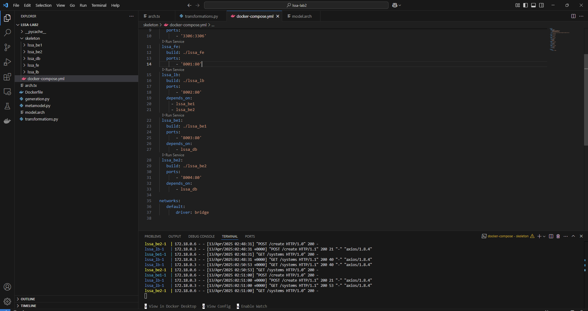
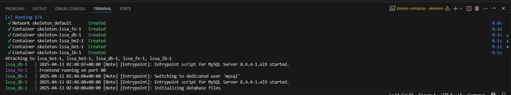
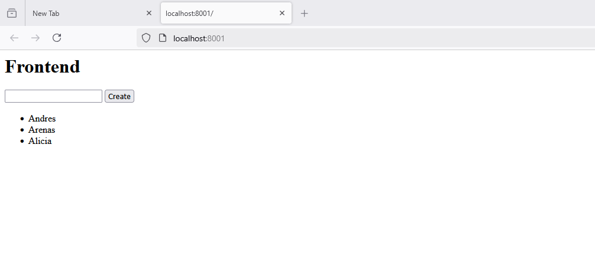

# [LSSA_2025i] - U2 - Laboratory 2

**Nombre:** Andrés Arenas

**Description**
The objective of this laboratory is to run in our on machine the given code and templates, and modify it to include a loadbalancer component. The changes are detailed below:


**arch.tx**

A new component called loadbalancer is defined.

ComponentType:
    'frontend' | 'loadbalancer' | 'backend' | 'database'  
;

The component is inserted between frontend and backend because the loadbalancer goes in the middle of the communicaton of those components. The order doen't matter besides the readibility tho.


**model.arch**

The approach that was taken covers 2 backend components. The main changes in here are: 

- The connector that previously existed from the frontend to the backend (only want) goes not more, and its replaced for a connection from frontend to the loadbalancer.
- The loadbalancer has one connection to each one of the backends.
- From each backed exists a connection to the database. 


    architecture:
        component frontend lssa_fe
        component loadbalancer lssa_lb
        component backend lssa_be1
        component backend lssa_be2
        component database lssa_db
        
        connector http lssa_fe -> lssa_lb
        connector http lssa_lb -> lssa_be1
        connector http lssa_lb -> lssa_be2
        connector db_connector lssa_be1 -> lssa_db
        connector db_connector lssa_be2 -> lssa_db


**transformations.py**


A new function was created to generate the loadbalancer component:

```python
def generate_loadbalancer(name, backend_services):
    path = f'skeleton/{name}'
    os.makedirs(path, exist_ok=True)
    upstream_block = "\n".join([f"        server {svc}:80;" for svc in backend_services])

    with open(os.path.join(path, 'nginx.conf'), 'w') as f:
        f.write(textwrap.dedent(f"""
            events {{}}
            http {{
                upstream backend_servers {{
{upstream_block}
                }}
                server {{
                    listen 80;
                    location / {{
                        proxy_pass http://backend_servers;
                    }}
                }}
            }}
            """
        ))

    with open(os.path.join(path, 'Dockerfile'), 'w') as f:
        f.write(textwrap.dedent("""
            FROM nginx:alpine
            COPY nginx.conf /etc/nginx/nginx.conf
            """
        ))


```
Some changes were done in other code sections to connect the related components, in example generate_frontend :

Before:

```python
def generate_frontend(name, backend):
```

After

```python
def generate_frontend(name, loadbalancer):
```


And apply_transformations had some changes too:

```python
def apply_transformations(model):
    components = {}
    backend_names = []
    database_name = None
    frontend_name = None
    loadbalancer_name = None

    for e in model.elements:
        if e.__class__.__name__ == 'Component':
            components[e.name] = e.type
            if e.type == 'database':
                database_name = e.name
            elif e.type == 'backend':
                backend_names.append(e.name)
            elif e.type == 'frontend':
                frontend_name = e.name
            elif e.type == 'loadbalancer':
                loadbalancer_name = e.name

    for e in model.elements:
        if e.type == 'database':
            generate_database(e.name)
        elif e.type == 'backend':
            generate_backend(e.name, database=database_name)
        elif e.type == 'frontend':
            generate_frontend(e.name, loadbalancer=loadbalancer_name)
        elif e.type == 'loadbalancer':
            generate_loadbalancer(e.name, backend_services=backend_names)

    generate_docker_compose(components, backends=backend_names)
```

There are other changes that are found on code.


**Evidence execution after changes**


The image below shows the generated yml and all the components created for the model with 1 balancer (lssa_lb) and 2 backends (lssa_be1 and lssa_be2)




Then we can see all the containers are running:




And finally we can see the program is still working:




**Biggest challenges I had**

- Copy pasting from a pdf can be painful, the indentation is lost on the process and it has a lot of meaning for python. Fixing the indentation took some time.
- The creation of the container didnt work with this command:
	docker run --rm -v "$PWD:/app" lssa-lab2
  it has to be changed to:
	docker run --rm -v "${PWD}:/app" lssa-lab2
- The changes to transformations.py had some work but it worked in the end.


********