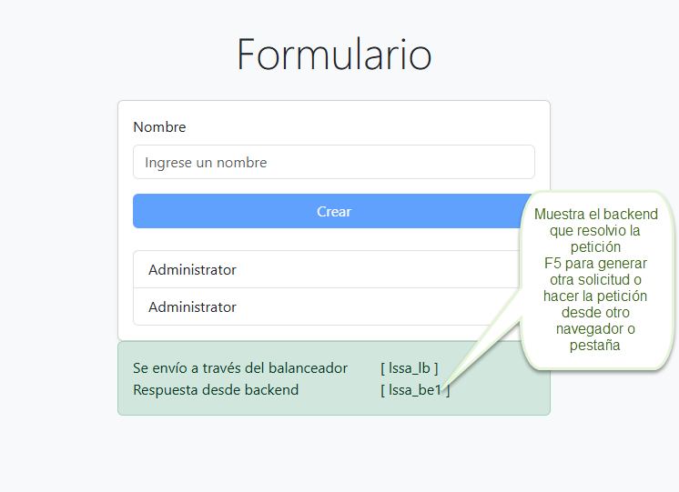

## Laboratorio 2

Edsson Yannick Bonilla Hernandez

## Cambios generados
Se realizan los siguientes cambios

* Se crean plantillas para manejar el código a generar por cada componente, estos se estructuran en la carpeta "**Templates**" con archivos de extensión "**Templ**"
* Se modifica el archivo "**arch.tx**" adicionando el componente "**load-balancer**"
* Se modifica el archivo "**model.arch**" para adicionar el componente "**load-balancer**" y sus conexiones
* Se crean las plantillas con la configuración del **load-balancer** se crea el "**Dockerfile nginx**" y el  "**nginx.config**" para la creación del contenedor.
* Se modifica el programa "**transformation.py**" para adicionar la opción de generar el contenedor en el "**Docker-compose**" y relaciones con otros componentes  y también se crea otra instancia del **backend**
* Se modifican los demás componentes ""**backend y frontend**" para adicionar correctamente el balanceador de carga que está puesto para diferentes instancias del backend
* Se generan los gráficos del metamodelo y el modelo

## Diagrama de metamodelo

## Diagrama de modelo

## Flujo del programa

* Se carga en un navegador por la url http://localhost:8001/ el frontend 
* Desde el frontend por conexión  **http** se realiza solicitudes al balanceador de carga http://localhost:9091
* El balanceador de carga realiza el balanceo de servidores backend a través de **http** con el algoritmo Round Robin en secuencia al servicio en la url http://localhost:8082 o http://localhost:8083
* Existen dos instancias del backend y de acuerdo a las solicitues realizadas por el "**load-balancer**" realiza la petición conectandose via **http** a la base de datos por la url http://localhost:3307 y retorna o la creción o el listado completo dependiendo de la solicitud.

## Evidenciar el  balanceador de carga

* En el campo que se resalta en la imagen anterior muestra desde que servidor backend se realizo la solicitud, ya sea **lssa_be o lssa_be1** para cambiar ese valor se puede hacer de dos formas una con **F5** lo cual refresca y se realiza otra solicitud lo que el balanceador hace es repartir esa solicitud, por lo tanto devolvera unico para cada servidor. O la segunda opción es realizar la solicitud desde otro navegador o pestaña lo cual hace lo mismo antes indicado.
