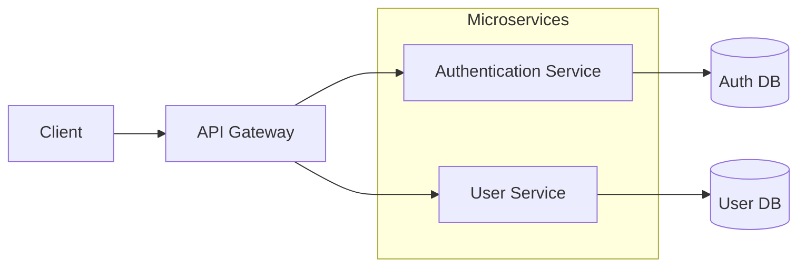
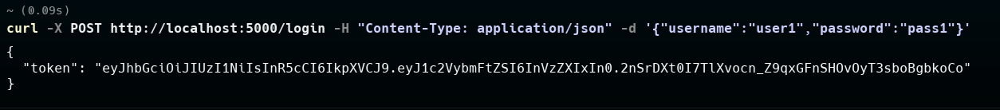
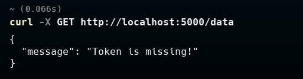
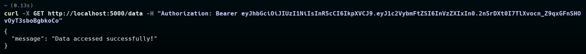
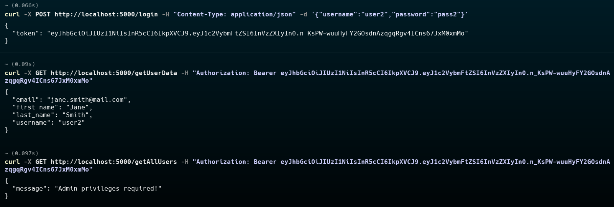
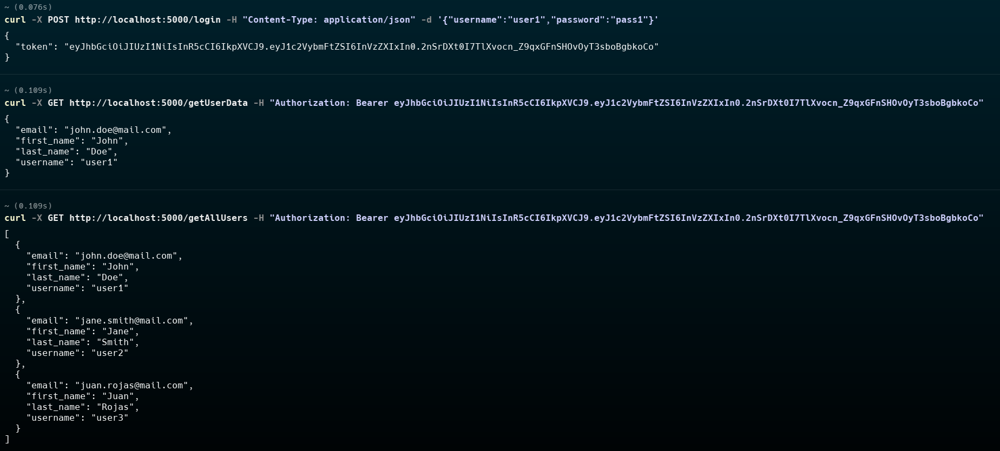

 Large-Scale Software Architecture
# Laboratory 3 - Security

## Author:
 Camilo Andres Cuello Romero

## Overview of Changes
This project extends the original sample by introducing a full API Gateway pattern and **Limit Exposure** security tactic across microservices and databases:

- Centralized **API Gateway** for authentication, authorization (JWT tokens), and IP-based access control.
- Separate **authentication** and **user** microservices, each hidden behind the gateway.
- Dedicated **databases** for each service, accessible only by their respective microservice.
- Decorators (`limit_exposure`, `token_required`, `admin_required`) to enforce service-to-service restrictions and user roles.

## Architecture Diagram


## Prerequisites
- Docker & Docker Compose installed

## Build and Run
1. Open a terminal in the project root (`1001193487`).
2. Build images:
```bash
docker compose build
```
3. Start all services:
```bash
docker compose up
```
4. Check logs or service health:
```bash
docker compose ps
```


## API Endpoints (detailed overview)
### API Gateway Endpoints (http://localhost:5000) [Accessible by all clients]
- GET / : Welcome message (no auth)
- POST /login : Forward credentials to Auth MS, returns JWT on 200, 401/403 on failure
- POST /register : Create user in Auth MS then Users MS, returns 201 or error
- GET /getUserData : Validate JWT, fetch auth data from Auth MS and profile from Users MS
- GET /data : Protected route, requires valid JWT
- GET /getAllUsers : Admin-only, fetch list from Users MS
- GET /getUserByUsername/{username} : Admin-only, fetch specific profile

### Auth Microservice Endpoints (http://auth_ms:80) [Just accessible by the Gateway]
- POST /login : Validate against Auth DB, issue JWT on success
- POST /register : Add new user to Auth DB
- GET /is_admin : JWT auth, checks user role in Auth DB, returns 200 if admin
- GET /getUser : JWT auth, returns auth record for token's user
- POST /validate_token : Verify JWT, return 200 if valid

### User Microservice Endpoints (http://users_ms:80) [Just accessible by the Gateway]
- GET /getAllUsers : Fetch all profiles from Users DB
- GET /getUserByUsername/{username} : Fetch single profile
- POST /createUser : Add new profile record

### Auth DB Service Endpoints (http://auth_db:80) [Just accessible by the Auth MS]
- GET /db : Health check, gateway only
- GET /getAllUsers : Returns all auth records
- GET /getUser/{username} : Returns record or 404
- POST /addUser : Insert auth record, returns 201

### Users DB Service Endpoints (http://users_db:80) [Just accessible by the Users MS]
- GET /db : Health check, gateway only
- GET /getAllUsers : Returns all user profiles
- GET /getUserByUsername/{username} : Returns profile or 404
- POST /createUser : Insert profile record

## Testing the System
1. **Login:** Obtain JWT token
   ```bash
   curl -X POST http://localhost:5000/login \
     -H "Content-Type: application/json" \
     -d '{"username":"user1","password":"pass1"}'
   ```
   
   
   

2. **Access Protected Data:**
   ```bash
   curl -X GET http://localhost:5000/data \
     -H "Authorization: Bearer <TOKEN>"
   ```

*Unauthorized access will return an error.*
   

*Authorized access will return a 200 status with data.*
   

3. **Admin Endpoints:** (e.g., `/getAllUsers`)
   
   *Non-admin users will receive an error.*
   
   **Admin users will have access.*
   


---
*Author: Camilo Andres Cuello Romero*