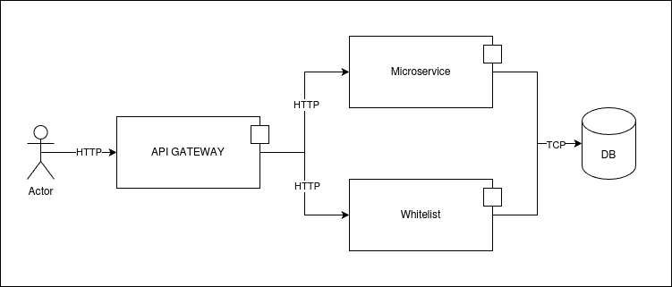

# Laboratory 3 - Security

Daniel Estivenson Dorado Lame

## Execution
### Prerequisites
- Docker (required)
- Docker compose (required)
- Make command (optional but recommended)

### Execution - Makefile
1. Use `make init` to build and pull all the required images for this laboratory.
2. Use `make run` to start the project.
3. Use any `*-request` to test case scenarios quickly.
    - `valid-login-request` returns the response for a valid login request.
    - `invalid-login-request` returns the response for an invalid login request.
    - `full-valid-request` returns the response for a login + authorization-needed endpoint.
    - `invalid-external-request` returns the response for a non IP-authorized client request.
    - `rate-limit-request` executes 15 request to show a rate limit scenario.
4. Use `make stop` to shutdown any running container.

### Execution - Manual
1. Use `docker compose up -d` to start up the project in detached mode.
2. You can run some request from the `host` machine. Take a look at the `Makefile` to show some valid requests using `curl`.
3. Use `docker compose run --rm invalid_request` to start a service to simulate a request from a non IP-authorized client.
4. Use `docker compose down` to shutdown the project

## Explanation
The C&C diagram for current architecture is the following:

This diagram illustrates several components:
- Actor: The user who initiates requests to our system.
- API Gateway: The component responsible for routing inbound traffic to the appropriate service. It prevents users from accessing backend services directly.
- Microservice: A service that simulates or mocks part of our system, which we don't want to expose publicly.
- Whitelist Service: Manages all whitelist-related operations. It is placed behind the API Gateway to ensure it cannot be accessed directly.
- Database: Stores data used by various services across the system.

This diagram highlights a key principle of this system: **secure by design**. The *Limit Exposure* tactic is implemented to minimize the visibility and accessibility of sensitive components. The main security measures in place include:
- Whitelist: Only IP-authorized clients are allowed to interact with the system.
- Rate Limiting: Prevents abuse or misuse by restricting the number of requests a client can make.
- Software-Defined Networks (SDNs): Provide logical separation between components, ensuring that only intended services can communicate with each other. For instance, the microservice is not directly accessible by any client, and the database cannot be reached by the API Gateway since they reside on separate network interfaces.
