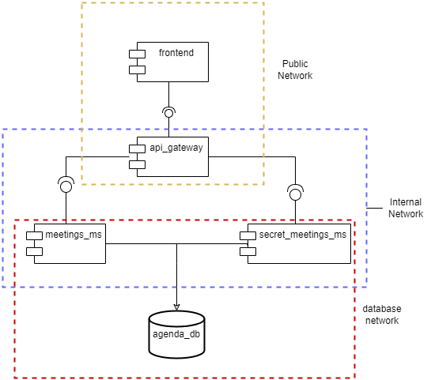

# Name: Cristian Camilo Triana García
# Agenda Microservices Application
A demonstration microservices application built with Python (Flask).
In order to apply the tactic of limit exposure,
I added a Role-Based Access Control (RBAC), a frontend to interaction with the apigateway, incluing now CORS validations, and isolated the networks using docker compose.


## Requirements

*   **Docker:** Latest stable version recommended.
*   **Docker Compose:** Usually included with Docker Desktop, otherwise install separately. (V2 preferred).
*   **Web Browser:** For interacting with the frontend.
*   **Terminal / Command Line:** For running Docker Compose commands.

## Getting Started

1.  **Build and Run Containers:**
    From the project's root directory (where `docker-compose.yml` is located), run:
    ```bash
    docker-compose up --build -d
    ```
2.  **Access the Application:**
    Once the containers are up and running (it might take a few moments for the database and APIs to initialize), open your web browser and navigate to:
    `http://localhost:8080`

3.  **Stopping the Application:**
    To stop and remove the containers, networks, and volumes, run:
    ```bash
    docker-compose down
    ```
    *   To stop and remove containers *and* the database data volume (deleting all meeting data), run:
        ```bash
        docker-compose down -v
        ```

## Usage

1.  **Login:** Access `http://localhost:8080`. You will see a login form. Use one of the following mock credentials defined in *api-gateway*:
    *   Username: `Pam`, Password: `Jim1234` (Role: `secretary`)
    *   Username: `Dwight`, Password: `Beet1234` (Role: `master`)
2.  **Interaction:** After successful login, you will see:
    *   A welcome message displaying your username and role.
    *   A "See Meetings" button: Click this to fetch meeting data from the backend via the API Gateway (requires `master` or `secretary` role).
    *   An "Extra Meetings" button (requires `master` role).
    *   A "Logout" button: Click this to clear your session information and return to the login screen.

## Role Management

Role-Based Access Control (RBAC) is implemented in the `api_gateway` service in order to improve the limit exposure:

1.  **Role Definition:** User roles are currently hardcoded in the `USERS` dictionary within `api-gateway/app.py`. In a real application, this would come from a database or identity provider.
2.  **JWT Payload:** Upon successful login (`/login`), the gateway generates a JWT containing claims about the user, **including their `role`**.
3.  **`@roles_required` Decorator:** This custom Flask decorator is applied to protected routes in `gateway.py`.
    *   It first validates the JWT (checking signature, expiry).
    *   It then extracts the `role` claim from the validated JWT payload.
    *   It compares the user's role against the list of roles allowed for that specific route (e.g., `@roles_required('master', 'secretary')`).
    *   If the user's role is permitted, the request proceeds to the route handler.
    *   If the user's role is *not* permitted, the decorator immediately returns a `403 Forbidden` response, preventing access.
4.  **Example:** The `/meetings` endpoint is decorated with `@roles_required('master', 'secretary')`, meaning only users logged in with either the `master` or `secretary` role can access it. An endpoint like `/extra-meetings` uses `@roles_required('master')`, restricting it solely to administrators.

## Network Security and Isolation

This project utilizes multiple custom Docker networks (`public`, `gateway`, `internal`, `db_net`) to enhance security through network segmentation:

*   **Controlled Entry Point (`api_gateway`):** The `api_gateway` acts as a choke point. It sits on the edge (`public` network) to receive external traffic and also connects inward (`internal`) to communicate with the apis. It is responsible for handling security checks, shielding the internal services.
*   **Frontend Separation (`public`):** The `frontend` only needs access from the user's browser and needs to talk *to* the `api_gateway`. It resides only on the `public` network and has no need (and no ability) to directly access the internal API or the database networks.

## Architecture

The application consists of the following services orchestrated by Docker Compose:

1.  **`db` (PostgreSQL):** The database service storing meeting information. It resides on the most isolated network (`backend_network`).
2.  **`meetings_ms` and `secret_meetings_ms`(Flask):** The internal "Agenda API" services. It handles business logic related to meetings and communicates directly with the `db` service. It's accessible only via the `internal` network (by the gateway) and connects to the `db_net` network (for the DB).
4.  **`api_gateway` (Flask):** The public-facing API gateway.
    *   Handles user login (`/login`) and issues JWTs containing user roles.
    *   Authenticates incoming requests using JWTs (`@token_required`, `@roles_required`).
    * Has CORS valitations, only allowing certain origins.
    *   Authorizes requests based on roles (`@roles_required`).
    *   Forwards valid requests to the internal `api` service (`/meetings`).
    *   Connected to the `frontend_network` (for external access) and `gateway_api_network` (to reach the `api`).
5.  **`frontend` (Nginx):** Users interact with this service via their browser. Connected only to the `public` network.



