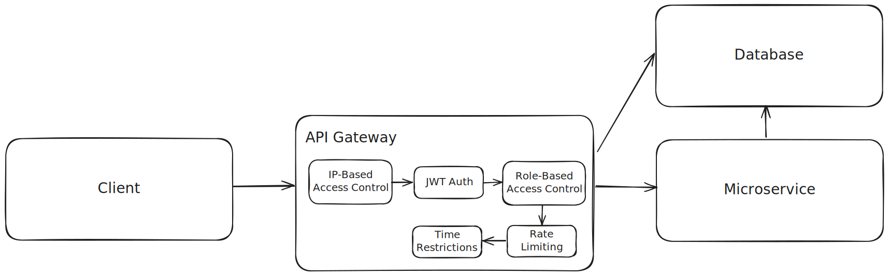

# [LSSA_2025i] - U2 - Laboratory 3

## Full name: José Fabián García Camargo

# Secure Microservices Architecture

This project implements a secure microservices architecture using Docker containers. The system consists of three main components:

1. API Gateway (Port 5000)
2. Microservice (Port 5001)
3. Database Service (Port 5002)

## Architecture Overview

The system is designed with security in mind, implementing several security measures:

- JWT-based authentication
- IP-based access control
- Rate limiting
- Role-based access control (RBAC)
- Time-based access restrictions



## Components

### API Gateway
- Acts as the entry point for all client requests
- Handles authentication and authorization
- Routes requests to appropriate microservices
- Implements security measures

### Microservice
- Handles business logic
- Communicates with the database service
- Protected by the API Gateway

### Database Service
- Handles data persistence
- Protected by the API Gateway

## Security Features

1. **JWT Authentication**
   - All protected routes require a valid JWT token
   - Tokens expire after 1 hour
   - Tokens include user role information

2. **IP-based Access Control**
   - Only allows requests from authorized IP addresses
   - Currently configured for local development

3. **Rate Limiting**
   - Login endpoint: 5 requests per minute
   - Other endpoints: 10 requests per minute

4. **Role-based Access Control**
   - Different endpoints require different user roles
   - Admin role required for analytics endpoint

5. **Time-based Restrictions**
   - Monitoring endpoint only accessible between 8am and 6pm

## Getting Started

### Prerequisites
- Docker
- Docker Compose

### Installation

1. Clone the repository
2. Navigate to the project directory
3. Build and start the containers:
```bash
docker-compose up --build
```

## API Usage Examples

### 1. Login
```bash
curl -X POST http://127.0.0.1:5000/login \
-H "Content-Type: application/json" \
-d '{"username": "user1", "password": "password123"}'
```

Expected Response:
```json
{
    "token": "eyJ0eXAiOiJKV1QiLCJhbGciOiJIUzI1NiJ9..."
}
```

### 2. Access Protected Data
```bash
curl -X GET http://127.0.0.1:5000/data \
-H "Authorization: Bearer YOUR_TOKEN_HERE"
```

Expected Response:
```json
{
    "message": "Protected data accessed successfully!",
    "microservice": {
        "message": "This is a secure microservice"
    },
    "database": {
        "message": "Database response"
    }
}
```

### 3. Access Analytics (Admin Only)
```bash
curl -X GET http://127.0.0.1:5000/analytics \
-H "Authorization: Bearer YOUR_TOKEN_HERE"
```

Expected Response:
```json
{
    "message": "Admin analytics data"
}
```

### 4. Access Monitoring
```bash
curl -X GET http://127.0.0.1:5000/monitoring \
-H "Authorization: Bearer YOUR_TOKEN_HERE"
```

Expected Response (if accessed between 8am-6pm):
```json
{
    "message": "Monitoring data"
}
```

## Available Users

1. Regular User:
   - Username: `user1`
   - Password: `password123`
   - Role: `user`

2. Admin User:
   - Username: `admin`
   - Password: `adminpass`
   - Role: `admin`

## Error Handling

The API provides clear error messages for various scenarios:

1. **Invalid Credentials**
```json
{
    "message": "Invalid credentials"
}
```

2. **Missing Token**
```json
{
    "message": "Token is missing!"
}
```

3. **Invalid Token**
```json
{
    "message": "Token error: [error details]"
}
```

4. **Unauthorized IP**
```json
{
    "message": "Forbidden: Unauthorized IP address"
}
```

5. **Rate Limit Exceeded**
```json
{
    "message": "Rate limit exceeded"
}
```

## Development Notes

- The system is configured for local development
- IP restrictions are set for localhost and Docker network
- JWT secret key should be changed in production
- Debug mode is enabled for development purposes

## Security Considerations

1. Change the `SECRET_KEY` in production
2. Update `AUTHORIZED_IP` list for production environment
3. Disable debug mode in production
4. Implement proper HTTPS in production
5. Consider implementing additional security measures like:
   - Request validation
   - Input sanitization
   - CORS configuration
   - Security headers

## Troubleshooting

1. **Connection Issues**
   - Ensure all containers are running
   - Check Docker network configuration
   - Verify port mappings

2. **Authentication Issues**
   - Verify token format
   - Check token expiration
   - Ensure correct role permissions

3. **Access Issues**
   - Verify IP address is authorized
   - Check time restrictions for monitoring endpoint
   - Verify rate limits haven't been exceeded 