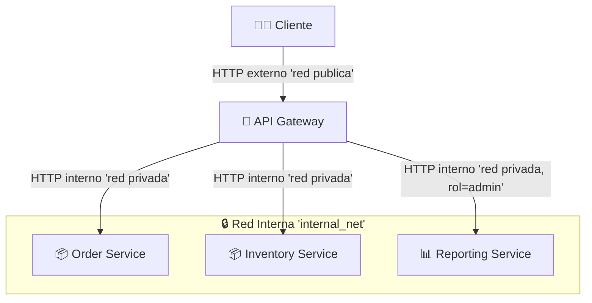

# Laboratorio 3 - Arquitectura Seguridad por Diseño

**Nombre:** Sebastian Rios Sabogal  
**Cédula:** 1143825130

## Objetivo
El objetivo de este laboratorio es diseñar, desplegar y experimentar con una arquitectura de microservicios segura, empleando tácticas de **Seguridad por Diseño** como `Limit Exposure`, `Authorize Actors` y `Separate Entities`. A través del uso de un **API Gateway centralizado**, autenticación mediante **tokens JWT**, validación de roles (`user` y `admin`) y una **red interna de contenedores Docker**, se busca demostrar cómo una arquitectura puede proteger los servicios internos, reducir la superficie de ataque y garantizar la confidencialidad e integridad de las operaciones, incluso en entornos con múltiples componentes y comunicaciones distribuidas. Este entorno simulado permite explorar los fundamentos prácticos de **arquitecturas seguras**, **desacopladas** y **resilientes** en el contexto de **sistemas a gran escala**.

## Seguridad Aplicada

- **Tácticas**: Limit Exposure, Authorize Actors, Separate Entities.
- **Patrón**: API Gateway para autenticación centralizada.
- **JWT con roles**: (user, admin).
- **Red interna Docker (internal: true)**: los servicios solo se comunican entre sí.
- **Validación por IP**: solo se acepta tráfico local (127.0.0.1).

## Descripción de la Arquitectura (Modelo C&C)

La arquitectura del laboratorio se estructura bajo el modelo **Componentes y Conectores (C&C)**, donde los elementos principales del sistema se representan como componentes independientes que interactúan a través de conectores explícitos. El flujo inicia desde un **Cliente externo**, que actúa como consumidor del sistema enviando solicitudes HTTP hacia el **API Gateway**, el cual es el único componente expuesto al exterior mediante un conector de tipo **HTTP REST**. Este gateway actúa como **punto de entrada centralizado**, encargado de realizar la **autenticación de usuarios (mediante JWT)**, la **autorización basada en roles**, y la **coordinación de solicitudes internas**. Desde el API Gateway se establecen conectores internos (también basados en HTTP) hacia tres microservicios especializados: el **Order Service**, que permite crear y listar órdenes; el **Inventory Service**, que expone el estado actual del inventario disponible; y el **Reporting Service**, que genera reportes estadísticos, accesibles únicamente para usuarios con rol administrativo. Cada microservicio es un componente autónomo, que encapsula su lógica de negocio y su propia "base de datos en memoria", cumpliendo así con la táctica de `Separate Entities`. Todos los conectores internos operan sobre una red privada (Docker internal bridge), cumpliendo con la táctica `Limit Exposure` al evitar el acceso directo desde el cliente a los servicios. Esta configuración modular y desacoplada permite observar cómo los principios de **Seguridad por Diseño** se integran en cada nivel de interacción.

### Diagrama de Componentes


#### Notas

- Todos los conectores internos operan sobre la red `internal_net`, no accesible directamente desde el cliente.
- El **API Gateway** valida tokens, roles y controla el acceso hacia los servicios internos.
- El **Reporting Service** requiere autenticación con rol `admin`.

## Prerequisitos

- Docker Engine
- Docker Compose
- jq para parsear JSON

## Ejecución del Sistema

Una vez verificados los prerrequisitos y teniendo la estructura del laboratorio preparada, sigue los siguientes pasos para ejecutar el sistema completo:

1. **Construir las imágenes**

Ejecuta el siguiente comando para construir todos los servicios definidos en el archivo `docker-compose.yml`, esto descargará las imágenes base y construirá los contenedores de cada componente (API Gateway, microservicios):

```bash
docker compose build
```

2. **Iniciar los servicios**

Levanta todos los servicios en segundo plano con:

```bash
docker compose up -d
```

3. **Detener y limpiar**

Este comando detiene todos los servicios y libera los recursos:

```bash
docker compose down --remove-orphans
```

## Uso de la API

La interacción con el sistema se realiza a través del **API Gateway**, que expone todos los `endpoints` al cliente. Cada solicitud debe ir autenticada con un token JWT válido, obtenido tras un inicio de sesión exitoso.

#### Endpoints disponibles

| Método | Endpoint                 | Descripción                                     | Requiere rol |
|--------|--------------------------|-------------------------------------------------|--------------|
| POST   | `/login`                 | Autenticación de usuario (genera token JWT)     | ❌ No        |
| POST   | `/order`                 | Crea una nueva orden                            | ✅ user/admin |
| GET    | `/orders`                | Lista todas las órdenes registradas             | ✅ user/admin |
| GET    | `/inventory`             | Consulta el inventario actual                   | ✅ user/admin |
| GET    | `/report`                | Genera reporte estadístico de órdenes           | ✅ admin      |

1. **Obtener un token de acceso**

```bash
curl -X POST http://localhost:5000/login \
    -H "Content-Type: application/json" \
    -d '{"username": "user1", "password": "password123"}'
```

Respuesta esperada:

```json
{"token": "<JWT_TOKEN>"}
```

2. **Crear una orden**

```bash
curl -X POST http://localhost:5000/order \
    -H "Authorization: Bearer <JWT_TOKEN>"
```

3. **Consultar todas las órdenes**

```bash
curl http://localhost:5000/orders \
    -H "Authorization: Bearer <JWT_TOKEN>"
```

4. **Consultar inventario**

```bash
curl http://localhost:5000/inventory \
    -H "Authorization: Bearer <JWT_TOKEN>"
```

5. **Generar reporte (solo rol admin)**

Si un usuario sin rol admin accede a este endpoint, recibirá un error 403 Forbidden.

```bash
curl http://localhost:5000/report \
    -H "Authorization: Bearer <JWT_ADMIN_TOKEN>"
```

## Pruebas de Uso de la API

Para validar rápidamente el funcionamiento de todos los componentes de la arquitectura, se provee un **script de prueba automática** que ejecuta todos los endpoints definidos en la sección “Uso de la API”. Este script simula el flujo de un usuario y un administrador interactuando con el sistema, verificando tanto el éxito de las operaciones como las restricciones de acceso.

Ejecuta el script:

```bash
./test_api.sh
```


### Fecha de Entrega
**Viernes, 25 de abril de 2025, antes de las 23:59**
