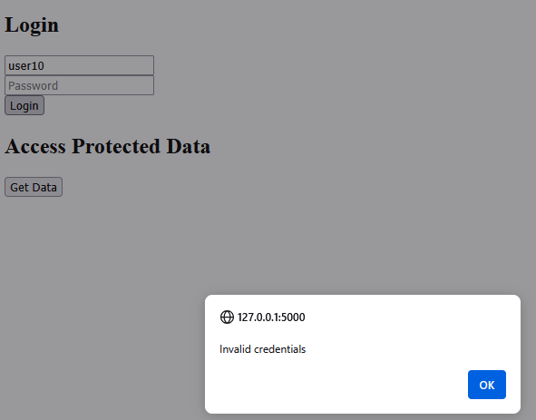
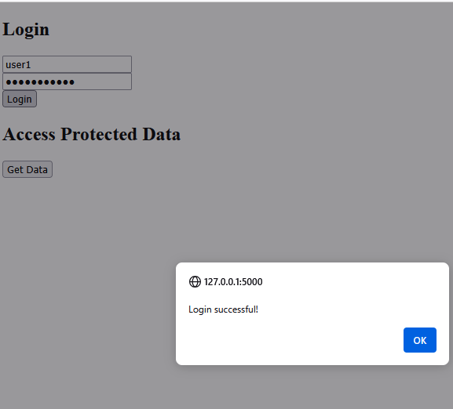
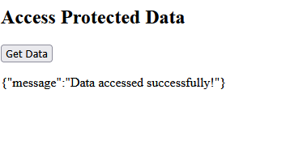
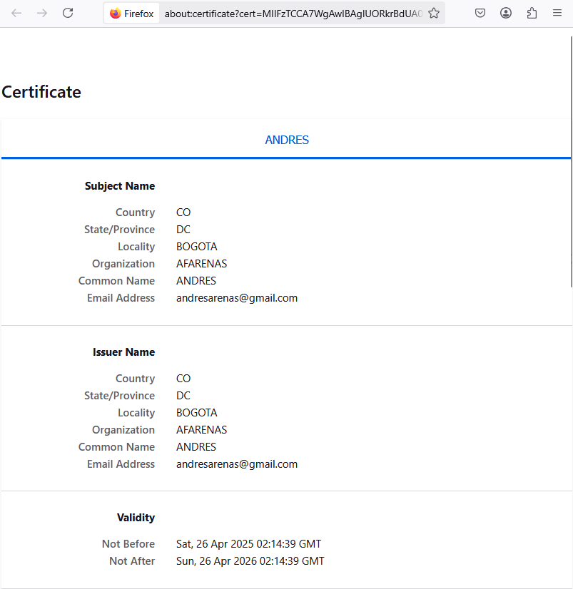
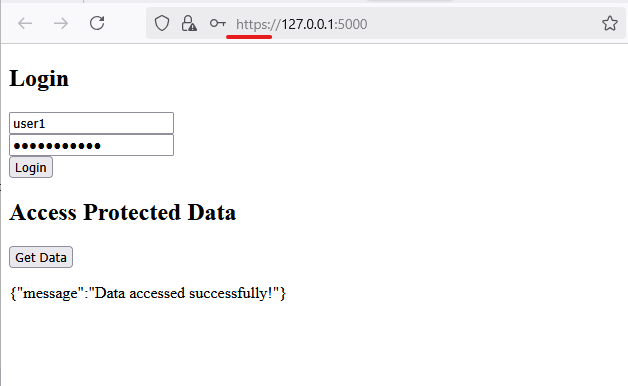
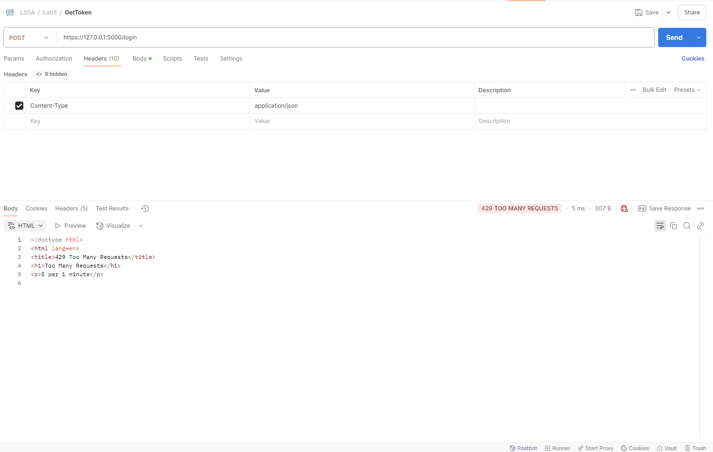

# [LSSA_2025i] - U4 - Laboratory 3

**Nombre:** Andrés Arenas

**Description**
The objective of this lab is to demonstrate how applying the Limit Exposure security tactic using the API Gateway architectural pattern significantly reduces the system's attack surface. This is a core principle of Secure by Design — building security into the architecture from the start. 

The changes are detailed below:

 **index.html**

A very basic html that captures username and password to obtain the jwt token and uses it to get the call get data

###### Invalid Credentials

###### Valid Credentials

###### Get Data

**database.py**

This component was not imported in the example given on the lab. The behaviour is pretty basic, it just host the mocked user that was into api_gateway.py

**api_gateway.py**

The next rules were added to limit exposure:

- HTTPS 

A self signed cert was created and the execution of the application was configured to run over SSL only.

###### Certificate

###### Server site on SSL

- Bruteforce protection

A limiter was added to protect of bruteforce attacks: 

`@limiter.limit("5 per minute")  # Bruteforce protection
`
Right now the limiter is only used on the login function

###### Too many requests

The limiter was tested using postman

********