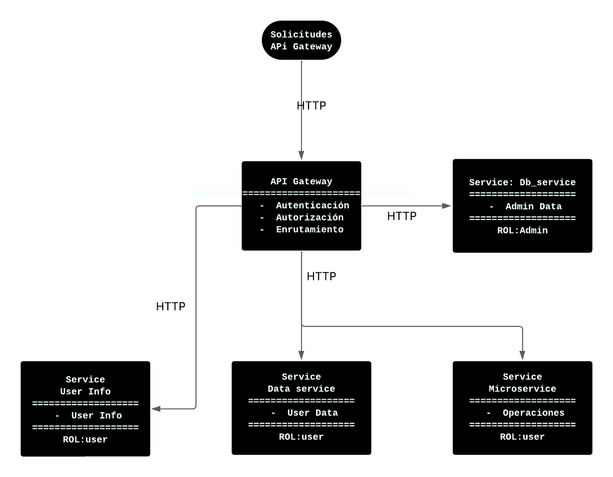

# Laboratorio 3 - Arquitectura de Software: API Gateway y Microservicios

Edsson Yannick Bonilla Hernandez

Este proyecto implementa una arquitectura basada en microservicios con un **API Gateway** como punto único de entrada. 

Se enfoca en prácticas de **seguridad guiada por diseño** y en la implementación de patrones arquitectónicos que garantizan la escalabilidad, modularidad y protección de los servicios.

---

## **Descripción General**

El sistema está compuesto por los siguientes elementos principales:

1. **API Gateway**:
   - Actúa como intermediario entre los clientes y los microservicios.
   - Implementa autenticación, autorización y enrutamiento dinámico.
   - Limita la exposición de los servicios según el rol del usuario.

2. **Microservicios**:
   - **db_service**: Servicio encargado de la gestión de datos administrativos.
   - **data_service**: Servicio que expone datos accesibles para usuarios con rol `user`.
   - **microservice**: Servicio genérico que realiza operaciones específicas.

3. **Red de Contenedores**:
   - Los servicios están desplegados en contenedores Docker y se comunican a través de una red segura definida en `docker-compose.yml`.

---

## **Arquitectura de Componentes y Conectores (C&C)**

Diagrama de Componentes y Conectores (C&C) de los elementos del sistema:


---

## **Descripción del Diagrama**
- **API Gateway**: Centraliza la autenticación y autorización, y enruta las solicitudes a los microservicios correspondientes.
- **Microservicios**: Cada servicio tiene una responsabilidad única y está aislado del resto, siguiendo el principio de **Single Responsibility**.

---

## **Prácticas de Seguridad Guiada por Diseño**

El diseño del sistema incorpora prácticas de seguridad desde las primeras etapas de desarrollo:

1. **Autenticación y Autorización**:
   - Uso de tokens JWT para autenticar usuarios y verificar roles.
   - Los roles (`admin`, `user`) determinan el acceso a los servicios.

2. **Limitación de Exposición**:
   - Decoradores como `@limit_exposure` restringen el acceso a los servicios según políticas predefinidas.

3. **Aislamiento de Servicios**:
   - Cada microservicio está desplegado en un contenedor independiente, lo que reduce el impacto de posibles vulnerabilidades.

4. **Variables de Entorno**:
   - Las credenciales y configuraciones sensibles (como contraseñas y URLs) se gestionan mediante variables de entorno para evitar exposición en el código fuente.

5. **Red Segura**:
   - Los servicios se comunican a través de una red Docker privada (`secure_net`), lo que evita accesos no autorizados desde el exterior.

6. **Manejo de Errores**:
   - Respuestas claras y controladas en caso de errores, como servicios no disponibles o accesos no autorizados.

---

## **Ejecución del Proyecto**

### **Requisitos Previos**
- Docker y Docker Compose instalados en el sistema.

### **Pasos para Ejecutar**
1. Construir y desplegar los servicios:
   
   Se debe ubicar en la raiz del proyecto donde se encuentre el docker-compose
  
   ```bash
   docker-compose up -d --build 
   ```
---
## **Endpoints y Roles**

A continuación, se describen las URLs de los endpoints disponibles en el API Gateway, junto con los roles necesarios para acceder a ellos:

### **1. `/login`**
- **Método:** `POST`
- **Descripción:** Autentica a los usuarios y genera un token JWT.
- **Rol Requerido:** No requiere autenticación previa.
- **Ejemplo de Uso:**
  ```json
  {
    "username": "user1",
    "password": "password"
  }```

### **2. `/userinfo`**
- **Método:** `GET`
- **Descripción:** Devuelve información del usuario autenticado.
- **Rol Requerido:** Cualquier usuario autenticado ('admin' o 'user').
- **Ejemplo de Uso:**
  ``` http://<API_GATEWAY_HOST>:5000/userinfo```

### **3. `/<service_name>`**
- **Método:** `GET`
- **Descripción:** Redirige dinámicamente las solicitudes al microservicio correspondiente.
- **Roles Requeridos:**
  - **`db`**: Requiere rol `admin`.
    - **URL:** `http://<API_GATEWAY_HOST>:5000/db`
  - **`data`**: Requiere rol `user`.
    - **URL:** `http://<API_GATEWAY_HOST>:5000/data`
  - **`data/profile`**: Requiere rol `user`.
    - **URL:** `http://<API_GATEWAY_HOST>:5000/data/profile`
  - **`microservice`**: Requiere rol `user`.
    - **URL:** `http://<API_GATEWAY_HOST>:5000/microservice`

### **Notas Importantes**
- Reemplaza `<API_GATEWAY_HOST>` con la dirección IP o dominio donde se está ejecutando el API Gateway.
- Asegúrate de incluir el token JWT en el encabezado de la solicitud para los endpoints que requieren autenticación:
  ```http  Authorization: Bearer <TOKEN_JWT> ```

---
## **Validar el sístema**

### Pre requisitos

## Usuarios del sistema
    ```
    Usuario Administrador :
    
    - Usuario `admin` 
    - Password `admin123` 
    
    ```
    ```
    Usuario normal : 

    - Usuario `user1` 
    - Password `user123`   
    ```
    Nota: Los usuario ya están creados.

## Pasos para ejecutar 

1. **Obtener JWT por roles**
```
    user: user1
    password: user123
    
    curl -X POST -H "Content-Type: application/json" -d '{"username": "user1","password": "user123"}' http://127.0.0.1:5000/login   
    
    user: admin
    password: user123

    curl -X POST -H "Content-Type: application/json" -d '{"username": "admin","password": "admin123"}' http://127.0.0.1:5000/login   

```
---
2. **Con el token consultar otros microservicios por roles**

    Con la instruccion anterior genera un token JWT

    Role:  `USER`
    
    Endpoint: 
    
    `/userinfo` (Usuario autenticado)

    ```
    curl -X GET http://<API_GATEWAY_HOST>:5000/userinfo -H "Authorization: Bearer $USER_TOKEN"

    Nota:
    
    Reemplazar <API_GATEWAY_HOST> con la dirección IP o dominio donde se ejecuta el API Gateway.
              <USER_TOKEN> con el toquen obtenido         
    ```

    Endpoint: 
    
    `/data` (Requiere rol user)
    ```
    curl -X GET http://<API_GATEWAY_HOST>:5000/data -H "Authorization: Bearer $USER_TOKEN"

    Nota:

    Reemplazar <API_GATEWAY_HOST> con la dirección IP o dominio donde se ejecuta el API Gateway.
              <USER_TOKEN> con el toquen obtenido 
    ```   

    Endpoint

    `/microservice` (Requiere rol user)
    ```    
    curl -X GET http://<API_GATEWAY_HOST>:5000/microservice -H "Authorization: Bearer $USER_TOKEN"

    Nota:
    
    Reemplazar <API_GATEWAY_HOST> con la dirección IP o dominio donde se ejecuta el API Gateway.
              <USER_TOKEN> con el toquen obtenido          
    ```

       Endpoint:

    `/data/profile` (Requiere rol user)
    ```
    curl -X GET http://<API_GATEWAY_HOST>:5000/data/profile -H "Authorization: Bearer $USER_TOKEN"

    Nota:
    
    Reemplazar <API_GATEWAY_HOST> con la dirección IP o dominio donde se ejecuta el API Gateway.
              <USER_TOKEN> con el toquen obtenido          
    ```

    Role: `ADMINISTRADOR`
    
    Endpoint:
    
    `/db` (Requiere rol admin)
    ```
    curl -X GET http://<API_GATEWAY_HOST>:5000/db -H "Authorization: Bearer $ADMIN_TOKEN"

    Reemplaza <API_GATEWAY_HOST> con la dirección IP o dominio donde se ejecuta el API Gateway.
              <ADMIN_TOKEN> con el toquen obtenido         
    ```
    
 