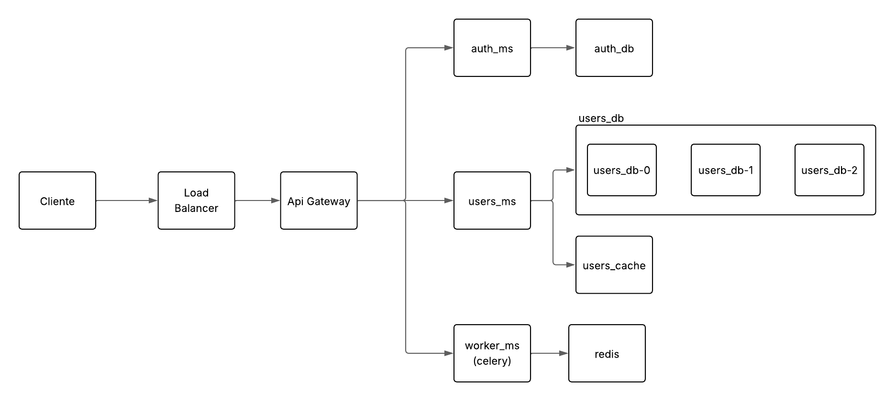

# Laboratory 4 - Scalabilty
## Camilo Andres Cuello Romero 

There is explained how the system has been expanded to implement more scalability techniques and patterns. The system is a microservices-based application that includes an API Gateway, authentication, user management, and asynchronous task processing.

## Architecture Overview

The application is composed of several microservices:

1. **API Gateway**: Entry point for the application
2. **Authentication Microservice**: Handles user authentication and authorization
3. **Users Microservice**: Manages user data
4. **Worker Microservice**: Handles asynchronous task processing
5. **Databases**: Separate databases for auth and user data
6. **Redis**: For caching and message broker functions
7. **Load Balancer**: For distributing traffic



## Scalability Techniques & Patterns

### 1. Horizontal Scaling with Load Balancing

The system uses Nginx as a load balancer to distribute traffic between multiple API Gateway instances.

```
# Load balancer configuration
upstream backend_servers {
    server api_gateway:5000;
    server api_gateway_replica:5000;
}
```

### 2. Database Sharding

The Users Microservice implements database sharding to distribute data across multiple database instances:

```python
# Shard selection logic
shard_index = hash(user_id) % len(db_urls)
db_url = db_urls[shard_index]
```

### 3. Caching with Redis

The application uses Redis for caching frequently accessed data:

```python
# Cache example from users_ms.py
cache_key = f"user:{id}"
cached = r.get(cache_key)
if cached:
    return jsonify(json.loads(cached)), 200
# Cache miss handling
# ...
r.set(cache_key, json.dumps(data), ex=cache_ttl)
```

### 4. Asynchronous Processing

Worker nodes process tasks asynchronously using Celery and Redis as a message broker:

```python
@shared_task(ignore_result=False)
def add_together(a: int, b: int) -> int:
    return a + b

@flask_app.post("/add")
def start_add():
    # ...
    result = add_together.delay(a, b)
    return jsonify({"result_id": result.id}), 201
```

### 5. Circuit Breaking and Rate Limiting

The API Gateway implements rate limiting to prevent overload:

```python
@app.route('/login', methods=['POST'])
@limiter.limit("5 per minute")
def login():
    # ...
```

### 6. Service Isolation

Each microservice runs in its own container with specific responsibilities:

```
services:
  api_gateway:
    build:
      context: .
      dockerfile: Dockerfile
    # ...
  auth_ms:
    build:
      context: ./microservices/auth_ms
      dockerfile: Dockerfile
    # ...
```

### 7. Replication for Fault Tolerance

Critical services are replicated:
- Multiple API Gateway instances
- User database replicas (users_db-0, users_db-1, users_db-2)

## Running the Application

```bash
docker-compose up --build
```

## Example Requests

### User Registration
```bash
curl -X POST http://localhost:80/register \
  -H "Content-Type: application/json" \
  -d '{"username":"testuser","password":"password123","first_name":"Test","last_name":"User","email":"test@example.com"}'
```
*you could add admin role to the user by adding "role":"admin" in the json body*

### Login
```bash
curl -X POST http://localhost:80/login \
  -H "Content-Type: application/json" \
  -d '{"username":"testuser","password":"password123"}'
```

### Getting User Data (Authenticated)
```bash
curl -X GET http://localhost:80/getUserData \
  -H "Authorization: Bearer YOUR_JWT_TOKEN"
```

### Adding a Task
```bash
curl -X POST http://localhost:80/add \
  -H "Content-Type: application/json" \
  -d '{"a":5,"b":10}'
```

### Checking Task Result
```bash
curl -X GET http://localhost:80/result/TASK_ID
```