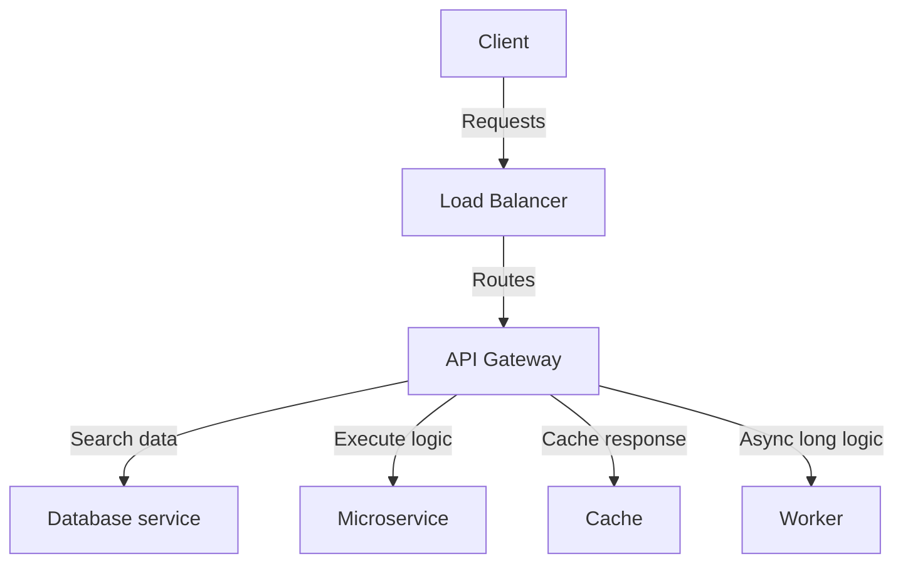
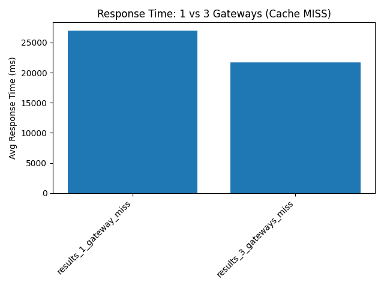
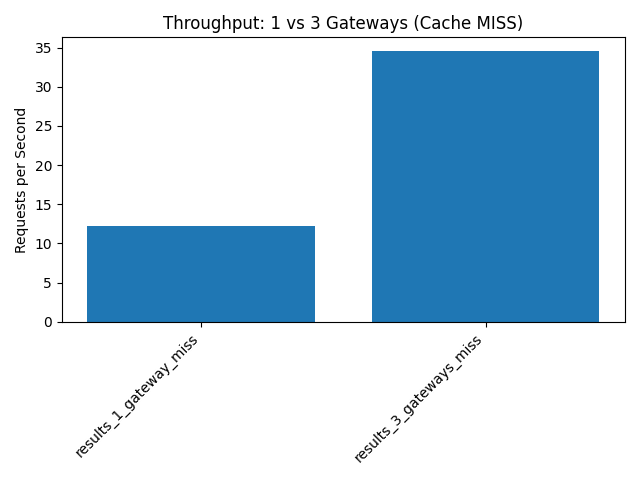
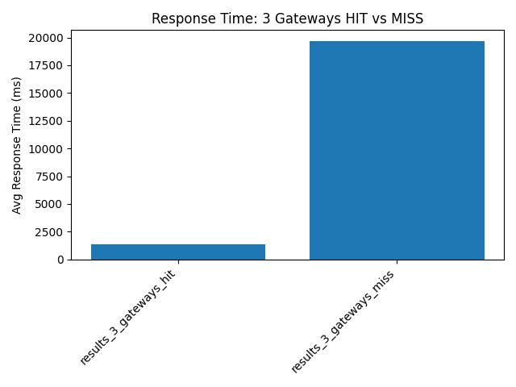
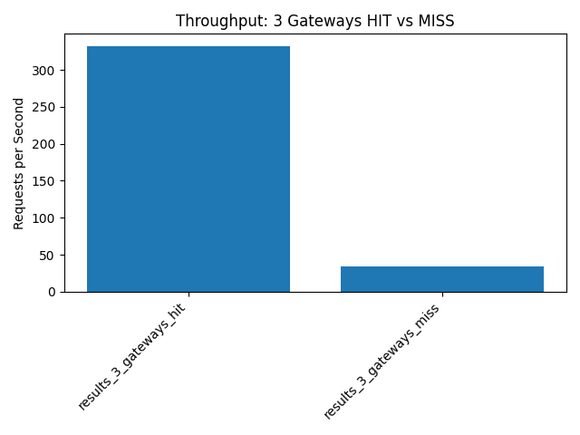

# Laboratory 4 - Scalability

Large Scale Software Architecture

Universidad Nacional de Colombia – 2025-I

---

## Student Information

Name: Santiago Suárez Suárez

Document ID: 1001326848

---

## Objectives

This lab explores how distributed architectures can be improved using caching and load balancing to handle large-scale traffic while maintaining performance. It was developed as part of the Large Scale Software Architecture course at Universidad Nacional de Colombia.

The main objectives of this lab are:

- Apply architectural tactics to improve scalability and performance in distributed systems.

- Demonstrate the use of architectural patterns such as **load balancing** and **caching**.

- Improve system response time and increase throughput under high load conditions.

---
## Lab Summary

During this lab, we created a distributed architecture using Docker Compose to simulate an environment with multiple API Gateway instances and a caching mechanism. Locust was used to apply load testing scenarios and gather performance metrics.

Each virtual user randomly accesses either the `/data` or `/process` endpoints during the test runs.

In addition to the main objectives, we:

- Tuned services using Gunicorn for production-grade server management.

- Refactored the API Gateway using decorators to enhance code structure and reusability.

- Implemented caching with TTL logic to reduce response time and avoid unnecessary database hits.

---
## Project Structure

The architecture includes the following folders and components:

- **load_balancer/**: Internal proxy that forwards requests to API Gateway instances in round-robin fashion.

- **api_gateway/**: Service responsible for authenticating requests and dispatching them to backend components. It also manages caching.

- **microservice/**: Business logic component for processing requests.

- **worker/**: Background processor that supports microservice tasks.

- **cache/**: In-memory key-value store (e.g., Redis-style logic) to optimize repeated requests.

- **database/**: Simulated database for slow-response scenarios.

- **tests/**: Contains load testing scripts and report generators.

---
## Architecture diagram



---
## Docker Services

|Service|Description|
|---|---|
|load_balancer|Receives external traffic and distributes it across API Gateway instances.|
|api_gateway|Handles JWT-based authentication, routing, and caching logic.|
|microservice|Contains business logic and interacts with backend services.|
|worker|Performs background tasks asynchronously.|
|cache|Stores repeated responses with configurable TTL.|
|database|Responds to /data requests with a simulated delay (to simulate DB latency).|

---
## Improvements in Functionality

- All Python services now use **Gunicorn** instead of Flask’s built-in development server.

- The API Gateway logic was improved using **decorators** for token validation and cache responses.

- TTL caching was added with logic to simulate cache hits and misses.

- Scripts were updated to separate scenarios (e.g., cache hit vs. cache miss).

---
## Available Endpoints

| Endpoint    | Description                                               |
|-------------|-----------------------------------------------------------|
| `/health`   | Healthcheck endpoint to verify service availability.      |
| `/login`    | Accepts credentials and returns a JWT token.              |
| `/data`     | Returns data from cache or DB; protected and cacheable.   |
| `/process`  | Calls the microservice; protected and cacheable.          |
| `/longtask` | Sends task to background worker; protected and asynchronous. |


Both `/data` and `/process` routes are accessed randomly during load testing.

---
## Testing Scripts

Load tests are configured through the **Makefile** and executed with Locust. The test configuration:

- **Users**: 1000

- **Spawn rate**: 100 users/sec

- **Duration**: 60 seconds


Test files are stored under `tests/`, and results are saved in:

- `tests/results/`: Raw CSV files from Locust.

- `tests/reports/`: Generated summary markdown and graphs.


Example of usage:

```
make benchmark-all
```

This command runs:

- `test1-miss`

- `test1-hit`

- `test3-miss`

- `test3-hit`


Warm-up steps with low traffic (10 users, 10 seconds) are included before each scenario.

Note: During the tests, users alternate randomly between `/data` and `/process` endpoints to simulate realistic load distribution.

---
## Local Results

Tests were executed on a developer machine with:

- **CPU**: AMD Ryzen 7 7730U

- **RAM**: 40 GB

### Understanding Cache Hit vs. Miss

In this lab, two distinct cache behaviors were tested:

- **Cache Hit (_hit):** Occurs when a requested resource is already stored in the cache. The API Gateway quickly serves the response without querying the backend services. This results in significantly faster response times and higher throughput.

- **Cache Miss (_miss):** Happens when the requested data is not yet cached or the cache has expired. The API Gateway must retrieve the data from backend services, which introduces more latency and load on the system.

By comparing these two scenarios under different configurations (e.g., 1 vs. 3 gateways), we can observe how caching impacts overall performance and scalability.

### Benchmark Summary

| Scenario | Avg Response Time (ms) | Requests/s | Failures |
|----------|------------------------|------------|----------|
| results_1_gateway_miss | 26992.09 | 9.61 | 0 |
| results_3_gateways_hit | 1971.26 | 271.36 | 0 |
| results_3_gateways_miss | 21742.52 | 28.95 | 0 |

### Response Time and Throughput: 1 vs. 3 API Gateways (Cache Miss)

The following graphs compare system performance when using one versus three API Gateway instances under **cache miss** conditions. As expected, adding more gateways slightly increases throughput and slightly reduces latency, but the overall gain is marginal without caching.

#### Average Response Time


#### Requests per Second (Throughput)


### Response Time and Throughput: Cache Hit vs. Miss (3 Gateways)

This comparison demonstrates the dramatic improvement introduced by caching. With cache hits, the system avoids database and microservice calls, leading to response times up to 10x faster and significantly higher throughput.

#### Average Response Time


#### Requests per Second (Throughput)



The following summary highlights key trends:

- **Caching** (scenarios ending in `_hit`) consistently reduces response time and improves throughput.

- **Load balancing** (1 vs 3) shows a slightly improve in response time and improves throughput.

These results validate caching as the most impactful optimization tactic in this architecture, with load balancing playing a secondary role.

---
## Running the Solution

### Requirements

Before running the solution, make sure you have the following tools installed:

- Docker

- Docker Compose

- [Python 3.10+](https://www.python.org/downloads/)

- [`venv`](https://docs.python.org/3/library/venv.html) and [`pip`](https://pip.pypa.io/en/stable/installation/)

- `make` (pre-installed on Linux/macOS; [Windows users can use `make` via WSL](https://learn.microsoft.com/en-us/windows/wsl/install))


### Setup & Execution

Once the requirements are met, follow these steps from the project root:

### Setup Instructions

```
make install        # Sets up the virtual environment and dependencies
make run1-hit       # Run services + test (cache hit)
make run3-miss      # Run services + test (cache miss, 3 gateways)
make benchmark-all  # Run the full benchmark suite
make report         # Generate charts and markdown summary
```

The `make benchmark-all` command performs warm-up cycles, executes four scenarios (`hit` and `miss` for both 1 and 3 gateways), and then shuts down the stack.


---
### Conclusion

This experiment demonstrates how introducing caching significantly improves system responsiveness and throughput, while load balancing helps distribute traffic evenly across multiple gateways. However, the impact of scaling the number of API Gateways is less noticeable when caching is active, indicating that caching may provide more substantial benefits in certain scenarios.
