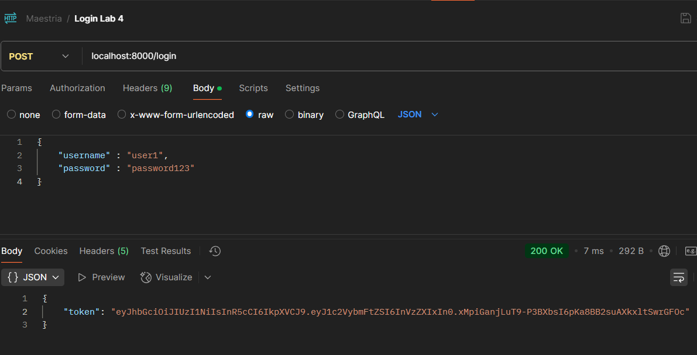
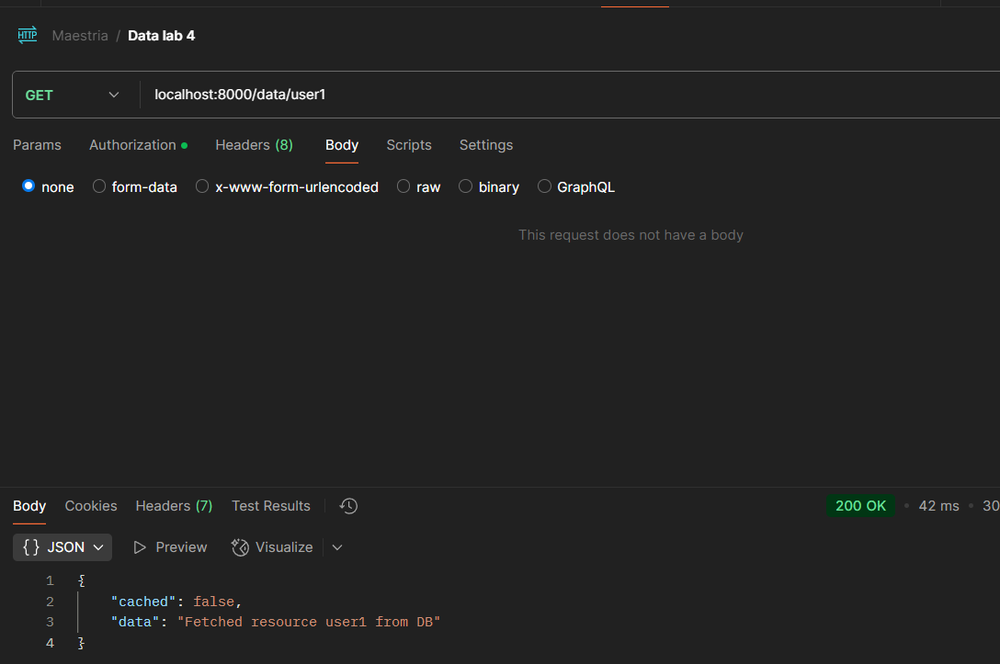
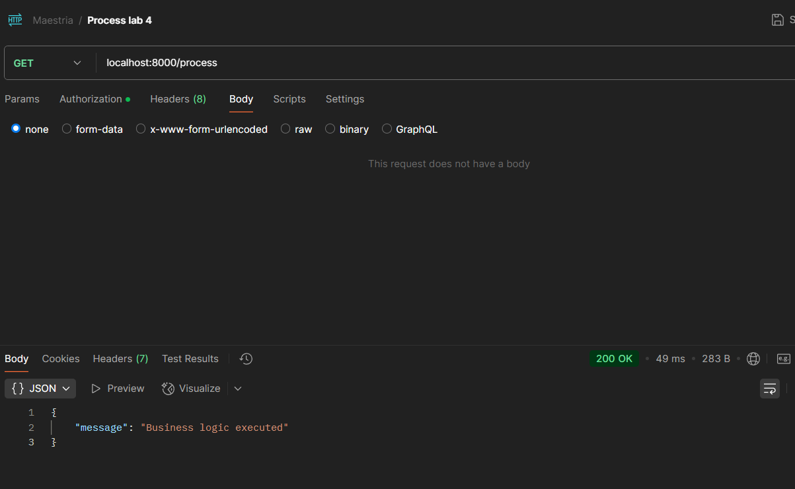

# Daniel Santiago Mendoza Morales

## Steps for execution

For this laboratory. The improvements made for a better exampling of Load Balancing and Caching architectural patterns were:

- For caching, modified database.py so the endpoint simulate the fetching of different elements to the db, all these elements once fetched are stored in cache, so we can test caching of multiple elements instead of a single endpoint.

- For load balancing, for improving architecture, we add a load balancer between the microservice and the api gateway, so if the microservice is highly requested the load can be distributed among multiple instances.

For running the laboratory:

Run on different terminals

1. python cache.py
2. python database.py
3. python microservice.py
4. PORT 5003 python microservice.py
5. python microservice_load_balancer.py
6. python api_gateway.py
7. PORT 5003 python api_gateway.py
8. python load_balancer.py

Through Postman or Curl access

1. Login endpoint (use token as bearer token for other api calls)

2. Data endpoint. Try accessing any element (string after data so: /data/element)

3. Process endpoint. Check on different microservices console output for checking load balancing.

