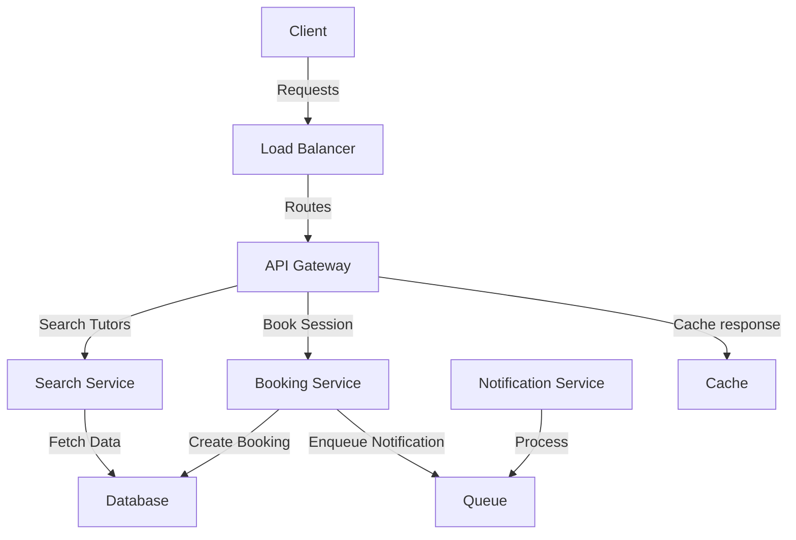

# Laboratory 4

**Author:** Juan Bernardo Benavides Rubio

This laboratory displays a simple implementation of a scalable architecture.
In order to make it more tangible, I decided to mimic a system for scheduling online
tutoring sessions. Even though all components in the system are implemented naively,
it is a functional prototype that allows you to login, search tutors and book sessions.

## Architecture

The architecture of the system is designed to handle high loads of requests as it implements
scalability tactics such as load balancing, caching and asynchronous processing. It has
the following components:

- **Frontend:** A very simple web interface for interactinv with the system.
- **Load Balancer:** A Fastapi server that uses the Round Robin algorithm to distribute incoming requests between multiple instances of the API Gateway.
- **API Gateway:** A server for receiving public trafic and route it to the appropriate service. It handles authentication and supports request caching.
- **Cache:** A naive implementation of an in-memory Caching service. It stores key value pairs of data for rapid access.
- **Search Service:** Quieries the database for retreiving the available tutors per subject.
- **Booking Service:** Creates Booking of classes from a student to a tutor. It enqueues a notification task to be handled asynchronously.
- **Queue:** A naive in-memory queue that allows for event-driven communication and asynchronous task processing.
- **Notification Service:** Listens to the queue and processes notifications.
- **Database:** A PostgreSQL database for storing tutor and booking information.

### Diagram

## Steps to run the project

The project is setup to be run with docker. To run the system you need to have docker and docker-compose installed and from the root of the project run `docker compose up -d --build`
which will build all the images and run them in detatched mode. Once this is done, you can go to the frontend in `http://localhost:80`. 

## Testing the project

1. For testing that authentication is working, search for tutors in a given subject and you'll see that credentials are invalid.
2. Login by using the user `student1` and the password `password`. A token will be stored in localhost.
3. Search for subject 'Math': a response with a tutor will be displayed showing that the result was not cached.
4. Search for the same subject again: The same response shows but now it shows that it was cached.
5. Check load balancer logs with `docker compose logs load_balancer` and see how it has been receiving and forwarding the requests.
6. Check logs for both instances of api gateway with `docker compose logs api_gateway_{n}` where n is 1 or 2 for each instance. See how each balancer has reveived half of the requests.
7. Check the cache logs with `docker compose logs cache` and see how the first request for Math got a miss (status 404) and the next request gets a hit (status 200).
8. Check logs for the queue with `docker compose logs queue` and see how many requests have been done to dequeue, but all have been unsuccessful.
9. Check logs for the notification service with `docker compose logs notification_service` and see that it has been polling the queue. And has not yet processed nothing.
10. Book a session using ID 1 for both student and teacher. The request will go to the booking service which will store the booking to the database and then queue the notification.
11. Check again logs for queue and notification service. You'll see in the queue one request to enqueue the task (done by the booking service) and right after one successful request to dequeue. In the notification service you'll see one successful request and the processing of notification being sent to the student 1 and tutor 1.

