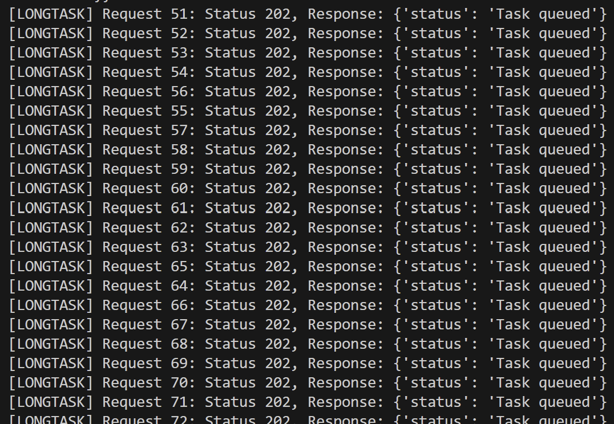

# [LSSA_2025i] - U2 - Laboratory 3

## Full name: Juan Sebastián Alcina Rodríguez

# New configuration to test load balancing and caching patterns

1. Added authentication method to the api_gateway configuration

Using Laboratory 3 as a reference, I implemented the /login route so that the user can authenticate, obtain a token, and access the services.

2. Update load_balancer code to execute POST and GET requests from the load balancer

For the implementation of a test script, I had to modify the load balancer to receive the request, forward it to the appropriate backend using the "requests" library, and then capture and forward the response to the client. The modifications allow proper handling of headers and bodies for each request.

3. Python script to execute tests over the endpoints

The file "load_test.py" contains a Python script that performs a load simulation on the system built according to the lab instructions. This script uses the "asyncio" and "aiohttp" libraries to send a total of 100 concurrent requests: it sends 50 to the /data endpoint and then 50 to the /longtask endpoint, using up to 10 simultaneous connections controlled by a semaphore.

Script logic:
- Obtains an authentication token by sending credentials to the /login endpoint.
- Using the token, it performs the corresponding GET and POST requests, including authorization headers.
- Each request prints its status and response.
- It displays how long it took to complete all the requests.

The goal of this script is to verify that all the API gateways are being used and that requests are also reaching the worker, the database, and the cache. Everything is executed through the load balancer. This type of script is useful for testing the behavior and performance of a system under concurrent load.

4. Update api_gateway and added new instance

I modified the api_gateway.py file so that each instance prints a unique identifier to validate that the load balancer is correctly distributing the requests.

print(f"Starting API Gateway on port {port}")

Additionally, in the load balancer, I added a new endpoint for a new instance of the api_gateway.

api_gateways = itertools.cycle(["http://127.0.0.1:5000", "http://127.0.0.1:5003", "http://127.0.0.1:5006"])

5. Add simulated response time

In database.py, I introduced a time.sleep(2) to simulate realistic latency. This will clearly show the improvement when the data comes from the cache.

6. Cache expiration:

I added a time-to-live (TTL) expiration variable in the cache.py file. The timestamps are saved along with the values.

# Instructions to execute code

Execute the following commands in separate termials

-   Api gateway instances
```
python api_gateway.py 5000
python api_gateway.py 5003
python api_gateway.py 5006
```

-   Load Balancer
```
python load_balancer.py
```

-   Database and cache
```
python database.py
python cache.py
```

-   Microservice and worker
```
python microservice.py
python worker.py
```

-   Python script
```
python load_test.py
```

The following are screenshots of the expected output from the python script:




