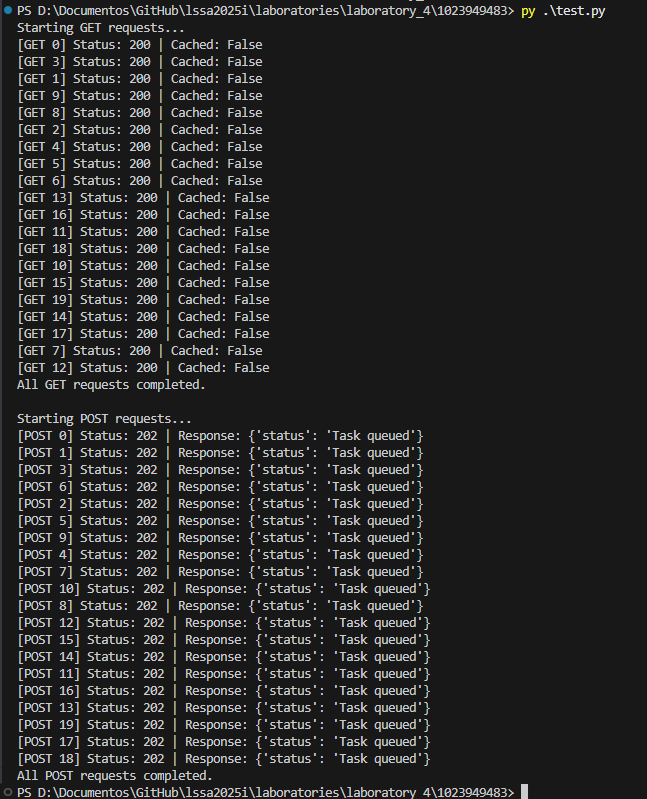
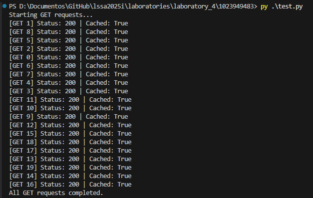
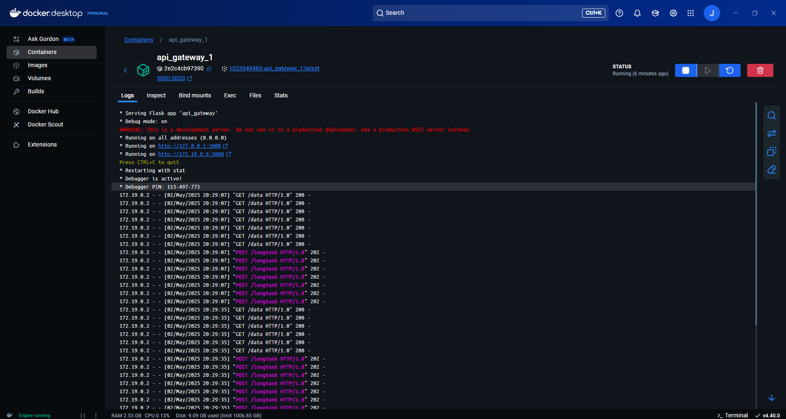
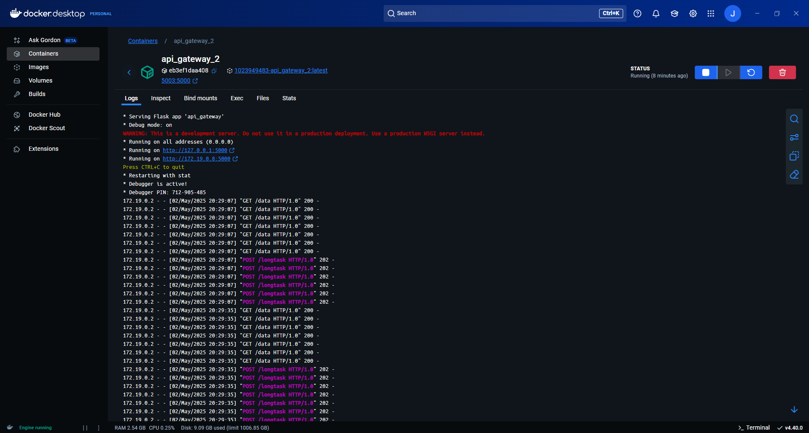
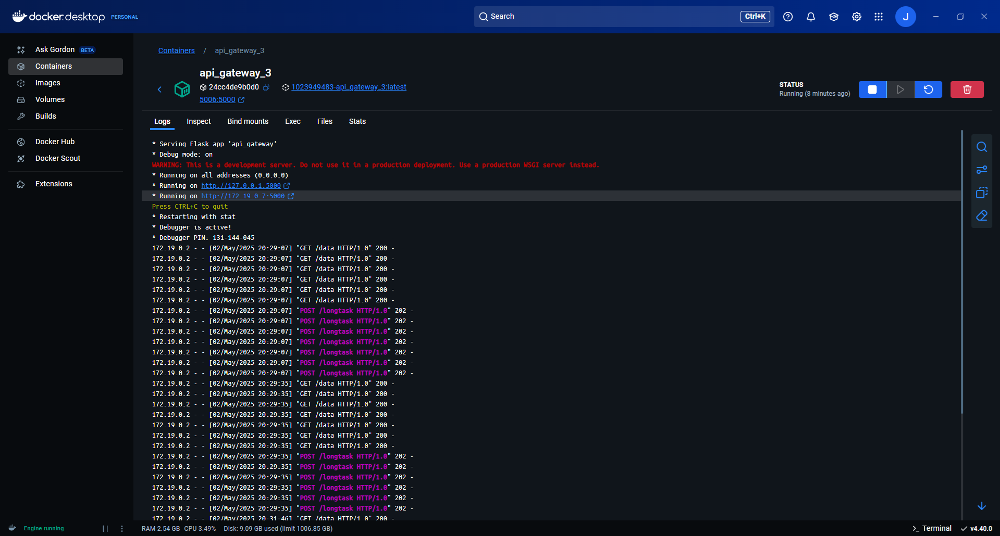
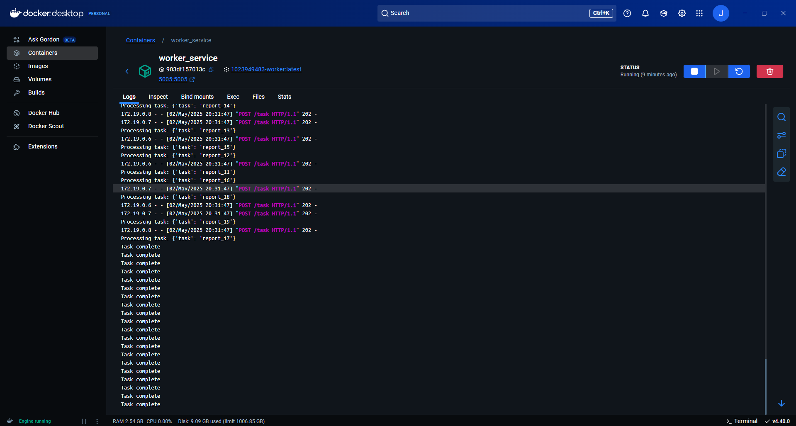
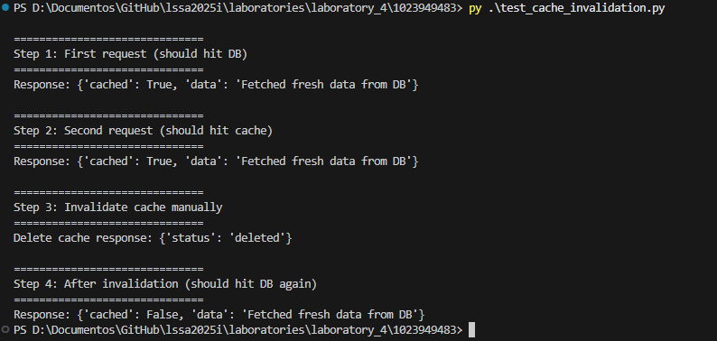

# Large-Scale Software Architecture  
## Laboratory 4 - Scalability
#### Julián Ricardo Beltrán Lizarazo - jrbeltranl@unal.edu.co - 1023949483

## Exercise changes

### Dockerization
The exercise was dockerized for easier execution and testing. Here's the docker-compose file:
```YAML
version: '3.8'

services:
  api_gateway_1:
    build:
      context: ./api_gateway
    ports:
      - "5000:5000"
    container_name: api_gateway_1
    networks:
      - lssa_net
    depends_on:
      - cache
      - database
      - worker

  api_gateway_2:
    build:
      context: ./api_gateway
    ports:
      - "5003:5000"
    container_name: api_gateway_2
    networks:
      - lssa_net
    depends_on:
      - cache
      - database
      - worker

api_gateway_3:
    build:
      context: ./api_gateway
    ports:
      - "5006:5000"
    container_name: api_gateway_3
    networks:
      - lssa_net
    depends_on:
      - cache
      - database
      - worker

  cache:
    build:
      context: ./cache
    ports:
      - "5004:5004"
    container_name: cache_service
    networks:
      - lssa_net

  database:
    build:
      context: ./database
    ports:
      - "5002:5002"
    container_name: database_service
    networks:
      - lssa_net

  worker:
    build:
      context: ./worker
    ports:
      - "5005:5005"
    container_name: worker_service
    networks:
      - lssa_net

  load_balancer:
    build:
      context: ./load_balancer
    ports:
      - "8000:8000"
    container_name: load_balancer
    networks:
      - lssa_net

networks:
  lssa_net:
```
As shown in the file, there are three instances of the `api_gateway` component. These instances can now be easily added by just modifying this compose file and the load balancing component since all of them will be created based on the same image.

### Cache invalidation endpoint
Cache invalidation is a need in many real-life scenarios. For the exercise, a cache invalidation endpoint was implemented to have this functionality.

```python
from flask import Flask, request, jsonify

app = Flask(__name__)
cache = {}

@app.route("/cache/<key>", methods=["GET"])
def get_cache(key):
    return jsonify({'value': cache.get(key)})

@app.route("/cache/<key>", methods=["POST"])
def set_cache(key):
    data = request.json
    cache[key] = data.get("value")
    return jsonify({'status': 'ok'})

@app.route("/cache/<key>", methods=["DELETE"])
def delete_cache(key):
    if key in cache:
        del cache[key]
    return jsonify({'status': 'deleted'})

if __name__ == "__main__":
    app.run(host="0.0.0.0", port=5004, debug=True)
```

## Execution and testing
**1. Execute the application through docker-compose:** In the *1023949483* directory, execute the following command:
`docker-compose up --build`

**2. Execute the testing scripts:** In the same directory, there are two Python scripts that help execute tests that show the application functionality with the implemented changes.

- **General cache, asynchronous tasks, and load balancing test:** 
    The `test.py` script simulates some concurrent requests to the `/data` and `/longtask` endpoints, logging the result of each one of them. 
    ```python
    import requests
    import threading

    GET_URL = "http://localhost:8000/data"
    POST_URL = "http://localhost:8000/longtask"

    def make_get_request(i):
        try:
            r = requests.get(GET_URL)
            print(f"[GET {i}] Status: {r.status_code} | Cached: {r.json().get('cached')}")
        except Exception as e:
            print(f"[GET {i}] Failed: {e}")

    def make_post_request(i):
        try:
            payload = {"task": f"report_{i}"}
            r = requests.post(POST_URL, json=payload)
            print(f"[POST {i}] Status: {r.status_code} | Response: {r.json()}")
        except Exception as e:
            print(f"[POST {i}] Failed: {e}")

    threads = []

    # Simulate 20 parallel GET requests
    print("Starting GET requests...")
    for i in range(20):
        t = threading.Thread(target=make_get_request, args=(i,))
        threads.append(t)
        t.start()

    # Wait for all GET threads to complete
    for t in threads:
        t.join()

    print("All GET requests completed.\n")

    # Clear the threads list for POST requests
    threads = []

    # Simulate 20 parallel POST requests
    print("Starting POST requests...")
    for i in range(20):
        t = threading.Thread(target=make_post_request, args=(i,))
        threads.append(t)
        t.start()

    # Wait for all POST threads to complete
    for t in threads:
        t.join()

    print("All POST requests completed.")
    ```
    This is what it looks like after a first execution. We can see that none of the requests used the cache, and all of the async tasks were queued.

    

    In a second execution, we can see that the cache is now being used.

    

    We can check that the requests are being balanced between the three `api_gateway` instances by checking the container logs for each one of them.

    
    
    

    The correct execution of the asynchronous tasks can be checked in its container logs as well.

    

- **Cache invalidation test:** The `test_cache_invalidation.py` script tests the cache invalidation endpoint.
    ```python
    import requests
    import time

    URL = "http://localhost:8000/data"
    CACHE_URL = "http://localhost:5004/cache/my_data"  # Directly hits cache

    def print_divider(title):
        print("\n" + "=" * 30)
        print(title)
        print("=" * 30)

    # Step 1: Fetch data to populate cache
    print_divider("Step 1: First request (should hit DB)")
    resp = requests.get(URL)
    print(f"Response: {resp.json()}")

    # Step 2: Fetch again (should hit cache)
    print_divider("Step 2: Second request (should hit cache)")
    resp = requests.get(URL)
    print(f"Response: {resp.json()}")

    # Step 3: Invalidate cache
    print_divider("Step 3: Invalidate cache manually")
    del_resp = requests.delete(CACHE_URL)
    print(f"Delete cache response: {del_resp.json()}")

    # Step 4: Fetch again (should hit DB)
    print_divider("Step 4: After invalidation (should hit DB again)")
    resp = requests.get(URL)
    print(f"Response: {resp.json()}")
    ```
    When run, we can see how the cache behavior changes before/after making a request to the implemented endpoint.

    

    The first request can hit or not hit the cache depending on whether this is the first request made to the application or not.

## Conclusions

The implemented changes allow us to easily execute and test the exercise, demonstrating the correct working of the implemented performance tactics. Also, the new cache invalidation endpoint enables this functionality, which is often required in real-life scenarios.