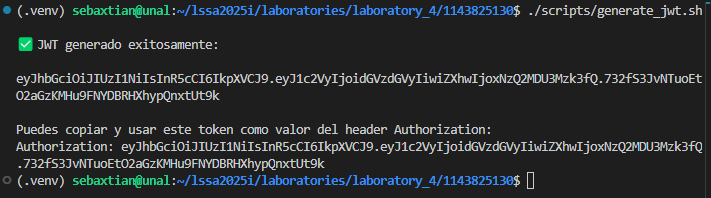
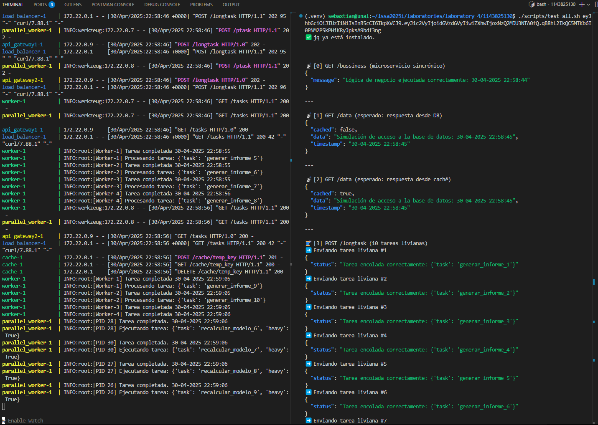
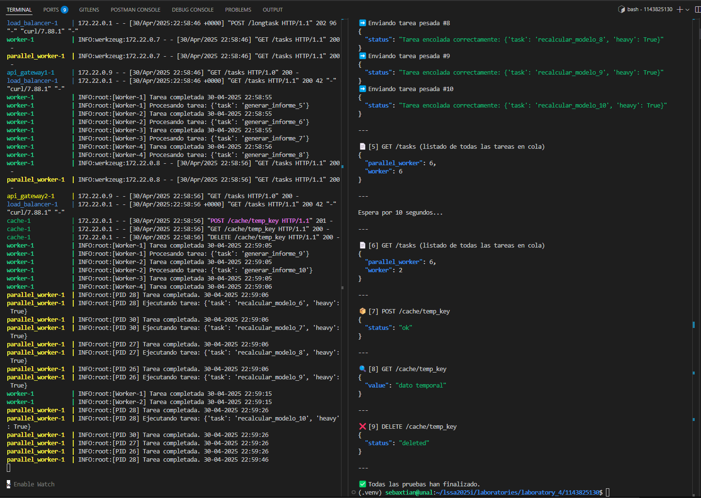
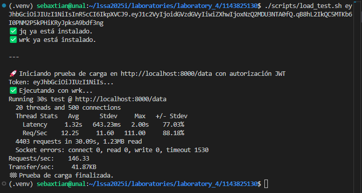

# 🧪 Laboratorio 4 – Escalabilidad en Arquitecturas de Software

**Nombre:** Sebastian Rios Sabogal  
**Cédula:** 1143825130

---

## 📘 Descripción del Proyecto

Este proyecto demuestra una arquitectura distribuida y escalable implementada con microservicios y contenedores Docker.
Utiliza tácticas de rendimiento como **balanceo de carga**, **caché**, y **procesamiento asíncrono (hilos y procesos)** para lograr elasticidad y respuesta bajo demanda.

Este sistema simula una arquitectura moderna basada en microservicios, empaquetada completamente con contenedores Docker y orquestada mediante `docker-compose`.

Los objetivos principales del proyecto son:

- Aplicar **tácticas arquitectónicas de escalabilidad y rendimiento**.
- Usar **Load Balancing** para distribuir tráfico entre múltiples gateways.
- Implementar **caché intermedia** para reducir el acceso a datos repetitivos.
- Delegar operaciones costosas a **servicios de procesamiento asincrónico**.
  - Uno usando **hilos** (`worker`)
  - Otro usando **procesos paralelos** (`parallel_worker`)

El API Gateway actúa como punto de entrada para todos los clientes, implementando autenticación basada en JWT, acceso con caché a los datos, y enrutamiento inteligente de tareas asincrónicas según su peso computacional.

---

## 🧱 Estructura del Proyecto y Servicios

El proyecto está organizado en una estructura modular, donde cada componente tiene su propia aplicacion y `Dockerfile`.

```plaintext
1143825130/
│
├── api_gateway/         → Punto de entrada, autenticación, caché, y enrutamiento de tareas
├── cache/               → Servicio en memoria para reducir acceso al backend
├── database/            → Simulación de una base de datos externa
├── load_balancer/       → Redirige tráfico a múltiples API Gateways
├── microservice/        → Lógica de negocio directa (utilizable por futuras extensiones)
├── worker/              → Procesamiento asincrónico con hilos (ligero)
├── parallel_worker/     → Procesamiento asincrónico en paralelo (procesos pesados)
├── docker-compose.yml   → Orquestador que define y conecta todos los servicios
└── README.md            → Documentación del sistema
```

---

## 🔧 Servicios definidos en docker-compose.yml

| Servicio         | Puerto | Rol principal                                               |
|------------------|--------|-------------------------------------------------------------|
| `load_balancer`  | 8000   | Balanceo de carga entre `api_gateway1` y `api_gateway2`     |
| `api_gateway1`   | 5000   | API principal: validación, enrutamiento, y uso de caché     |
| `api_gateway2`   | 5003   | Segunda instancia idéntica al gateway principal             |
| `cache`          | 5004   | Cache HTTP para datos repetidos                             |
| `database`       | 5002   | Fuente de datos simulada (latente, no persistente)          |
| `microservice`   | 5001   | Servicio de lógica sincrónica simple                        |
| `worker`         | 5005   | Procesa tareas simples con hilos                            |
| `parallel_worker`| 5006   | Procesa tareas pesadas en paralelo con múltiples procesos   |

---

## 🚀 Cómo Ejecutar el Proyecto (Instalación y Despliegue)

### 📦 Requisitos

- [Docker](https://www.docker.com/)
- [Docker Compose](https://docs.docker.com/compose/)

### 🔧 Pasos de instalación y ejecución

1. Desde la raíz del proyecto `1143825130/`, ejecuta el siguiente comando para construir las imágenes y levantar todos los servicios:

```bash
docker-compose up --build
```

2. Verifica que todos los servicios estén corriendo. Puedes hacerlo desde los logs o accediendo a:

```bash
# Este es el punto de entrada del sistema, gestionado por el balanceador de carga.
http://localhost:8000
```

3. Para detener los servicios:

```bash
docker-compose down
```

### 🔍 Verifica servicios individuales

Si deseas probar cada servicio por separado, puedes usar:

```bash
docker-compose ps        # Ver estado de los contenedores
docker-compose logs -f   # Ver logs en tiempo real
```

---

## 🌐 Endpoints Disponibles

A continuación se listan los endpoints más relevantes accesibles a través del balanceador (`http://localhost:8000/`):

| Método | Ruta             | Descripción                                                        |
|--------|------------------|--------------------------------------------------------------------|
| GET    | `/data`          | Obtiene datos (usa caché si está disponible)                       |
| POST   | `/longtask`      | Envía una tarea (liviana o pesada) al sistema de procesamiento     |
| GET    | `/process`       | (Microservicio directo) Ejecuta una operación de lógica simple     |
| POST   | `/cache/<key>`   | Almacena un valor en caché (usado internamente por el gateway)     |
| GET    | `/cache/<key>`   | Recupera un valor desde la caché                                   |
| DELETE | `/cache/<key>`   | Elimina una entrada de caché (manual)                              |
| GET    | `/db`            | Obtiene datos frescos directamente desde la base de datos simulada |

---

## ⚙️ Scripts de Pruebas Automatizadas

La carpeta `scripts/` contiene herramientas útiles para automatizar pruebas y generar tokens JWT para autenticación.

### 🔐 1. Generar un JWT válido

Puedes generar un token JWT válido con la clave `"secret"` (misma que usa el API Gateway) ejecutando:

```bash
# Este script imprimirá un token en pantalla que puedes copiar para las siguientes pruebas.
./scripts/generate_jwt.sh
```



### 🧪 2. Ejecutar todas las pruebas con curl

Una vez tengas el token JWT generado, pásalo como argumento al script de pruebas:

```bash
./scripts/test_all.sh "<jwt_token>"
```





---

## 🔄 Pruebas de Carga Automatizadas

El script `scripts/load_test.sh` permite simular múltiples usuarios accediendo al sistema mediante herramientas de benchmarking como [`wrk`](https://github.com/wg/wrk) o [`ab`](https://httpd.apache.org/docs/2.4/programs/ab.html).

> ⚠️ Este script requiere un token JWT válido. Usa `generate_jwt.sh` para generarlo.

### 🛠️ Requisitos

Debes tener instalada al menos una de estas herramientas:

- `wrk` (recomendado)
- `ab` (Apache Benchmark)

### ▶️ Ejecutar prueba de carga

```bash
./scripts/load_test.sh "<jwt_token>"
```

Esto ejecutará múltiples solicitudes concurrentes al endpoint protegido:

```bash
GET http://localhost:8000/data
Authorization: <jwt_token>
```

### ⚙️ Parámetros preconfigurados

| Herramienta | Concurrencia | Duración / Nº Solicitudes |
|-------------|--------------|---------------------------|
| `wrk`       | 20 hilos     | 15 segundos               |
| `ab`        | 20 usuarios  | 500 solicitudes totales   |



### Fecha limite de entrega

Vierne, Mayo 2, 2025, antes de 23h59
